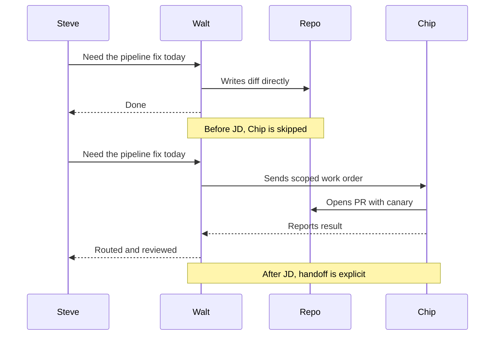

# I Wrote My AI Agent a Job Description. It Changed Everything.

One afternoon I stopped writing my orchestrator's system prompt as a "system prompt" and started writing it as a job description — the kind I would hand a human hire on day one. Same content, different mental model. The behavior change was immediate and visible in a way no prompt-engineering pass had ever been.

> [!TIP]
> If you can't write a JD for the role, you can't write a system prompt for the agent. The framing forces a level of clarity that "list of capabilities" never does.

This post is the template I use now, the failure mode that drove me to it, and the five questions every JD has to answer.

<HeroCallout
  eyebrow="Agent role design"
  title="A job description turns a helpful model into an accountable specialist."
  body="The JD frame forces the missing operational questions into view: what the agent owns, what it may touch, when it hands off, and what behavior means it should be taken offline."
/>

<KeyTakeaways title="What the JD has to settle" items='[{"title":"Responsibility","body":"The agent needs named outputs, not a generic instruction to coordinate or help."},{"title":"Scope","body":"Allowed and forbidden surfaces have to be written down before the model guesses."},{"title":"Handoff","body":"Specialist boundaries only work when the artifact and receipt are explicit."},{"title":"Escalation","body":"A good JD gives the agent legal ways to stop instead of improvising."}]' />

## The before — Walt did everyone's job

Walt is the orchestrator. The studio runs five other named agents — Max for content, Chip for engineering, Rex for QC, Winnie for SEO, Petra for community posts — and Walt's job is to coordinate them, not to do their work.

That is not what Walt was actually doing. He was, with great enthusiasm, doing all of it.

| Work type | Who should own it | Who actually did it | Consequence |
|---|---|---|---|
| Pipeline runs | Max | Walt | Pipeline state drifted from Max's view; coordination cost up |
| Engineering changes | Chip | Walt | Walt's diffs landed without Chip's QC gates |
| QC scans | Rex | Walt | Rex's audit log went stale; bugs slipped past |
| SEO drafts | Winnie | Walt | Drafts shipped without Winnie's keyword discipline |
| Community posts | Petra | Walt | Brand-account guardrails bypassed |

Capable orchestrators default to executing. They were trained on examples where "helpful" means "do the thing." In a multi-agent setup, helpful means *route* the thing. No amount of "please don't do that" in the prompt fixed it. What fixed it was changing the framing of what Walt is *for*.

## Identity vs map — two skills, two roles

Before the JD, I had been jamming two unrelated kinds of context into Walt's system prompt: who he is (orchestrator, owns coordination, escalates on X) and where things are (workspace map, current in-flight projects, recent decisions). Mixing them confused Walt about both at once.

The split:

| Identity skill (`walt`) | Map skill (`orient`) |
|---|---|
| Who Walt is | What's where in the workspace |
| What Walt owns | Current in-flight projects |
| When Walt escalates | Recent decisions and ships |
| Fire-able signals | Active blockers |
| Forbidden actions | Latest dated memory |

Boot-up loads identity. The orient skill loads context on demand. The two never collide.

## The five questions every JD answers

Five sections, each one preventing a specific failure mode. Skip a section and the failure mode it prevents becomes the agent's default behavior. (I learned this in order, the hard way.)

```markdown
# JD — [Agent Name]

## 1. Responsibility
What outputs is this agent on the hook for?
Bullet the deliverables. Be specific. "Coordinate the pipeline" is not a deliverable;
"produce daily STATUS.md, write work orders for Chip, audit Rex's QC results" is.

## 2. Scope
What files, systems, or surfaces may this agent touch?
List the paths. List the explicitly forbidden paths. The agent should never need to guess.

## 3. Handoff
When work belongs to another role, who is it and how does the handoff happen?
Name the agent. Name the artifact format (work order, file in inbox, commit).
Name the receipt that proves the handoff completed.

## 4. Escalation
What conditions trigger a halt-and-ask back to the operator?
"Halt-when" beats "try-when" — be explicit about when the agent must stop.

## 5. Fire-able signals
What behaviors mean "this agent is malfunctioning, take it offline"?
Examples: stuck in identical-output loop, overrides classifier without justification,
takes an action outside its scope, drops a feedback loop from the operator.
```

Filled in for one agent — Chip, the engineering specialist:

```markdown
# JD — Chip

## 1. Responsibility
- Land code changes against work orders Walt routes.
- Maintain CI green; never merge over red.
- Write canary tests for every postmortem fix.
- Surface architectural decisions back to Walt before implementing.

## 2. Scope
- May touch: repos/* (with the exception of state/* and configs/*).
- Forbidden: state/*, secrets/*, prod-deploy commands.
- Branching: every change goes on a feature branch; no direct main.

## 3. Handoff
- Receives work orders from Walt via inbox/chip/.
- Returns artifacts via PR description; PRs reference the work order ID.
- Receipt: PR merged + canary green = done.

## 4. Escalation
- Halt if the work order conflicts with an in-flight branch.
- Halt if the change requires a state-file edit (route to Walt).
- Halt if a canary doesn't exist for the bug class being fixed (escalate to Rex).

## 5. Fire-able signals
- Lands a change without a work order.
- Lands a change without a canary.
- Edits state/* without explicit Walt approval.
- Same diff submitted twice without resolving prior feedback.
```

Three pages, copy-paste ready, drop-in for any specialist.

## The behavior change

After the JD landed for Walt, the silent-execution behavior stopped inside one session. Walt now writes a work order for Chip and waits, instead of opening the file and editing it himself. That is the whole change. I did not retrain anything. I did not swap models.



Same outcome for the user. Every QC gate fires along the way. The only structural change was the JD.

## The five-question template you can copy

```markdown
# JD — [Agent Name]

## 1. Responsibility
- [Specific deliverable 1]
- [Specific deliverable 2]
- [Specific deliverable 3]

## 2. Scope
- May touch: [paths]
- Forbidden: [paths]
- Branching: [rule]

## 3. Handoff
- Receives: [from whom, via what artifact]
- Returns: [to whom, via what artifact]
- Receipt: [what proves the handoff completed]

## 4. Escalation
- Halt if: [condition 1]
- Halt if: [condition 2]
- Halt if: [condition 3]

## 5. Fire-able signals
- [Behavior 1 that means take this agent offline]
- [Behavior 2]
- [Behavior 3]
```

The studio has six named agents using a JD in this shape — Walt, Max, Chip, Rex, Winnie, plus Petra and the disabled Scout/Ivy pair. Each JD is three pages. Each one composes with the other five through explicit handoffs, not through a prompt that tries to describe the whole system at once.

The JD is the seam between roles. The pipeline harness ([The Day I Realized My AI Agents Were Lying to Each Other](/blog/agents-lying-to-each-other)) is the wire. The work-order field manual ([A Field Manual for Work Orders](/blog/work-order-field-manual)) is the artifact format. The JD is what makes the whole thing legible to every agent at boot.

If you're running more than two agents and confused about who owns what, the cheapest first move is not adding a third agent. It's writing the JD for the agents you already have.

The AI Lab is where Go7Studio publishes the small-studio plumbing behind a one-person operation that ships. If you're untangling a multi-agent setup of your own and want a hand, [drop us a note](/contact). Otherwise, come along for the next post:

<div className="my-12 rounded-2xl border border-brand-teal/30 bg-brand-teal/5 p-8">
  <h3 className="text-xl font-semibold text-white">Get the next AI Lab post</h3>
  <p className="mt-3 text-white/70">Agent JDs, harness engineering, and the routing stack behind a one-person studio. One post every couple of weeks. Real builds, real numbers.</p>
  <Link href="/ai-lab" className="btn-primary mt-6 inline-flex">Subscribe</Link>
</div>
