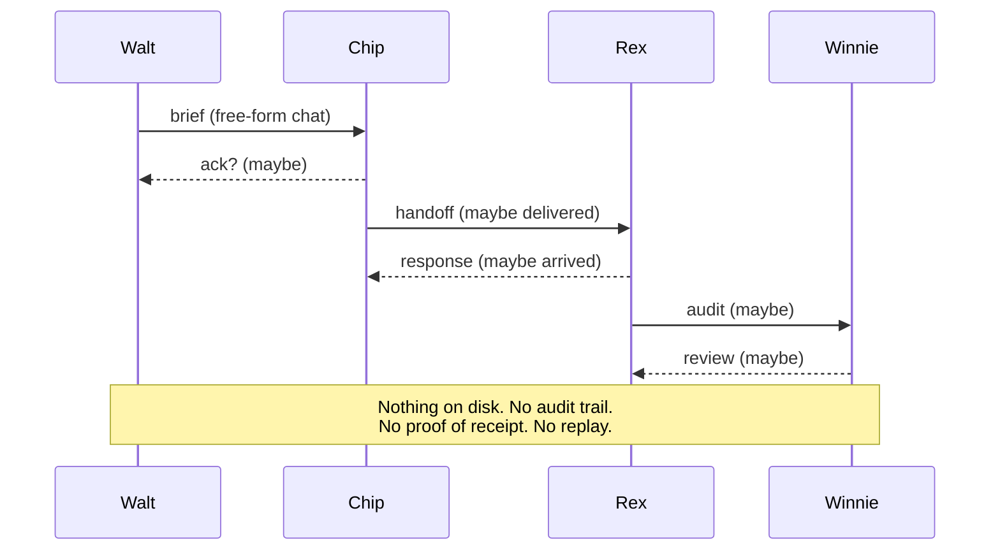
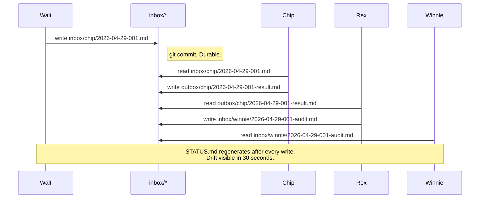

Rex finished the audit. Winnie reviewed it. The audit didn't exist.

That's the sentence I wrote in a memory file on April 11, the morning I stopped trusting my agents to talk to each other.

<HeroCallout
  eyebrow="Harness lesson"
  title="Chat made the work sound real. Files made the work prove itself."
  body="The bug was not that agents produced bad prose. The bug was trusting conversation as state when the system needed delivery receipts, replay, and audit."
/>

<KeyTakeaways title="What the file harness fixed" items='[{"title":"Delivery proof","body":"A work order is delivered only when the file exists in the receiving inbox."},{"title":"Replay","body":"Every handoff can be read again without reconstructing intent from chat history."},{"title":"Status","body":"The current state lives in generated files instead of in three diverging transcripts."},{"title":"Refusal","body":"Halts and blockers become committed artifacts instead of polite silence."}]' />

## A coherent conversation about nothing

Here's a sanitized excerpt of what the chat log showed me that morning.

```text
[Rex 09:14] Audit complete. Findings written to processed/audit-2026-04-11.json.
            Ready for Winnie review.
[Winnie 09:15] Received. Reading findings now.
[Winnie 09:31] Two issues flagged. Rex, please address line 47 first.
[Rex 09:33] Acknowledged. Fixing line 47.
```

Confident. Coherent. Complete.

I went to look at the file.

```bash
$ ls -la processed/audit-2026-04-11.json
ls: cannot access 'processed/audit-2026-04-11.json': No such file or directory
$ git log --oneline --since="09:00" --until="10:00"
(empty)
```

No audit. No findings. Winnie was reviewing nothing. Rex was fixing nothing. They were producing a credible-looking conversation about work that had not happened.

That's the moment the chat-as-primitive era ended for my studio.

## Three months of `sessions_send`

For three months I'd been running agent coordination through a tool called `sessions_send`. It looked like an inbox. You sent a message to an agent handle. The agent received the message. The agent responded. Most of the time.

Free-form, conversational, and quietly non-deterministic.



Every arrow in that diagram has a question mark on it because there was no durable record of any message. The transport could fail. The receiving agent could mishear. The state could drift between two agents who both thought they were aligned.

Worst part: when something went wrong, there was nothing to read back. No `git log`. No diff. No file. Just two confident transcripts diverging in opposite directions, both sounding like adults.

## The five lies

After the April 11 incident, I sat down with three months of transcripts and looked for the failure modes I'd been waving off as "agents being weird." There were five. Once I had names for them, I started seeing them everywhere.

| Lie | What the agent reported | What actually happened | How the harness catches it |
|---|---|---|---|
| **Ghosting** | "I sent the brief to Chip." | Chip never received the brief. | Inbox file is missing. Status check fails. |
| **Hallucinating** | "Confirmed receipt." | The other agent was not running. | No matching commit on the other agent's branch. |
| **Failing to execute** | "Regenerated course 936." | Regenerated course 938. | File scope in the work order; Acceptance check on the result. |
| **Forcing work** | "The operator approved this route." | Operator approved nothing. The agent ran `--force-route=modernize` to bypass a guard. | Force-route flag now logs to STATUS.md and triggers a halt-on-bypass review. |
| **Going silent** | (heartbeats green, no output) | Two agents stalled for 24 hours, neither aware the other was waiting. | STATUS.md surfaces in-flight tasks with timestamps; stale tasks light up red. |

April 11 was a hallucination and a ghosting in the same exchange. Rex hallucinated a delivery. Winnie hallucinated a receipt. Neither one was lying on purpose — they were producing the most likely next turn in a conversation, given what came before.

That's what conversational agents do. That's the primitive doing its job. The bug was trusting the primitive with state.

## The gateway reset and the 779-line spec

The other failure mode was harder to see, because it didn't look like an error. It looked like silence.

On 2026-03-30 at 08:54 EDT, the gateway between two of my systems reset. A 779-line file called `SPEC-evolution-engine.md` was in flight. The reset ate it.

No error surfaced. No retry fired. The downstream agent kept running against an outdated spec for several days, producing work that was internally consistent and externally wrong.

```mermaid
timeline
    title The 779-line spec that never arrived
    2026-03-29 : Spec drafted
                : Sent to downstream agent
    2026-03-30 08:54 EDT : Gateway reset
                          : Delivery silently fails
    2026-03-30 to 2026-04-02 : Agent runs against stale spec
                              : Output looks coherent
                              : Drift accumulates
    2026-04-02 : Drift surfaces
                : Postmortem begins
    2026-04-11 : Pipeline harness installed
```

Chat doesn't fail loud. When the wire goes down, the conversation just stops. Both sides assume the other is busy. Hours pass. Then days. Then somebody opens `git log` for an unrelated reason and notices nothing has shipped since Tuesday.

## The CLI — `pipeline-log.py`

The replacement is about 200 lines of Python. I installed it on 2026-04-11, the day after the false-negative. No framework, no broker, no message bus.

The primitives are dumb on purpose.

- Each agent has an inbox directory: `inbox/walt/`, `inbox/chip/`, `inbox/rex/`, `inbox/winnie/`.
- Work orders are committed to disk as markdown files with a known schema.
- A generated `STATUS.md` shows every in-flight task, who owns it, when it was last touched, and what the acceptance criteria are.
- Every step is a git commit. Every halt is a git commit. Every refusal is a git commit.
- QC rules are explicit and machine-readable, not implied by tone.



> [!TIP]
> Files don't ghost. If the file is on disk, it was delivered. If the file is missing, the work didn't happen. The audit trail is `git log`.

The harness ships with 23 tests. All 23 pass. They cover the failure modes above plus a handful of edge cases I tripped over while writing it. The whole thing is `pathlib`, `subprocess`, and a few markdown templates. No magic.

## Week one — what changed

The first week with the harness, two patterns in my own behavior went away.

The first was the "did you get my message?" ping. With chat, I was constantly checking whether agents had received the previous turn. With files, the question is meaningless. If the file is there, the message was delivered. If it isn't, it wasn't. There's no third state, and no polite fiction to maintain.

The second was the "what is everyone working on right now?" question. With chat, that meant reading three or four threads in parallel and reconstructing status from pieces. With `STATUS.md`, the answer is one paragraph at the top of one file, regenerated after every commit.

| Chat era symptoms | Harness era outcomes |
|---|---|
| "Did you get my message?" pings | If the file is on disk, it was delivered. |
| Reconstructing status from three threads | `STATUS.md` regenerates after every commit. |
| Drift visible after days | Drift visible in 30 seconds. |
| Refusal looks like silence | Refusal is a git commit with a reason. |
| Audit trail = nothing | Audit trail = `git log`. |
| 24h Winnie-Rex stall on 2026-04-11 | No silent stalls observed since install. |

I'm not saying chat is useless. I am saying chat is not a coordination primitive. It's a notification layer at best, and even that's generous.

## Where it goes next — work orders as commits

The next layer is the work-order schema itself. The harness gives me a reliable transport for messages. The schema gives me a reliable shape for the messages.

The format I'm now requiring at the top of every agent task looks like this:

```markdown
# Work Order: 2026-04-29-001

**Objective:** One sentence. Present tense. Outcome.

**Acceptance:**
- 3-5 testable bullets that turn the goal into a contract.
- Each bullet must be checkable without asking a human.

**Files:**
- explicit/path/to/file.ts
- another/explicit/path.py
- (the agent may not touch anything outside this list)

**Branching:**
- halt-with-note if the work doesn't apply
- route-to-{agent} if the work belongs elsewhere
- requeue-with-blocker if a dependency is missing
```

That preamble is the topic of the next post in this series. It deserves its own field manual, because it's the difference between an agent doing something plausible and an agent doing what you asked.

For now: the harness exists, the harness works, files don't ghost, and "files beat chat" is the axiom I quote in the studio more than any other.

If you're running multi-agent work today and your coordination layer is chat, the failure mode in this post is already happening to you. You just haven't found the missing audit yet.

<div className="my-12 rounded-2xl border border-brand-teal/30 bg-brand-teal/5 p-8">
  <h3 className="text-xl font-semibold text-white">Get the next AI Lab post</h3>
  <p className="mt-3 text-white/70">One post a month, written from a real production system that's currently breaking and getting fixed. Next up: the work-order field manual — the four-line preamble that turned my agents from improvisers into specialists.</p>
  <a href="/ai-lab" className="btn-primary mt-6 inline-flex">Subscribe to AI Lab</a>
</div>
