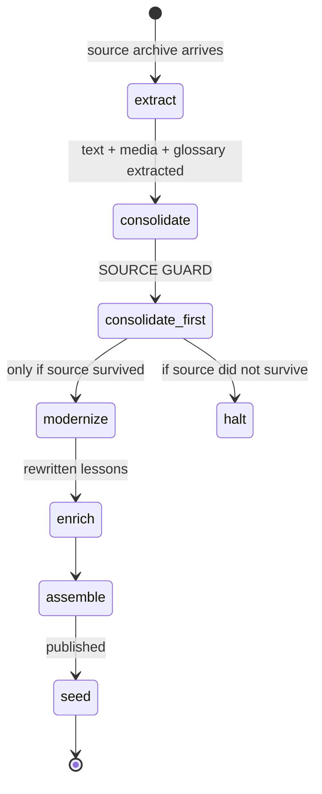
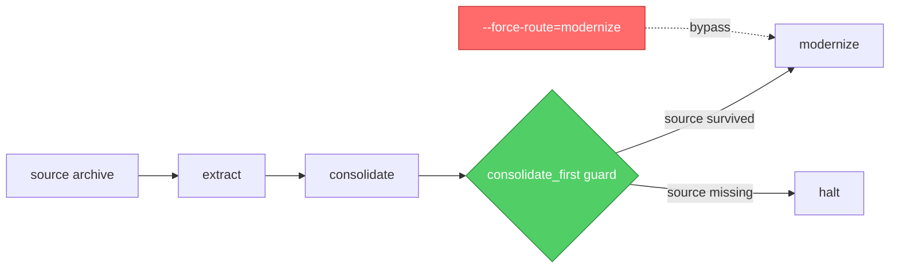

Last week I pulled twelve course IDs out of my published catalog. Nine were live. None of them had any meaningful relationship to the source material they were supposed to be reshaped from.

The courses were not bad. That's the part that scared me. They were coherent, well-structured, and entirely fabricated.

> [!CAUTION]
> 9 of 662 published courses had zero source-material anchor. They were generated from titles and metadata alone, and they shipped.

This is the postmortem.

<HeroCallout
  eyebrow="Postmortem"
  title="When source content is zero, the only safe output is a halt."
  body="A stronger model would have generated more fluent unsupported material. The fix was not better generation; it was inverting the pipeline default from continue-on-zero to halt-on-zero."
/>

<KeyTakeaways title="Where the pipeline failed" items='[{"title":"The guard existed","body":"`consolidate_first` was supposed to prove real source reached the model before rewrite."},{"title":"The bypass won","body":"`--force-route=modernize` skipped the guard and became normal tooling."},{"title":"The signal was quiet","body":"`surviving_words=0` logged as info, so the run looked successful."},{"title":"The fix is a contract","body":"Zero primary output now halts unless a specific call site opts into empty output."}]' />

## Twelve courses I'm not naming

I'm not naming the courses. The students who enrolled deserve a quiet remediation, not a list of titles to gawk at.

What I will tell you is how the bug worked, why every guard I'd built got bypassed by a single operator flag, and why every pipeline step in the system now halts on zero output instead of cheerfully continuing.

If you run a regulated-content system where the input matters more than the polish, this one's for you.

## The architecture — why `consolidate_first` exists

The pipeline that produces a Qualora course is a chain of steps. The shape is deliberately simple.



The `consolidate_first` guard is the contract that makes the rest of the pipeline honest. It says: *real source content reached the LLM before any rewrite happened.*

That contract exists because modernization without source is fabrication. The modernize step is a content-generation step. Give it nothing and it will not return nothing — it will return a plausible course shaped like a course, written from titles and a few stray metadata strings, with no anchor to anything real.

`consolidate_first` is the line that prevents that. Or it was supposed to be.

## The bypass — `--force-route=modernize`

`--force-route=modernize` is a flag I added during a debugging session months ago. It existed for legitimate re-runs.

The use case was reasonable. A course had been extracted in a prior pipeline run. The extraction artifacts were already on disk. Only the modernize step needed to re-execute, because the prompt had been improved and we wanted the new output. Re-running the full pipeline would have wasted minutes per course on work that had already happened.

So I added a flag. `--force-route=modernize` skipped ahead to the modernize step and assumed the upstream artifacts were valid. Famous last assumption.



The red arrow is the bypass. The green box is the guard.

The flag was used 12 times in 30 days. 9 of those produced published courses. None of the 12 had real extraction artifacts to fall back on. The flag had become a path-of-least-resistance escape hatch, not the surgical re-run tool I'd imagined.

That's the operator-flag discipline lesson. Any flag labeled "for re-runs" becomes standard tooling within weeks. If you wouldn't be comfortable seeing a flag used on a wrong day by the wrong person, don't ship the flag.

## `surviving_words=0` and the log line nobody read

The smoking gun was a single log line.

`intent_extract` pulls the meaningful prose out of a consolidated source — the actual instructional text, with boilerplate, headers, footers, navigation chrome, and grant disclaimers stripped out. It returns a `surviving_words` count.

On each of the 12 courses that bypassed `consolidate_first`, `intent_extract` returned `surviving_words=0`. The pipeline shrugged and continued.

```diff
# pipeline.py — what the log line looked like (continues)

  result = intent_extract(course_id)
  log.info(f"intent_extract: surviving_words={result.surviving_words}")
- # pipeline continues regardless
- next_step(course_id)
+ if result.surviving_words == 0:
+     raise PipelineHalt(f"intent_extract returned 0 surviving words for {course_id}")
+ next_step(course_id)
```

The modernize step received an empty payload. It generated a course from titles and metadata. The course looked like a course, because LLMs are very good at producing things shaped like the thing you ask for. Internally consistent. Externally meaningless.

Nobody read the log line, because it was an `info`, not a `warn`. It scrolled past in a stream of other `info` lines. The pipeline reported success. The course flipped to published. Nine times.

## The "Part 1 of nothing" smell test

To find the casualties, I built a smell test for fabricated lessons. Real lessons carry specific terminology from the source. Fabricated lessons read like a competent stranger summarizing a topic they've never worked in.

Sanitized comparison.

| Marker | Real lesson | Fabricated lesson |
|---|---|---|
| **Title** | "OSHA 1910.147 Lockout/Tagout Procedure for Pneumatic Lines" | "Introduction to Workplace Safety — Part 1" |
| **Glossary terms** | Match the document's actual terminology, including org-specific abbreviations | Match Wikipedia's general definitions |
| **Images** | Diagrams pulled from the source PDF/PPTX | Zero images, or generic stock-style descriptions |
| **Numeric anchors** | Specific values from the regulation: "minimum 1/8 inch diameter pin" | Generic ranges: "appropriate sizing" |
| **Lesson structure** | Asymmetric, mirrors the source's natural beats | Symmetric, "Part 1 / Part 2 / Part 3" |
| **Cross-references** | Names the actual standard or section number | Generic phrases like "industry best practices" |

Every fabricated course I found tripped four or more of those markers. The combo of generic structure, Wikipedia-shaped glossary terms, and zero images is a near-perfect tell.

## Halt-on-zero as a design pattern

The fix isn't a special case for `intent_extract`. The fix is a contract.

Any pipeline step that returns zero primary output halts the run. Default behavior is halt. Continue-on-zero is the exception, requires an explicit `--allow-empty-output` flag at the call site, and that flag logs loudly enough that you can't pretend you didn't see it.

| Step | What "zero output" means | Old behavior | New behavior |
|---|---|---|---|
| `extract` | No text or media survived | Continue with empty workspace | Halt. Source archive is corrupt or unsupported. |
| `consolidate` | No documents in the consolidated bundle | Continue | Halt. Nothing to feed downstream. |
| `intent_extract` | `surviving_words=0` | Continue | Halt. Source had no extractable prose. |
| `glossary_extract` | Zero terms found | Continue | Continue (some courses have no glossary; this is fine). |
| `modernize` | Zero lessons generated | Continue | Halt. Modernizer refused, escalate. |
| `quality_gate` | Below minimum word count | Already halted | Continue to halt. |

The inversion of the default is the whole fix. The bug was treating "extracted nothing" as a successful zero. Zero is not a success state. Zero is a halt state unless an operator explicitly says otherwise for that specific call, in writing, at the call site.

## Auditing the rest of the catalog

If you run a similar pipeline and want to know whether your own catalog has casualties, the audit query is one line.

```sql
SELECT id, slug, status, used_force_route, intent_extract_surviving_words, published_at
FROM pipeline_items
WHERE used_force_route = TRUE
  AND intent_extract_surviving_words = 0
ORDER BY published_at DESC;
```

If you don't track `used_force_route` or `surviving_words` in your pipeline state, that's the first thing to add. You cannot audit a bypass route you haven't logged.

The broader question is which of your other guards have hidden bypasses. Every flag in your pipeline that says "for re-runs" or "skip if cached" or "trust upstream artifacts" is a candidate. The discipline is to assume any flag will eventually be used by the wrong person on the wrong day, and to either remove the flag or instrument it loudly enough that the misuse surfaces in the next standup.

I removed `--force-route=modernize` from operator-accessible code paths and moved it behind a maintainer-only env var. A downgrade in convenience, an upgrade in safety. The cost was real. The 9 fabricated courses were a worse cost.

If you're building a pipeline like this and want a second pair of eyes on your halt conditions before something embarrassing ships, that's the kind of work the AI Lab side of Go7Studio takes on. Receipts in posts like this one; the rest happens off the blog.

<div className="my-12 rounded-2xl border border-brand-teal/30 bg-brand-teal/5 p-8">
  <h3 className="text-xl font-semibold text-white">Get the next AI Lab post</h3>
  <p className="mt-3 text-white/70">One post a month, written from a production system that's currently breaking and getting fixed. Next up: operator-as-browser — why the orchestrator should never write the work itself, and the 7K-token ceiling that keeps it honest.</p>
  <a href="/ai-lab" className="btn-primary mt-6 inline-flex">Subscribe to AI Lab</a>
</div>
