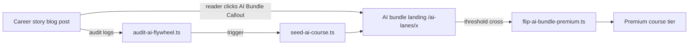
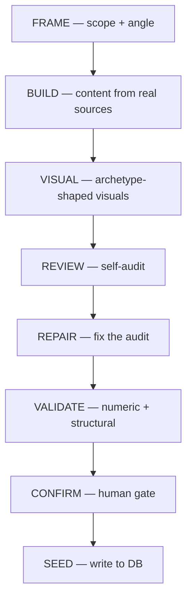

## The funnel in one diagram

The shape is simple before the moving parts get in. A reader lands on a career story. The story has an AI bundle callout. The callout points at an AI bundle landing page. The bundle's traffic and conversion are watched by a nightly audit. When a bundle clears its threshold, a flip script promotes it from free to premium tier. Future readers get a slightly better-monetized version of the same post.



There are four scripts in there, all of them in the Qualora repo. None of them require a person in the loop on a normal day. Below is what each one does and why we deliberately wrote them as small, dumb, single-purpose pieces.

## The audit script

`audit-ai-flywheel.ts` is the daily cron. It reads:

- page-view counts per blog post in the `ai-career-stories` series
- click-through rates from the in-post AI Bundle Callout
- bundle landing-page visits and downstream signups

It computes a per-bundle conversion ratio (`bundle_visits / story_views`), flags bundles where the ratio is healthy enough to graduate, and writes a queue.

```typescript
type AuditOutput = {
  generated_at: string;
  candidates: Array<{
    bundle_slug: string;
    series: 'ai-career-stories';
    story_views_30d: number;
    bundle_visits_30d: number;
    conversion_ratio: number;
    threshold_met: boolean;
    bundle_completeness_pass_count: number; // 6 or 7
    notes: string[];
  }>;
};
```

The audit's only job is to write that JSON. It does not flip anything. It does not change tiers. It identifies candidates and stops.

The reason for the firewall is operational. If something is wrong with the audit logic — wrong thresholds, broken metrics, drifted definitions — I want to read a JSON file and ignore it, not deal with a tier flip that should not have happened. Audits write. Triggers act. Different scripts.

## The flip trigger

`flip-ai-bundle-premium.ts` is intentionally dumb. It reads the queue from the audit, validates that the bundle has all six (or seven) production passes complete, and flips a single tier flag in the bundles table.

```typescript
async function flipToPremium(slug: string) {
  const bundle = await db.query.aiBundles.findFirst({
    where: eq(aiBundles.slug, slug),
  });

  if (!bundle) throw new Error(`Bundle not found: ${slug}`);
  if (bundle.tier === 'premium') return { skipped: 'already premium' };
  if (!bundle.completenessAudit?.allPassesComplete) {
    return { skipped: 'audit incomplete' };
  }

  await db
    .update(aiBundles)
    .set({ tier: 'premium', flippedAt: new Date() })
    .where(eq(aiBundles.slug, slug));

  return { flipped: slug };
}
```

No model call. No content generation. No surprises. The flip is data-layer only. UI surfaces re-render off the new tier flag at next request. The bundle itself does not change — its production passes were already done; its tier label is the only thing that moved.

## The seed pipeline and the 6-pass production

When a brand-new bundle is queued (a career we haven't covered yet, a topic with measurable search demand, a sibling cluster the auditor flags), `seed-ai-course.ts` runs the full six-pass production pipeline.



Each pass has one accountability and one handoff.

- **FRAME** — defines scope, angle, audience, the question the bundle is answering
- **BUILD** — writes the content. Reshaped from real human sources (instructor lectures, college courseware, transcripts), never invented
- **VISUAL** — applies our archetype system (anatomy, threshold, procedure, taxonomy, checklist, plus the v2 archetypes) — one primary visual per lesson, validated against the canonical alt-text and node-count rules
- **REVIEW** — runs a structured self-audit against a rubric
- **REPAIR** — fixes whatever the review caught
- **VALIDATE** — numeric and structural checks (lesson counts, glossary FK integrity, quiz distribution, canary tests)
- **CONFIRM** — the human gate, where someone reads the bundle end-to-end before it touches production
- **SEED** — writes to the database

The point of breaking it into named passes is that handoffs are explicit. If the validate pass fails, the repair pass owns the fix; nothing goes back to BUILD unless the failure is a content failure rather than an audit failure. That distinction saves an enormous amount of wasted regeneration work.

## The 7-pass dual-use variant

Some bundles need a higher bar. **Dual-use bundles** are the ones that will both graduate to premium AND sit on a free landing page where general traffic can hit them. Higher visibility means stricter checks.

For dual-use, two passes get inserted between REPAIR and VALIDATE.

| Pass | 6-pass | 7-pass adds |
|---|---|---|
| FRAME | scope + angle | + Walt strategic frame |
| BUILD | content from real sources | — |
| VISUAL | archetype-shaped visuals | — |
| REVIEW | self-audit | — |
| REPAIR | fix audit | — |
| WALT REVIEW | — | brief alignment check |
| CODEX RED-TEAM | — | numeric + factual hallucination audit |
| VALIDATE | structural | — |
| CONFIRM | human gate | — |
| SEED | DB | — |

The Walt review catches strategic drift — angle that softened, claims that wandered, framing that lost the original brief. The Codex red-team audit is a separate model call whose only job is to red-team the numeric and factual claims in the bundle. Field-correction loop: any failure kicks back to BUILD with the failure attached as context, so the rebuild starts informed instead of blind.

We log every pass and the model that ran it. Every dual-use bundle we ship has a record like:

```json
{
  "bundle_slug": "ai-for-medical-coding",
  "series": "ai-career-stories",
  "passes_run": ["FRAME", "BUILD", "VISUAL", "REVIEW", "REPAIR", "WALT_REVIEW", "CODEX_RED_TEAM", "VALIDATE", "CONFIRM", "SEED"],
  "walt_review": { "pass": true, "drift_flags": [] },
  "codex_red_team": { "pass": true, "numeric_findings": 0, "factual_findings": 0 }
}
```

If the Codex red-team produces findings, the bundle does not seed. It goes back to BUILD with the findings attached. We have caught our own numeric drift this way more than once.

<div className="my-12 rounded-2xl border border-brand-teal/30 bg-brand-teal/5 p-8">
  <h3 className="text-xl font-semibold text-white">See it live on Qualora</h3>
  <p className="mt-3 text-white/70">Career-aligned courses, free lesson sampler, no signup needed to try.</p>
  <Link href="https://qualora.io/quiz/sampler" className="btn-primary mt-6 inline-flex">Try a free lesson</Link>
</div>

## What I'd build differently

Three architectural calls I'd undo if I started over.

> [!NOTE]
> Three things I'd change about this flywheel if I started over.
>
> 1. **The audit and the flip should be one process.** I split them for safety, but in practice I read the audit output and run the flip the same morning. The split adds operational steps without adding real safety once the flip has its own preflight.
> 2. **The 6-pass is too rigid for short-form bundles.** A 4-lesson bundle does not need the same 6-pass overhead a 12-lesson bundle does. The right shape is "minimum passes that survive the validate step" with a per-bundle declared length.
> 3. **The Codex red-team audit should run before visuals, not after REPAIR.** Fixing facts after diagrams render means re-doing the diagrams. Move the red-team to right after BUILD; visuals build on confirmed-correct content.

The flywheel works. We ship bundles end-to-end without me touching them on most days. Reader clicks AI Bundle Callout, bundle visits log, audit fires nightly, threshold trips, flip script runs the next morning. We see the conversion in GSC and the funnel in our own analytics.

The version of this we'll have a year from now will probably be unrecognizable from this version. That's the point of writing it down.
