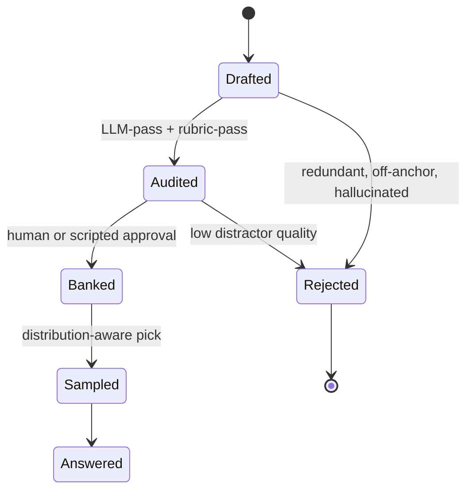
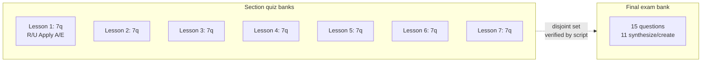
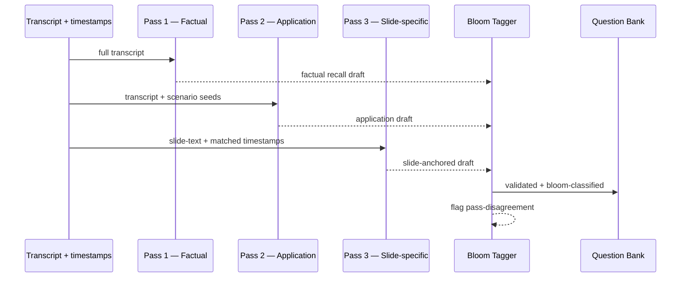

The first version of our CE platform asked the LLM to write a quiz at the moment a student opened a lesson.

It worked. It looked great in a demo. We almost shipped it.

Then I sat down and asked the regulator's question: if a student fails a quiz, retries it, and passes the second time, what did they actually see? A different prompt's response. A different shape. Possibly a different difficulty. We had no record of which questions were asked, no audit trail of which distractors appeared, and no way to guarantee that two students of the same skill level took comparable assessments.

That's not a quiz engine. That's a vibe.

This post is about what we built instead — a Bloom-tagged question bank with distribution-aware selection — and why it's the right shape for any compliance-grade learning platform we ship through Go7Studio. The platform we're describing is the [NEALAC Learning Hub](https://drannnealac.com), built with Dr. Ann Leonard-Zabel as the public-facing CE provider. The architecture decisions here generalize to every edtech platform we've built since.

## Section 1: The trap — letting the LLM write quizzes at runtime

The pitch sounds great:

> Every student gets a fresh quiz. The LLM reads the lesson, writes three questions, renders them. No bank to maintain. No human authoring required.

What you actually get when you ship that:

- **Latency on every lesson load.** A 3–8 second pause while the model generates. On a 7-lesson course, that's a minute of friction.
- **Non-determinism.** The same student retrying the same quiz gets different questions. Sometimes the new set is harder. Sometimes it's easier. There is no fairness story to tell.
- **No audit trail.** When a regulator asks "what did student X actually see?" the honest answer is "we don't know — we never persisted the rendered output."
- **Same-shape collapse.** Despite the fluency of the model, three questions from one prompt almost always end up being three variants of "what is X?" Recall, recall, recall. Application questions don't appear unless you specifically engineer for them.

> [!NOTE]
> Runtime LLM generation is fine for *content* — drafting a glossary entry, suggesting a flashcard, summarizing a lesson. It is not fine for *assessment*, where the platform must be able to show every student saw a comparable, auditable, deterministic instrument.

The framing that finally clicked for me: a quiz is not "content the LLM produces on demand." A quiz is a *measuring instrument*, and an instrument needs calibration, distribution control, and a reproducible read.

## Section 2: The bank model

Here's the schema we settled on. Every question is a row, fully tagged at write time, before it ever reaches a student.

```sql
CREATE TABLE quiz_questions (
  id              uuid PRIMARY KEY,
  course_id       int NOT NULL,
  lesson_id       int NOT NULL,
  section_id      int NOT NULL,
  bloom_level     text NOT NULL,
    -- 'remember' | 'understand' | 'apply' | 'analyze' | 'evaluate' | 'create'
  difficulty      smallint NOT NULL CHECK (difficulty BETWEEN 1 AND 5),
  pass_source     text NOT NULL,
    -- 'factual' | 'application' | 'slide_specific'
  transcript_anchor_ts numeric(10,3),
  slide_anchor    text,
  stem            text NOT NULL,
  answers         jsonb NOT NULL, -- [{ text, isCorrect, rationale }]
  correct_idx     smallint NOT NULL,
  distractor_quality_score smallint,
  audit_status    text NOT NULL DEFAULT 'banked',
    -- 'drafted' | 'audited' | 'banked' | 'rejected'
  created_at      timestamptz NOT NULL DEFAULT now()
);

CREATE INDEX quiz_questions_lesson_bloom
  ON quiz_questions (lesson_id, bloom_level)
  WHERE audit_status = 'banked';
```

Three properties matter about that schema:

1. **Bloom level is a database column, not a hope.** Every question is classified as Remember/Understand/Apply/Analyze/Evaluate/Create at write time. The classifier is itself audited (more on that in section 5).
2. **The question is anchored.** A `transcript_anchor_ts` (or `slide_anchor`) lets us prove every question is grounded in the source lecture. There is no question floating without a citation.
3. **Audit status gates visibility.** Only `banked` questions are eligible to be sampled. Everything else sits quarantined until human or scripted review promotes it.

Each question lives in exactly one of five states across its lifecycle:



A question only reaches a student via that pipeline. Generation, audit, banking, sampling — distinct stages, each with its own log, each separable.

A real row from the NEALAC TBI bank, slightly abridged:

```json
{
  "id": "q_8f3c1a",
  "lesson_id": 27,
  "bloom_level": "apply",
  "difficulty": 3,
  "pass_source": "application",
  "transcript_anchor_ts": 542.180,
  "stem": "A patient who recently sustained a moderate TBI shows...",
  "answers": [
    { "text": "...", "isCorrect": true, "rationale": "..." },
    { "text": "...", "isCorrect": false, "rationale": "..." },
    { "text": "...", "isCorrect": false, "rationale": "..." },
    { "text": "...", "isCorrect": false, "rationale": "..." }
  ],
  "correct_idx": 0,
  "distractor_quality_score": 4,
  "audit_status": "banked"
}
```

Notice the rationale on each answer, including the wrong ones. This is what lets us run distractor-quality audits without re-engaging a model. A good distractor is plausibly wrong; a bad one is obviously wrong. We score every distractor at write time so the bank itself can be filtered.

## Section 3: Distribution-aware selection

Here's where most quiz engines fail even when they have a bank: they pick three random rows.

A section quiz on the NEALAC TBI course is exactly three questions. We pick:

- 1 question from `bloom_level IN ('remember', 'understand')`
- 1 question from `bloom_level = 'apply'`
- 1 question from `bloom_level IN ('analyze', 'evaluate')`

Why this composition? Because a passing CE quiz that tests only recall doesn't actually demonstrate competency. It demonstrates lookup. Distribution control is how we say "the student understands the material at three cognitive levels," not just "the student memorized terminology."

The bank coverage on the TBI course as it currently sits:

| Bloom level                  | Target per quiz | Bank coverage (NEALAC TBI) |
| ---                          | ---             | ---                        |
| Remember / Understand        | 1               | 28 questions               |
| Apply                        | 1               | 24 questions               |
| Analyze / Evaluate           | 1               | 13 questions               |
| Synthesize / Create (final)  | n/a (final only)| 11 questions               |

Twenty-eight Remember/Understand questions across seven lessons gives us four per lesson on average — comfortable. Apply is healthy at 24 (~3.4/lesson). Analyze/Evaluate is the tight band at 13 (~1.9/lesson) and we monitor it; if a future course produces fewer than two per lesson at that tier, the build fails and we go back to the 3-pass generator with a directive to weight harder.

The selector is deterministic on `(lesson_id, student_seed)`. The same student retrying the same quiz gets the same three questions. Two different students get different draws but with the same Bloom shape. This is the hinge of the audit story — a regulator can ask "what did student X see on quiz Y on date Z?" and we can reconstruct it from the seed alone.

```typescript
// Pseudocode of the selector. Real implementation lives in
// repos/NEALACLearningHub/server/quiz/selector.ts
function selectSectionQuiz(lessonId: number, studentSeed: string): Question[] {
  const composition = [
    { bloom: ['remember', 'understand'], count: 1 },
    { bloom: ['apply'],                   count: 1 },
    { bloom: ['analyze', 'evaluate'],     count: 1 },
  ];

  return composition.flatMap(({ bloom, count }) => {
    const pool = db.bankFor(lessonId, bloom);
    if (pool.length < count) {
      throw new BankUnderCoverageError(lessonId, bloom);
    }
    return seededSample(pool, count, hash(studentSeed, lessonId));
  });
}
```

The `BankUnderCoverageError` is load-bearing. We never silently relax distribution constraints. If a lesson can't produce a balanced quiz, the platform refuses to serve a quiz at all and the build halts.

## Section 4: The final-exam blueprint

The final exam is where the architecture really earns its keep.

The TBI final is 15 questions. **11 of them are tagged `synthesize` or `create`. Zero overlap with any section-quiz question.** That zero is enforced by a script that runs at seed time:

```typescript
// scripts/verify-no-final-overlap.ts
const sectionQuizIds = new Set(
  await db.allBankedQuestionIdsAcross(['section_quiz_1', ..., 'section_quiz_7'])
);
const finalIds = await db.allBankedQuestionIdsAcross(['final_exam']);
const overlap = finalIds.filter(id => sectionQuizIds.has(id));
if (overlap.length > 0) throw new OverlapError(overlap);
```

The final isn't "harder versions of the same questions." It's a different cognitive shape entirely.



Why does that disjoint property matter? Because if a student aces every section quiz by memorizing those 21 questions, the final exam catches whether they actually integrated the material — or just memorized the test. A student who's truly competent can answer questions tagged `synthesize` (combining concepts from lessons 2 and 5) and `create` (proposing an approach to a novel scenario). Neither the section banks nor any prior version of those banks contain such items.

This is the structural answer to the surveillance question I'll get to in [our compliance-via-architecture post](/blog/compliance-via-architecture-not-surveillance): we don't need a webcam to know whether a student integrated the material. We just need a final exam that can't be passed by memorizing the section quizzes, and a verification script that proves the disjoint property at every build.

<div className="my-12 rounded-2xl border border-brand-teal/30 bg-brand-teal/5 p-8">
  <h3 className="text-xl font-semibold text-white">Build with Go7Studio</h3>
  <p className="mt-3 text-white/70">A small AI-augmented studio that ships compliance-grade learning platforms in days, not quarters.</p>
  <Link href="/contact" className="btn-primary mt-6 inline-flex">Book a discovery call</Link>
</div>

## Section 5: Feeding the bank — 3-pass generation

The bank doesn't write itself. We feed it through a 3-pass generator that I cover in detail in [Whisper Plus a 3-Pass Quiz Generator](/blog/whisper-three-pass-quiz-generator-21-questions). The short version:

1. **Pass 1 — Factual.** Anchored to specific transcript timestamps. Output is recall (Bloom Remember/Understand).
2. **Pass 2 — Application.** Scenario stems. Output is application (Bloom Apply).
3. **Pass 3 — Slide-specific.** Only fires when slides are present. Anchors to slide-text and catches diagram-driven content. Output skews Analyze/Evaluate.



The tagger is the second model — Gemini 2.5 Flash, separate prompt, separate audit log. It reads each draft and assigns a Bloom level. The interesting case is **pass disagreement**: Pass 2 produces a question, the prompt says "make it Apply," and the tagger reads the rendered question and labels it Remember. That disagreement gets surfaced in the audit log and the question is rejected. The model said "I made an Apply question." The tagger said "this is Remember." We trust neither alone; we trust the agreement.

In the NEALAC build, ~12% of pass-2 drafts were rejected for tagger disagreement on the first generation. The bank that survives audit is smaller and tighter than the bank we drafted.

## Section 6: When the LLM is allowed; when it's hard-blocked

Here's the rule we converged on:

- **Generation time, with audit:** allowed. The 3-pass generator, the tagger, distractor diversification — all of these involve model calls, but they happen in a controlled environment with audit logs and human-or-scripted gates before output reaches a student.
- **Runtime, between "student clicks lesson" and "quiz renders":** hard-blocked. No model call. None.

> [!IMPORTANT]
> Three runtime LLM calls we explicitly banned in NEALAC:
>
> 1. **"Generate three quiz questions for this lesson"** — non-deterministic, no audit trail, distribution drift.
> 2. **"Score this free-response answer"** — no reproducibility, model drift across versions, no way to defend a low score on appeal.
> 3. **"Suggest a hint when the student is stuck"** — fluent and tempting, but invisible to the audit log; would show up in support tickets as "the system told me X" with no way to verify.

The general principle: a CE platform's contract with its students and its regulator is that the assessment is *the same* regardless of the latency of an external API. A model outage cannot mean "no quiz today." A model upgrade cannot quietly change difficulty. The bank is the contract; the model is just a tool that wrote the bank.

## Section 7: Reproducibility, retries, and the audit trail

This is the part the regulator actually cares about.

Every quiz the platform serves writes a row to an audit log:

```json
{
  "audit_id": "qa_2026-04-15T13:42:08Z_42",
  "course_id": 7,
  "lesson_id": 27,
  "student_id": "s_a1b2c3",
  "quiz_id": 16,
  "selected_question_ids": ["q_8f3c1a", "q_b2e441", "q_c9c0fa"],
  "selector_seed": "s_a1b2c3:27",
  "bank_snapshot_hash": "sha256:0bf3...",
  "served_at": "2026-04-15T13:42:08.291Z"
}
```

Three properties matter:

- `selected_question_ids` is the receipt. The student can see exactly what they were shown.
- `selector_seed` makes the selection reproducible. Re-deriving with the same seed yields the same draw, which lets a regulator confirm "yes, that's what student X would have seen on retry."
- `bank_snapshot_hash` pins the state of the bank at that moment. If we add a new question tomorrow, the audit log still references yesterday's bank, and we can reconstruct exactly what was available.

Same student → same quiz on retry. Different students → different sampling within the same Bloom distribution. Audit trail per impression. None of that is achievable with runtime LLM generation, and all of it falls out of the bank model for free.

## What this gets us

A platform that the regulator can audit. A platform where two students of the same skill level take comparable assessments. A platform that doesn't go down when the model API does. A platform whose quiz quality is owned by the team that built it, not by whatever the model decides to write at the moment of impression.

The reason all 10 lines of our NEALAC verification suite passed on the first run is partly that we built the bank model from day one. Distribution checks, no-overlap checks, anchor checks, eligible-flag checks — all of them were *expected to pass* because the architecture made them tractable.

If you want to see what this looks like in a live, regulator-facing CE platform, [drannnealac.com](https://drannnealac.com) is hosting the result. The platform is small enough to read in an afternoon and rigorous enough to survive an audit. That's what we're optimizing for.

<div className="my-12 rounded-2xl border border-brand-teal/30 bg-brand-teal/5 p-8">
  <h3 className="text-xl font-semibold text-white">Build with Go7Studio</h3>
  <p className="mt-3 text-white/70">A small AI-augmented studio that ships compliance-grade learning platforms in days, not quarters.</p>
  <Link href="/contact" className="btn-primary mt-6 inline-flex">Book a discovery call</Link>
</div>
