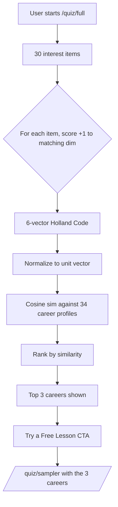

## BuzzFeed quizzes are not assessment

"Which Disney princess matches your work style?" is entertainment. It produces engagement, not direction. Most career quizzes that ship as features for engagement metrics fall in the same bucket — they're optimized for completion rate and shares, not for telling somebody something true.

> [!NOTE]
> Engagement metric ≠ assessment quality. A quiz can be 100% completion rate and 0% useful for the question it pretends to answer.

We wanted assessment. The user comes to Qualora because they want to figure out what to do with the next phase of their working life. A quiz that hands them a vibes-based answer is worse than no quiz — it produces false confidence and routes them toward courses that don't actually fit.

The standard for "real career assessment" already exists. We didn't have to invent it. We just had to implement it correctly.

## O*NET as the assessment standard

**O\*NET** is the US Department of Labor's occupation database — a free, open, public-domain resource maintained by the National Center for O\*NET Development. State workforce systems, community colleges, and federal employment programs use it as the canonical career data source.

O\*NET ships a short-form interest profiler called the **Mini-IP**, built around the **RIASEC** model (also called Holland Codes after John Holland). Six dimensions. 30 questions in the short form. Real psychometric validation behind it.

| Dim | Code | One-liner |
|---|---|---|
| Realistic | R | Hands-on, tools, machinery, physical work |
| Investigative | I | Analytical, scientific, problem-solving |
| Artistic | A | Creative, expressive, unstructured |
| Social | S | Helping, teaching, healing, working with people |
| Enterprising | E | Leading, persuading, selling, building ventures |
| Conventional | C | Detail, data, organized, procedure-driven |

Every occupation in O\*NET has an interest profile — a 6-vector showing how strongly that career maps to each RIASEC dimension. So a Medical Coder is high-Conventional, high-Investigative, with a Realistic streak (handling physical records, working with diagnostic codes systematically). An EMT is high-Realistic, high-Social, high-Investigative.

Scoring a person's RIASEC vector and comparing it to occupation vectors is exactly the right shape of problem for cosine similarity. Which is what we did.

## Phase 1 — ship the funnel before the assessment

Before we built the actual O\*NET assessment, we shipped the **funnel** that would eventually sit on top of it.

Phase 1 deployed on **2026-04-15** (commit `a3b4ccb`). It added:

- "Try a Free Lesson" CTAs on the existing quiz results page
- A new `/quiz/sampler` page — a 3-career dashboard with visit tracking and a pick-your-favorite mechanic


No new assessment yet — the existing (less rigorous) quiz drove this. The point was to prove the funnel converted before paying the assessment-engineering cost.

This is a thing I keep having to relearn. The temptation is always to build the best version of the feature first. The right move is to ship the lowest-quality version that proves the funnel, and only invest in the feature itself once you've measured the funnel converting at any quality bar. Phase 1 had Phase 1 traffic data before we wrote a Phase 2 question.

<div className="my-12 rounded-2xl border border-brand-teal/30 bg-brand-teal/5 p-8">
  <h3 className="text-xl font-semibold text-white">See it live on Qualora</h3>
  <p className="mt-3 text-white/70">Career-aligned courses, free lesson sampler, no signup needed to try.</p>
  <Link href="https://qualora.io/quiz/sampler" className="btn-primary mt-6 inline-flex">Try a free lesson</Link>
</div>

## Phase 2 — the actual O*NET assessment

Phase 2 went out the same day (commit `df771d5`). It added `/quiz/full` — the 30-question Mini-IP RIASEC implementation.



Each question is a single interest statement on a Like / Neutral / Dislike scale. Each Like scores +1 to the dimension that question targets. Five questions per dimension, 30 total. The user's resulting 6-vector is their Holland Code.

Reused everything from Phase 1 downstream of the result. The Phase 2 user lands on the same `/quiz/sampler` page, the same "Try a Free Lesson" hook, the same career-dashboard surface. We layered the better assessment on top of a funnel we already knew worked.

## Cosine similarity against 34 career profiles

Each of our **34 career profiles** has its own 6-vector backfilled from O\*NET-SOC occupation interest data. We compute cosine similarity between the user's vector and each profile vector. Top 3 by similarity become the matches.

```typescript
function cosineSimilarity(a: number[], b: number[]): number {
  if (a.length !== b.length) {
    throw new Error('Vector dimensions must match');
  }
  let dot = 0;
  let magA = 0;
  let magB = 0;
  for (let i = 0; i < a.length; i++) {
    dot += a[i] * b[i];
    magA += a[i] * a[i];
    magB += b[i] * b[i];
  }
  const denom = Math.sqrt(magA) * Math.sqrt(magB);
  return denom === 0 ? 0 : dot / denom;
}

function matchCareers(userVector: number[], profiles: CareerProfile[]) {
  return profiles
    .map((p) => ({
      slug: p.slug,
      title: p.title,
      similarity: cosineSimilarity(userVector, p.riasecVector),
    }))
    .sort((a, b) => b.similarity - a.similarity)
    .slice(0, 3);
}
```

That's the whole matcher at the math layer. Eleven lines. The thing that makes it work is not the code — it is that the 34 career-profile vectors are seeded from O\*NET-SOC, which is the dataset states use to make labor-policy decisions. The signal lives in the input data, not the algorithm.

## The verification numbers

Three test profiles, three verifications. Each profile is a clean Holland Code where the canonical O\*NET-recommended career is well-known. If our matcher reproduces those expected matches, the system is doing what it claims to do.

| Holland Code | Top match | Cosine sim | Expected? |
|---|---|---|---|
| ICR (Investigative-Conventional-Realistic) | Medical Coder | 99% | yes (canonical) |
| RSI (Realistic-Social-Investigative) | EMT | 98% | yes (canonical) |
| ESA (Enterprising-Social-Artistic) | Entrepreneurship | 98% | yes (canonical) |

Each of those is a textbook O\*NET match. ICR is the canonical Medical Coder profile (analytical + procedure-driven + handling physical/digital records). RSI is the canonical EMT profile (hands-on + helping + analytical under pressure). ESA is the canonical Entrepreneurship profile (selling + people-oriented + creative problem-solving).

Three matches at 98–99% is not noise. It is the system reproducing established, externally-verified mappings from a public-domain occupation database.

If the matcher had returned, say, "ICR → Welder, 87%," that would be a sign we had a bug — Welder is more Realistic-dominant. The fact that the canonical matches come back at 98%+ on canonical inputs tells us the vector seeding is faithful to the source data and the cosine math is doing what it should.

## Why Phase 1 first

The right order for revenue. If the funnel doesn't convert at any quality bar, an O\*NET-backed assessment doesn't fix it. We had Phase 1 traffic data before we wrote a Phase 2 question.

> [!TIP]
> Ship the funnel before the feature. The assessment can be the worst version of itself — vibes, BuzzFeed, anything that produces a top-3 careers result — as long as the downstream funnel is real. Then the feature work is investing in something you've already proven moves traffic in the direction you want.

Three takeaways for anybody building career assessment, education products, or really any "match the user to a recommended path" feature:

1. **Use the existing standard.** O\*NET is free, public domain, validated, and is the data state workforce systems are already using. If you're inventing your own framework, you're either inventing a worse O\*NET or marketing a brand around what amounts to the same six dimensions with different names.
2. **Cosine similarity is the right shape.** When you have a user-vector and a set of profile-vectors and want top-K matches, cosine similarity is the boring correct answer. Don't over-engineer it.
3. **Ship the funnel first.** The best assessment in the world doesn't help if the user has nowhere productive to go after the result page. Build the post-quiz funnel before you build the quiz.

Both phases shipped 2026-04-15. The O\*NET implementation has been live for two weeks at the time of this writing. The verification numbers above are from the matcher itself — same code path users hit.

If you've taken our quiz, the math above is what produced your results. If you haven't yet, the link's a few paragraphs up.
