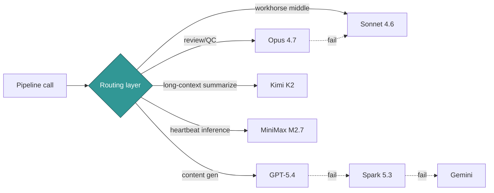
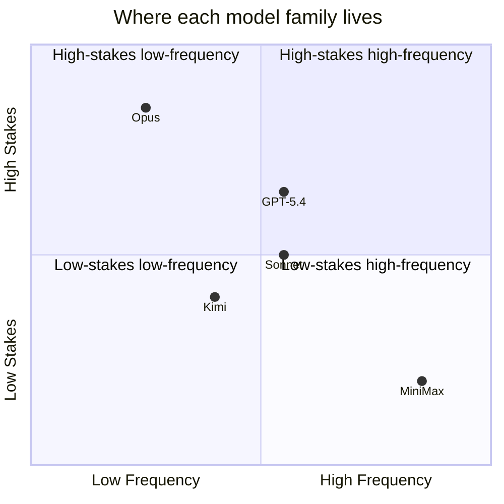

If you are running a fixed-budget AI studio, you cannot afford to route everything to the strongest model.

The interesting question is not which model is best. The interesting question is which model goes where. Best-model-per-call beats best-model-overall every time, because the cost difference between routing well and routing badly compounds across thousands of calls per day.

This is the routing layer I run today. Five model families, six call types, real production cost numbers, and the fallback chains that keep the whole thing bounded.

## Five families, one harness



The routing layer is the seam. The routing layer makes per-call decisions about which model to use, what reasoning level to spend, and what the fallback chain looks like if the primary fails.

The five families are wired through one harness because none of them is best at everything. Opus catches errors GPT-5.4 misses. GPT-5.4 produces content faster than Opus. Kimi handles long contexts cheaper than either. MiniMax runs heartbeat-rate inference for less than the price of a coffee per month. Sonnet is the workhorse middle that fills the gaps.

If I tried to route every call to Opus, I'd be out of budget in a week. If I tried to route every call to MiniMax, my audit calls would miss things that matter. The routing layer is the answer to "how do you afford to ship this much content."

## The model card

One paragraph per family. What it's good at. What it costs. Where it fails.

| Family | Sweet spot | Weakness | Cost shape |
|---|---|---|---|
| **Opus 4.7** | Review, QC, audit. Catches errors others miss. Strong at structured output and following audit rubrics. | Expensive per call. Slower than the alternatives. Overkill for content gen. | Highest per-token of any in the stack. |
| **GPT-5.4 (via Codex)** | Content gen with reasoning. Fast at `low` and `medium` reasoning. Good at code-adjacent prose. | `xhigh` is a footgun for non-audit calls (see [the config post](/blog/one-config-line-slowed-the-studio)). | Mid-range; reasoning level dominates cost. |
| **Kimi K2** | Long-context summarize. Cheap on input tokens. Reads 100k+ token windows without choking. | Multi-hop reasoning is shaky. Don't use for audit. | Cheap on input, mid on output. |
| **MiniMax M2.7** | Heartbeat-cheap inference. High-frequency low-stakes loops. The model behind Hydra's research queue. | Single-shot reasoning is shallow. Wrong model for one-shot critical decisions. | $30/month for 15K calls/window. |
| **Sonnet 4.6** | Workhorse middle. Code review. Classifier. Anything that needs to be cheaper than Opus and smarter than Kimi. | Nothing it's actively bad at; nothing it's actively best at. | Mid-range. |

The pattern: each family has a niche where it dominates. The routing rule is "match the niche to the call type."

## Call-type taxonomy

Six call types. Each one has a primary, a secondary, and a fallback.

| Call type | Primary | Secondary | Fallback | Reasoning effort |
|---|---|---|---|---|
| **Content gen** (course lessons, blog drafts) | GPT-5.4 | Spark 5.3 | Gemini | `low` |
| **Audit** (numeric preservation, contamination scan) | Opus 4.7 | Sonnet 4.6 | halt | `high` |
| **Classify** (domain routing, contamination tags) | Sonnet 4.6 | Kimi K2 | halt | `low` |
| **Summarize** (long-doc digests, syllabus → outline) | Kimi K2 | Sonnet 4.6 | GPT-5.4 | `low` |
| **Code** (script generation, refactor proposals) | GPT-5.4 | Sonnet 4.6 | halt | `medium` |
| **Review** (QC pass before publish, agent output check) | Opus 4.7 | Sonnet 4.6 | halt | `high` |

The taxonomy is the routing rule. The model selection follows from the taxonomy, not the other way around.

When somebody on the team asks "which model should I use for X," the answer is not a model name. The answer is "what call type is this?" Once you know the call type, the model is determined. The discipline is in classifying the call correctly.

## Per-call `reasoning_effort`

Reasoning effort is the dimension that confuses people most.

The lesson from [the config post](/blog/one-config-line-slowed-the-studio) is that reasoning level barely affects content-gen latency but dominates audit latency. Spending high reasoning on content gen is mostly wasted. Spending low reasoning on audit costs you the errors the audit was supposed to catch.

The per-call rule:

- **Content gen** → `low`. Throughput wins.
- **Classify** → `low`. Classifications don't need depth; they need volume.
- **Summarize** → `low`. Summarization is a compression task; reasoning doesn't help much.
- **Code** → `medium`. Code benefits from a bit more reasoning, especially on refactor decisions.
- **Audit** → `high`. Audits earn the reasoning budget.
- **Review** → `high`. Same.

`xhigh` is not in the table. `xhigh` is a one-off override for specific audits where the cost of a missed error is high enough to justify the latency. It is never a default. It is never set globally.

The previous post covered why. Setting `model_reasoning_effort = "xhigh"` globally in `~/.codex/config.toml` was the bottleneck for an entire studio's worth of throughput for weeks. The lesson is that reasoning is a per-call decision, full stop.

## MiniMax M2.7 as heartbeat-cheap inference

MiniMax is the family in this stack that surprises people most.

Hydra (my multi-strategy trading desk) runs on MiniMax. The numbers: 4.5s per call, $30/month, 15K calls per window, started at roughly 1% utilization (31 calls per hour against a 3000 calls per hour ceiling).



MiniMax sits in the bottom-right: high-frequency, low-stakes. That's where it earns its keep. It's the right model for tight loops where you need an inference every few seconds and the cost of a single shallow answer is roughly nothing.

It's the wrong model for one-shot reasoning. If you need a single answer that has to be right, do not call MiniMax. The shallow-but-cheap profile is the whole point; trying to use it for review or audit is using a hammer to drive screws.

The pattern that works: route any high-frequency low-stakes inference to MiniMax. Examples include: heartbeat probes for agent liveness, novelty hashes on agent output, light classification of incoming events, "should this trigger a deeper review?" gates. None of those needs Opus. All of them benefit from MiniMax's cost structure.

## Fallback chains

Two real fallback chains, side by side.

```mermaid
flowchart LR
    subgraph content_gen["Content gen chain"]
        A1[gpt-5.4@low<br/>~$0.04/call] -->|fail| A2[Spark 5.3<br/>~$0.02/call]
        A2 -->|fail| A3[Gemini<br/>~$0.01/call]
        A3 -->|fail| A4[halt + queue]
    end
    subgraph review["Review chain"]
        B1[Opus 4.7<br/>~$0.35/call] -->|fail| B2[Sonnet 4.6<br/>~$0.07/call]
        B2 -->|fail| B3[halt + queue]
    end
```

Each chain is a cost-bounded recovery. Each link is cheaper than the last. The last link is "halt and queue for human review," not "keep retrying forever."

The shape is intentional. When the primary fails, falling through to a cheaper alternative gives the run a chance to complete, but at lower quality. The operator gets to decide whether that lower-quality result is acceptable, or whether it should be re-run on the primary later. That decision is logged. Nothing happens silently.

The review chain is shorter than the content-gen chain because there are fewer credible fallbacks for review-quality output. If Opus and Sonnet both fail, falling through to a third tier is a worse decision than halting and queuing. Halt is a legitimate end of the chain.

## The metric that actually matters: cost per accepted output

The number that matters is not cost-per-call. The number that matters is cost-per-*accepted*-output, which factors in retries.

A call type with a 95% accept rate has a cost-per-accepted-output close to its cost-per-call. A call type with an 80% accept rate has a cost-per-accepted-output that's 25% higher than naive cost-per-call would suggest. The 5% of calls you re-run are real money.

The takeaway: accept rate is part of the cost model. A model that's 20% cheaper but has a 70% accept rate is worse than a model that's 20% more expensive at 95% accept rate. Cost-per-call is a vanity metric. Cost-per-accepted-output is the metric that survives a budget meeting.

In practice this means tracking three numbers per call type, not one:

1. **Cost per call** — the model's list price applied to your prompt + completion size
2. **Accept rate** — the fraction of outputs that passed your validator and reached the user
3. **Cost per accepted output** — (1) divided by (2), the only number worth reporting

We log these per call into a usage file (`usage/claude-dispatch.jsonl` and similar). Once a month the numbers get re-checked and the routing matrix gets adjusted. A model that drifts on accept rate gets demoted from primary to fallback, even if its list price is unchanged.

## When to consolidate (and why I won't yet)

There is a credible case for consolidating to a single vendor.

| Consolidate now | Hold multi-vendor |
|---|---|
| Operational simplicity. One SDK, one config, one billing. | Per-call optimization. Different families dominate different niches. |
| Easier to negotiate enterprise pricing. | Vendor risk. Single-vendor outage = full pipeline halt. |
| Fewer integration surfaces to maintain. | Fallback safety. Multi-vendor = real fallback chains. |
| Engineers spend less time on routing logic. | Capacity planning. Different vendors have different rate-limit shapes. |
| One support relationship. | Cost ceiling. Per-call routing keeps spend bounded. |

I'm not consolidating yet, and I want to explain why.

The strongest argument for staying multi is fallback safety. When `gpt-5.4` rate-limits at the wrong moment, falling through to Spark and Gemini keeps the pipeline moving at lower quality instead of halting. Single-vendor doesn't have a credible fallback. If the vendor is down, you are down.

The second-strongest argument is per-call optimization. The cost difference between Opus on review and MiniMax on heartbeat is two orders of magnitude. Consolidating means accepting a worse cost profile on at least one of those niches, probably both.

The argument for consolidating is real. Operational simplicity is not nothing. Fewer SDKs and config files would be genuinely easier. But the leverage of routing well is bigger than the cost of routing across five families.

I will revisit this when one of three things happens:
1. A single vendor's product matrix actually dominates across all six call types (it doesn't yet).
2. Operational complexity of multi-vendor exceeds the cost savings of routing well (it doesn't yet).
3. A vendor offers an enterprise contract with rate guarantees that close the fallback-safety gap (none have offered that yet).

Until then: five families, one harness, per-call routing, fallback chains. The routing layer is what makes the rest of the studio possible.

If you are running a fixed-budget AI shop and you find yourself routing everything to the strongest model, the leverage is in routing better, not in finding a stronger model. The strongest model isn't the one your budget rewards. The strongest routing is.

<div className="my-12 rounded-2xl border border-brand-teal/30 bg-brand-teal/5 p-8">
  <h3 className="text-xl font-semibold text-white">Get the next AI Lab post</h3>
  <p className="mt-3 text-white/70">One post a month on real production AI. No fluff. The series so far covers the agent harness, the bypass casualty, the operator role, the config bottleneck, the work-order field manual, and now the routing matrix.</p>
  <a href="/ai-lab" className="btn-primary mt-6 inline-flex">Subscribe to AI Lab</a>
</div>
