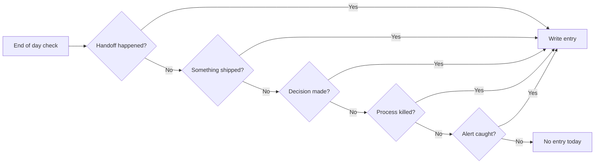

# Why I Keep a Daily Memory File (and Read It Back to the AI Every Morning)

Every fresh AI session starts at zero. System prompts can hold a few thousand tokens of identity and convention; they can't hold three months of decisions, ships, and reversals. So when a fresh session starts, the AI re-derives state from scratch — and gets it wrong, because the state was never fully recoverable from the codebase alone.

The fix is not a longer context window. The fix is a **daily memory file** — written for the next session of the AI, not for me — that brings a fresh agent up to current state in 30 seconds.

> [!IMPORTANT]
> The amnesia problem is not solved by bigger context. It is solved by writing receipts. The audience of the daily memory file is not you, six months from now. It is the AI session you boot ten minutes after this one.

## The format — one paragraph per event, timestamped

Every entry: timestamp, event type, one paragraph. No journal-style reflection. No "today I felt." Just what happened and what changed.

```markdown
# 2026-04-29 — Daily Memory

## 09:14 — Decision
Decided to ship the visual-archetype v2 rollout to the pipeline this week.
Threshold: 39/39 canaries must pass before merge. Rollback plan: revert
the visual_archetype step from STEP_ORDER in pipeline.py and re-run on
two test courses.

## 11:32 — Ship
Bulk SQL strip for TAACCCT contamination shipped. 212 affected courses
flipped to draft for re-audit. Commit 8ad84ac8. Canary added at
canaries/taaccct_contamination.py.

## 14:05 — Killed process
Disabled Scout cron line (was 0 */6 * * *). Reddit account doesn't exist
yet; agent was generating cost without output. Will re-enable after Petra
warmup phase completes.

## 16:47 — Alert
Ad revenue on Empire Tycoon dropped to $0.41 today (peak day was $7.11).
Not a product change — checked AdMob dashboard, ad-fill rate down across
the network. No action; will revisit if it persists 3+ days.
```

Five entry types cover every load-bearing change. If none of those types fired today, the day doesn't earn an entry.

## Five triggers that earn an entry



| Trigger | Definition | Example |
|---|---|---|
| Handoff | Work crossed agent boundaries | Work order routed from Walt to Chip |
| Ship | Something deployed or merged | Bulk SQL strip commit landed |
| Decision | A path was picked from options | Chose v2 rollout this week |
| Killed process | A running thing was stopped | Disabled Scout cron line |
| Alert | A problem was caught | AdMob fill rate drop |

If the day was just normal grind with no triggers, that's a real signal — the file stays empty. Empty days are data too.

## Why markdown, not a database

| Storage | Diffable | Greppable | Portable | Survives tool change |
|---|---|---|---|---|
| Markdown | Yes | Yes | Yes | Yes |
| SQLite | Limited | Limited | Yes | If you keep the file |
| Notion | No | Limited | Limited | No |
| Obsidian DB | Limited | Yes | Yes | Limited (vault-shaped) |

Markdown wins because it survives me forgetting about the system. A database needs a schema, an export tool, a backup story, and a whole tool stack that can read the schema. A directory of timestamped markdown files survives tool churn, OS migrations, and my own decision to switch editors. `git log` is the audit trail.

## The compound — 101 files, ~90 days of receipts

Started 2026-02-01. Today (2026-04-29) the directory has 101 daily files.

```text
$ ls memory/ | grep -E '^[0-9]{4}-' | wc -l
101
$ ls memory/ | grep -E '^[0-9]{4}-' | head -5
2026-02-01.md
2026-02-02.md
2026-02-03.md
2026-02-04.md
2026-02-05.md
$ ls memory/ | grep -E '^[0-9]{4}-' | tail -5
2026-04-25.md
2026-04-26.md
2026-04-27.md
2026-04-28.md
2026-04-29.md
```

When I want to know "what did we change about the modernize step in early March?" the answer is a `grep` away. Twenty seconds, full context. No re-derivation, no guessing, no asking the AI to reason from first principles about a decision the AI itself was part of three weeks ago.

## The orient skill that bootstraps a fresh session in 30 seconds

The daily memory layer is paired with a small skill called `orient`. When a fresh session starts, the operator (or the agent itself) invokes `/orient`. The skill reads the latest 7 daily files plus the MEMORY.md index, generates a status briefing, and returns it as context.

```text
$ /orient

=== Last 7 days of activity ===
2026-04-23: Caught TAACCCT contamination (212 courses); shipped strip_grant_boilerplate.py
2026-04-24: Bulk SQL strip; HIT 101/105 image-quality fixes (Bug 18, Bug 19)
2026-04-25: Pipeline bypass + extraction-gap audit; Walt alert filed
2026-04-26: qualora-visuals v2 renderer shipped (companion commit)
2026-04-27: Glossary dedup audit (2,523 redundant rows across 205 courses)
2026-04-28: Glossary dedup ship; partial unique index applied
2026-04-29: Visual-archetype v2 rollout decision; AdMob fill alert

=== Active workstreams ===
- qualora-pipeline: visual-archetype v2 rollout (this week)
- empire-tycoon: $339.56 lifetime, 37 buyers; endgame design
- petra: warmup phase, 3 comments/day cap

=== Active blockers ===
- Scout/Ivy disabled, awaiting Petra warmup completion
- Storyline 2+ HTML5 extractor (3 medical-series courses blocked)
```

Fresh AI session goes from zero to current state in one command. The session can then write its own dated memory file by end of day, and the next session boots with the context the previous session generated.

## The compounding loop

```mermaid
flowchart LR
    Boot[Session boot] --> Orient[/orient skill]
    Orient --> Read[Read last 7 dailies + MEMORY.md]
    Read --> Work[Session does work]
    Work --> Write[Write today's daily file]
    Write --> Sleep[Session ends]
    Sleep --> Boot
```

Each loop adds one file. The compound after a year is 365 files of receipts. The cost is one paragraph per trigger. The savings are every re-derivation that didn't happen.

## TEMPLATE-DAILY.md as starting kit

The skeleton is just markdown. Copy, change date, fill in entries when triggers fire, leave empty when they don't.

```markdown
# YYYY-MM-DD — Daily Memory

## HH:MM — [Handoff | Ship | Decision | Killed process | Alert]
[One paragraph. What happened. What changed. What needs to be true tomorrow.]

## HH:MM — [trigger]
[...]
```

That's the entire template. The discipline of the format does the compounding work. The audience of the file is the AI session ten minutes from now, the day after, and three months from today.

<div className="my-12 rounded-2xl border border-brand-teal/30 bg-brand-teal/5 p-8">
  <h3 className="text-xl font-semibold text-white">Get the next AI Lab post</h3>
  <p className="mt-3 text-white/70">The lab covers memory architecture, agent design, and the routing stack behind a one-person studio. New post every couple of weeks.</p>
  <Link href="/ai-lab" className="btn-primary mt-6 inline-flex">Subscribe</Link>
</div>
