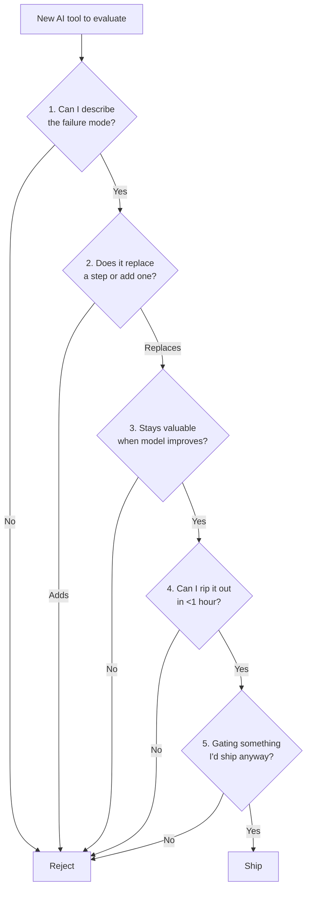

# How I Decide Whether to Ship or Pause an AI Tool

Three threads in my feed last week pitched me "the next must-have AI tool." I tried two and shipped neither. The deciding factor wasn't ROI — ROI is too easy to project on a slide. It was a different question:

**Can I describe how this tool fails?**

If I can't describe the failure mode, I can't operate it. If I can't operate it, it doesn't ship. Five questions — three minutes per tool — and most of them get filtered out before I write a line of integration code.

> [!NOTE]
> ROI is downstream of operability. A tool that earns 10x in projection but breaks in ways I can't diagnose costs more than a 2x tool I can ripcord in an hour.

## The five questions



Each question rejects a different failure mode. Every "no" is a stop. Tools that make it through all five are tools I can operate end to end without surprise.

## Shipped — DeepInfra Llama-3.2-90B-Vision PDF OCR

The pipeline ingests image-only scanned PDFs from public-domain course archives. Default PDF text extraction returns zero words on those. DeepInfra's vision model reads them at roughly $0.001 per page.

Walked through the five questions:

1. **Failure mode** — Vision OCR returns junk on rotated pages or low-contrast scans; we detect via a word-count floor and route to a fallback extractor.
2. **Replaces a step** — Replaces the previous "skip image-only PDFs" non-step. Net change: more content in, same downstream contract.
3. **Stays valuable when models improve** — Yes. The vision model is a swap-in; a better one drops in tomorrow at the same call site.
4. **Rip out in under an hour** — Yes. Single dispatch call in `extract_pdf.py`, behind a feature flag.
5. **Gating shippable work** — Yes. HIS-280 went from 0% real content to 100% real content the day this shipped.

```python
# extract_pdf.py — OCR fallback decision (simplified)
text = extract_pdf_text(path)
if word_count(text) < THIN_PDF_THRESHOLD:
    text = pdf_ocr_via_deepinfra(path)  # ~$0.001/page
return text
```

Shipped 2026-04-14. Net cost on the first 1,710-word OCR'd PDF: $0.008. The integration paid for itself the first hour it ran.

## Rejected — a no-name "AI agent CLI"

Trending on Twitter. Promising demos. Lots of replies.

Failed Q1: I could not describe how it would fail in a long-running production setup. The failure mode in the demo videos was "agent gets confused, you reset the session" — which is fine for a demo and unworkable for a cron job.

Failed Q4: rip-out estimate was a multi-day rewrite because the tool inserted itself into the middle of the orchestration layer instead of sitting on the edge.

> [!CAUTION]
> Tools that wrap your orchestration layer become load-bearing in days. Tools that wrap a single capability (vision, transcription, classification) stay swappable forever. Bias toward the second.

The other red flag was that the tool's own docs didn't explain what to do when it returned garbage. That is a Q1 failure dressed up as a UX problem. I closed the tab.

## The Qwen3-32B local model — kept on tap, never primary

Local model on the M4 Pro. Benchmarked at 86 tok/s prefill and 9.8 tok/s gen. Usable. Cheap.

It passed Q1-Q4 cleanly. It failed Q5: nothing in the production pipeline was gated on having a local model. Codex Spark via the API was already faster, smarter, and acceptable on cost for everything the production pipeline needed.

So Qwen sits in the routing chain as a fallback for offline tasks, never as primary:

```text
Routing rule (input <1500 tokens):
  Codex Spark   → primary (cloud, fast, cheap)
  Qwen3-32B     → fallback if Codex unavailable
  MiniMax M2.7  → ultra-cheap chained inference (high-frequency only)
```

It's a tool I keep installed because someday I'll need it, not because it ships work today. That's a real category — "kept on tap" is a legitimate decision that isn't "ship" and isn't "rip out."

## The meta-rule: compounding tools beat model wrappers

The five questions correlate strongly with one underlying property: **does this tool add domain knowledge, or does it wrap a model's chat interface?**

| Compounding tool | Model wrapper |
|---|---|
| Vision OCR pipeline | "Chat with your PDFs" UI |
| Embedding index | Yet another agent CLI |
| Audit-log indexer | Prompt-template library |
| Domain-specific extractor | Generic "assistant" frame |

When GPT-6 ships, the wrappers degrade overnight. The compounding tools — the ones that add a specific piece of pipeline plumbing — keep working because they encode work that the model itself doesn't do.

Most days, that's the only filter that matters. The five questions are how I make sure I'm honest about which side the new tool is actually on.

<div className="my-12 rounded-2xl border border-brand-teal/30 bg-brand-teal/5 p-8">
  <h3 className="text-xl font-semibold text-white">Get the next AI Lab post</h3>
  <p className="mt-3 text-white/70">The lab covers tool decisions, agent failure modes, and the routing stack behind a one-person studio. New post every couple of weeks.</p>
  <Link href="/ai-lab" className="btn-primary mt-6 inline-flex">Subscribe</Link>
</div>
