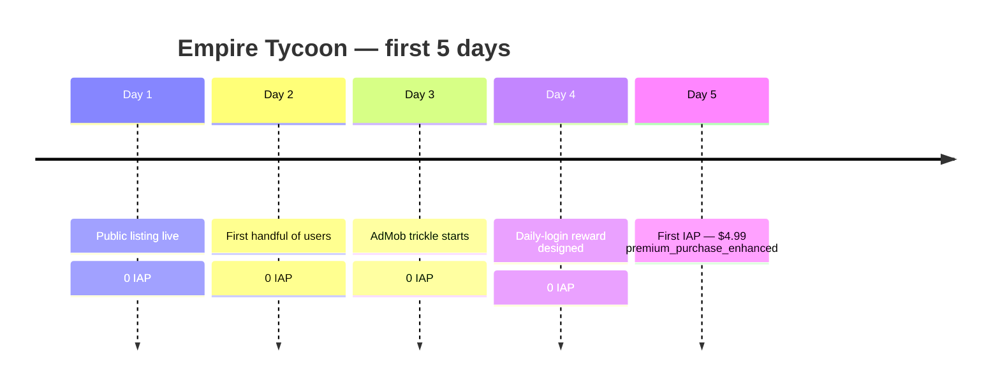

# The Day Empire Tycoon Made Its First Dollar

On Day 5 of a 30-day revenue challenge, somebody I have never met paid Empire Tycoon $4.99.

That was the first dollar. Then the second through fifth, all at once. One transaction, one buyer, and a single line in the scoreboard that ended a long stretch of running ads against an audience of one.

Here is what that line looked like, copied from `scoreboard.json`:

```text
2026-02-05  premium_purchase_enhanced  $4.99  Manual report from Steve
```

Five dollars and a manual report. That is the entire artifact.

## What the price told me

The buyer picked the entry tier. The bundle was right there in the IAP carousel — `starter_bundle` at $22.60, `pp_pack_large` at $25.55 — and they walked past both for the cheapest non-rewarded purchase in the game.

> [!NOTE]
> First conversions tell you what the funnel offers, not what the buyer wants. They picked $4.99 because the higher tiers had no story attached to them yet. By Day 90, the entry tier carried the line: 15 of 37 total IAP buyers.

The bundle wasn't earning trust because nothing in the game had earned the bundle yet. New player, new account, fifth day live — they wanted the smallest possible commitment that proved the IAP worked. Which is exactly what an entry tier is for.

## What the timing told me

Day 5. Not Day 30, not "after a week of free play converts to engaged user." A stranger downloaded an unsigned-feel idle game from a no-name studio and paid for premium content within the first session window.



I had been planning the conversion funnel around a "let them play for a week first" assumption that turned out to be wrong. First-session intent is real. If your game has a clear hook in the first 20 minutes and a credible reason to spend, some percentage of users will spend that day. Most won't ever come back to spend if they didn't spend then.

## The contrast with the AdMob trickle

The same week, ad revenue was running cents per day. The peak day didn't arrive until Feb 13 (eCPM $30.00) — eight days later. On Day 5 specifically, AdMob earnings were noise. The single IAP purchase was worth roughly thirty days of ad revenue at the rate ads were running at that moment.

That reframed the rest of the 90-day arc. The dashboards I had been building optimized for ad eCPM and impression count. After Day 5, the dashboards I actually checked first thing in the morning were the IAP funnel and the last-IAP-purchase timestamp.

## The one thing I changed the next day

The IAP prompt had been firing on the prestige screen — once a player completed their first prestige reset. The first buyer never prestiged. They saw the entry-tier offer because I had also planted it in the post-build summary screen as a secondary placement, almost as an afterthought. That placement is where the conversion happened.

So on Day 6 I moved the post-build placement earlier in the loop, made it the primary placement, and pushed the prestige-screen prompt to secondary. Buyer-activation jumped on the change. By Day 90 the same SKU had carried 15 buyers.

<div className="my-12 rounded-2xl border border-brand-teal/30 bg-brand-teal/5 p-8">
  <h3 className="text-xl font-semibold text-white">See what 37 strangers paid for</h3>
  <p className="mt-3 text-white/70">Empire Tycoon is the idle-game side of the studio that turned a $4.99 first sale into a 90-day revenue line. It's free, monetizes with rewarded ads and IAPs, and runs on Android.</p>
  <Link href="https://play.google.com/store/apps/details?id=com.go7studio.empire_tycoon" className="btn-primary mt-6 inline-flex">Get Empire Tycoon</Link>
</div>

The first dollar was a manual report from a scoreboard that had been showing zeros for a week. The lesson wasn't "I made money." It was that pricing, placement, and timing assumptions I had baked into the funnel were all wrong, and a single buyer told me so.

The 90-day total ended at $339.56. Day 5 was the day I stopped guessing and started reading the data.
