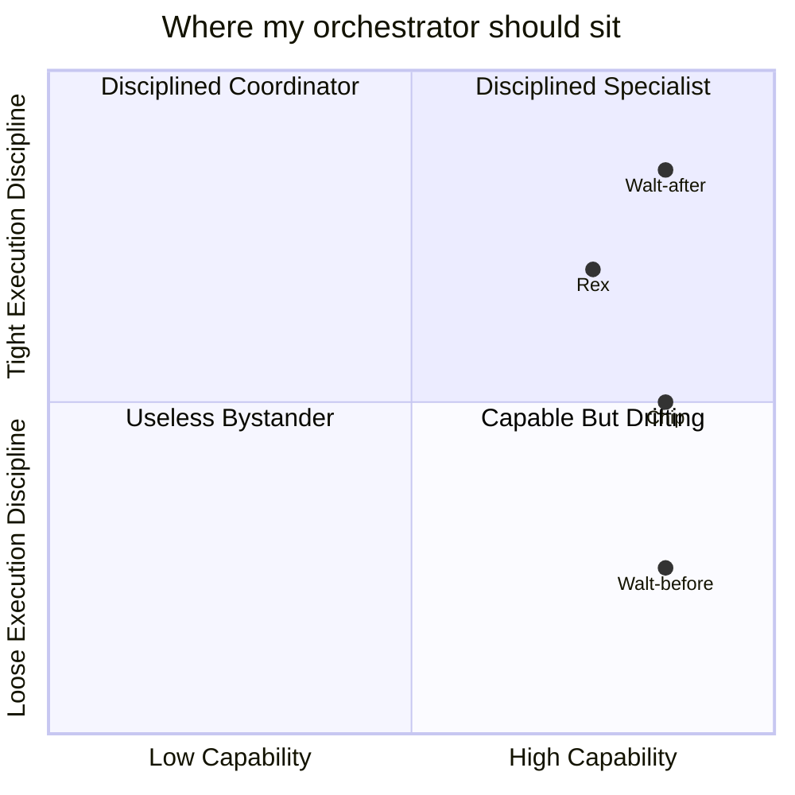

I caught Walt drafting SQL at 2 AM. He looked proud of it.

```text
[Walt 02:14] One sec, I'll write the migration query.
SELECT id FROM pipeline_items
WHERE used_force_route = TRUE
  AND intent_extract_surviving_words = 0;
```

The query was small. The query was correct. I was about to celebrate.

Then I remembered Walt is my orchestrator. Walt's job is to route work, not to do it. He had quietly switched seats, and the rest of the studio didn't notice because the answer looked right.

That is the moment I started fixing the orchestrator default.

## The orchestrator default

Capable orchestrators default to executing. They were trained on examples where helpful equals doing. In chat, helpful looks like answering the question.

In a multi-agent setup, helpful does not look like that. Helpful looks like routing the question to the agent who owns it, attaching the right context, and reviewing the output.

The capability is the trap. An orchestrator is usually sharp enough to write the SQL itself, draft the migration, read the file and propose the patch. So it does. Every time, it accumulates context it does not need, and the context degrades the next routing decision.



Walt-before sat in the bottom-right. Capable, but executing freely. Walt-after sits in the top-right. Capable, but disciplined into routing only. Same model, same context window — just a tighter sense of what the role is for.

## Operator-as-browser

The mental model I now use is operator-as-browser.

Walt is a browser. Walt opens tabs. Each tab is a specialist. Walt writes a one-page brief into each tab, waits for the output, reviews it, and decides what to do next.

Walt does not author files in the production repos. Walt does not run `npm install`. Walt does not edit `state/*.json`. Walt does not write SQL at 2 AM, no matter how small the query is.

Chip writes the code. Rex audits it. Winnie ships the courses. Max runs the pipeline. Walt routes between them and reviews their outputs against the work order.

The flip from "Walt is a worker" to "Walt is a browser" is the single change that produced the most measurable improvement in my multi-agent setup. Routing decisions got better. Specialist outputs got more focused. The "wait, why did Walt do that?" debugs dropped to roughly zero — which, if you have been there, is the metric that actually matters.

## The 7K hot-token rule

The reason routing decisions degrade when the orchestrator works is hot-token accumulation.

Walt has a working context budget. Below roughly 7K hot tokens, Walt routes well. Above 7K, Walt starts answering questions instead of dispatching them. The count creeps up every time Walt reads a file, drafts a paragraph, or runs a query — every "small" piece of work the orchestrator quietly absorbs.

| Context size | Walt's mode | Observable behavior | Failure mode |
|---|---|---|---|
| 0–2K hot tokens | Pure routing | Reads work order, picks specialist, writes brief, hands off | None observed |
| 2K–7K hot tokens | Mixed routing + light review | Routes most work, reviews outputs, occasionally asks clarifying questions | Slight latency on routing; usable |
| 7K–15K hot tokens | Drift toward execution | Starts drafting answers itself, paraphrases work orders, skips specialists | Routing accuracy drops; specialists get stale briefs |
| 15K+ hot tokens | Full executor mode | Writes code, runs SQL, edits state files, declines to hand off | The 40K-token mess. Specialists go idle. |

I now treat 7K as a hard ceiling. When Walt approaches it, I either rotate the working context (drop completed tasks from the in-flight list) or hand control to a fresh Walt instance with a clean brief.

The slogan I keep coming back to is *operator is a budget, not a worker*. The budget is what keeps the role coherent. Above the budget, the role collapses into "smart agent that does whatever seems useful next" — which is the exact failure mode the role exists to prevent.

## Five fire-able-agent signals

When to fire your orchestrator from a task. These are the signals I watch for now — most of them showed up in the first week of taking the discipline seriously.

| # | Signal | Example | What I do now |
|---|---|---|---|
| 1 | Produces a "small correct" artifact for a specialist's domain | Walt drafts SQL at 2 AM | Halt. The query goes in a work order to Chip. |
| 2 | Overrides a classifier "because I know better" | Walt forces a route the classifier flagged as not-applicable | Halt. The override needs to be a commit with a reason. |
| 3 | Misses a feedback loop | Operator says the previous output was wrong; Walt does not update the brief before the next handoff | Halt. The new brief must reference the rejection. |
| 4 | Scope creep | Walt adds an unrequested feature ("while I was in the file, I also fixed...") | Halt. Out-of-scope work goes in a separate work order. |
| 5 | Silent execution | No work order, no log line, just an output | Halt. Every action is a commit; there is no silent path. |

By month two, signals 1 and 4 had disappeared from the logs. Signal 5 is the one I still watch most carefully — silent execution is the easiest mode for a capable agent to fall back into, and the hardest to catch after the fact.

## Work orders that survive handoff

The format that turned Walt from a worker into a coordinator is four lines.

```markdown
**Objective:** One sentence. Present tense. Outcome.

**Acceptance:**
- 3-5 testable bullets.
- Each one checkable without asking a human.

**Files:**
- explicit/path/to/file.ts
- (the agent may not touch anything outside this list)

**Branching:**
- halt-with-note if the work doesn't apply
- route-to-{agent} if the work belongs elsewhere
- requeue-with-blocker if a dependency is missing
```

Each of those four lines prevents a specific failure mode, and each took me a few weeks to get right — there's a separate field manual coming on the format. For now: Objective is the contract, Acceptance is how the contract is verified, Files is the scope, Branching is the legal way to refuse.

The format gives Walt a way to communicate intent without doing the work. The format gives Chip a way to receive intent without guessing. The format gives Rex a way to audit the result without reconstructing the original goal from chat history.

## Three commits I now forbid my orchestrator

> [!IMPORTANT]
> Walt cannot commit to `repos/`. Walt cannot run `npm install`. Walt cannot edit `state/*.json` directly.

Walt's git history in the production repos is empty by design. Every code change goes through Chip. Every dependency change goes through Chip. Every state-file mutation goes through whichever specialist owns that state.

This is a permission system, not a suggestion. The harness I wrote about in the previous post enforces it at the file-system layer: Walt's inbox can write work orders to `inbox/chip/` but cannot write to `repos/`. The constraint is mechanical. Walt cannot violate it even if Walt wants to.

Walt's job is now small, legible, and stable. The 40K-token mess turned into a 7K-token coordinator, and the studio ships more.

If you are running a multi-agent setup where the orchestrator keeps drifting into execution, the fix is almost never a smarter orchestrator. The fix is a tighter scope.

This is the kind of small-studio plumbing we work on at Go7Studio's AI Lab — boring on paper, decisive in production. If you're stuck inside one of these messes and want a second pair of eyes, [tell us about it](/contact). And if you'd rather just read more of them:

<div className="my-12 rounded-2xl border border-brand-teal/30 bg-brand-teal/5 p-8">
  <h3 className="text-xl font-semibold text-white">Get the next AI Lab post</h3>
  <p className="mt-3 text-white/70">One post a month on real production AI. Next up: the work-order field manual — the four-line preamble that survived 12 months of agent handoffs, and the failure mode each line prevents.</p>
  <a href="/ai-lab" className="btn-primary mt-6 inline-flex">Subscribe to AI Lab</a>
</div>
