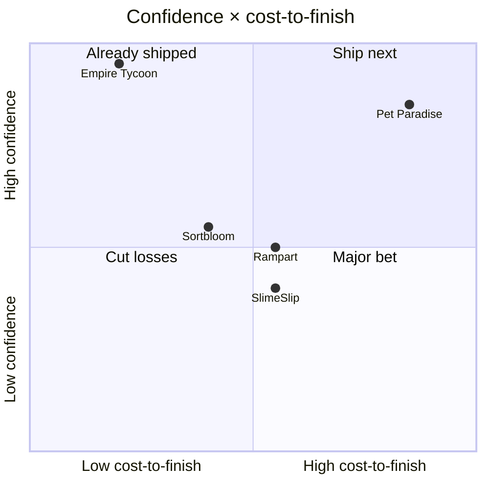
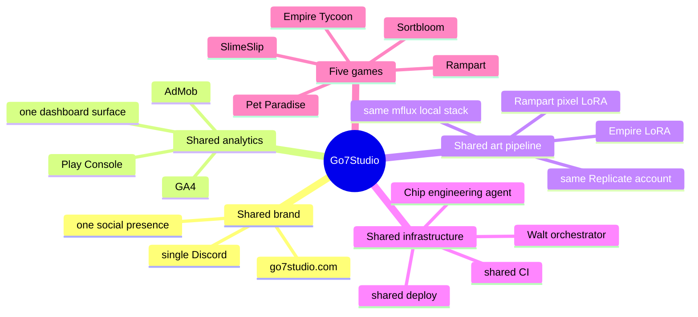
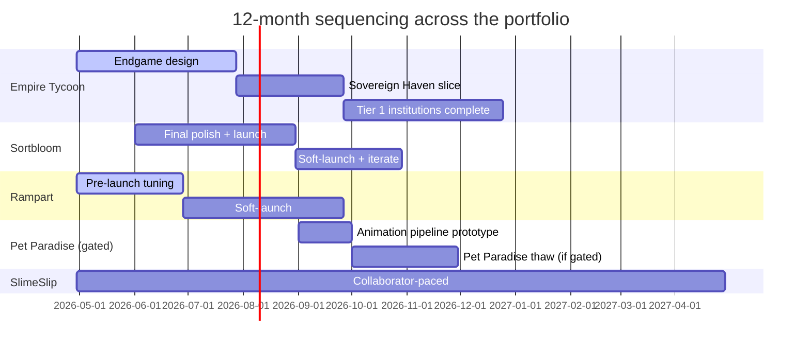

# A Five-Game Portfolio for a One-Person Studio

Conventional advice for solo developers: pick one game and go deep. The advice has a real basis — divided attention is the most common failure mode for indie devs, and most solo studios that try to ship multiple titles end up shipping zero.

I run five anyway. Not because I disagree with the advice, but because the cost of running a second, third, fourth, and fifth game is much lower than the advice assumes — *if* the studio is built around shared infrastructure. And because for a solo studio, picking the one bet is the highest-variance decision you can make. The portfolio is variance reduction.

This post is the five games, why each one is at the stage it's at, the four cost-controls that make a five-game portfolio operable for one person, the kill criteria that keep paused games from drifting into abandoned, and the sequence that ties it all together.

## The five at a glance

| Game | Stage | Status | Expected role |
|---|---|---|---|
| Empire Tycoon | Live | $339.56 lifetime, 37 buyers, monetizing | Revenue driver; pays the studio's daily costs |
| Sortbloom | In development | ASO-rebranded from Stakd; Zen-Garden sort puzzle | Casual-puzzle ship after Empire's next phase |
| SlimeSlip | In development (60-70%) | Casual platformer, paced for a learning collaborator | Slow-burn project |
| Pet Paradise | On hold (80-90%) | Pet-breeding mutation system on Roblox | Highest-upside; gated on 4 resume conditions |
| Rampart | Pre-launch | Wave-defense title; in development | Pre-launch hold; ships when soft-launch metrics justify |

Five entries, five different stages, one shared studio. None of these are "abandoned." All are at the stage that's currently right for them, given the daily revenue, the time budget, and the resume gates I've written.

## Why one bet is too many bets

A solo studio can't predict the hit. The picker is wrong more often than it's right. That's not a flaw in the picker — it's the base rate for indie games. Three of every four shipped solo games earn under a thousand dollars lifetime. The probability that *my* one bet is the one that breaks the trend is, all things equal, about one in four.

Portfolio strategy doesn't fix that one-in-four. It makes it a portfolio-level number instead of a personal-level catastrophe. Four shots at one-in-four better than one shot at one-in-four, mathematically. Five even better, until the operational cost of running a fifth project breaks the math.

The honest test: am I diluting attention from a single bet that would otherwise compound, or am I working on things that compound *with each other*? If the answer is the second, the portfolio isn't procrastination — it's structure.

## How I keep the portfolio cheap

Four cost-controls make the difference. Take any one of them away and a five-game portfolio breaks under the operational load.

| Cost layer | Shared mechanism | What it saves |
|---|---|---|
| Brand | go7studio.com, single Discord, one social presence | Per-game audience-building drops to near zero |
| Analytics | AdMob/GA4/Play Console feeding one dashboard | One review session per morning instead of five |
| Art | Empire LoRA + Rampart LoRA on shared mflux stack | $0 marginal cost per asset after $4.56 training |
| Infrastructure | Walt + Chip + shared CI/deploy | One pipeline serves all games |

The shared art pipeline is the most concrete example. Every game in the portfolio gets art from the same shared system — either through one of the trained LoRAs ([the LoRA cost $2.28 to train](/blog/custom-game-art-lora-228)) or through the same Replicate/mflux stack with a different prompt. Per-asset marginal cost is zero across all five games.

## Kill criteria — paused isn't abandoned

The real risk of running multiple games isn't picking the wrong one. It's letting one drift from "paused for a real reason" to "abandoned by neglect." The fix is writing a resume gate for every paused project before pausing it.

| Paused game | Resume criteria | Met? |
|---|---|---|
| Pet Paradise | Empire $500+/mo stable | No (currently $5-7/day) |
| Pet Paradise | Sortbloom launched | No |
| Pet Paradise | 2-week uninterrupted block clear | No |
| Pet Paradise | Animation pipeline prototyped on a non-PP project | No |
| SlimeSlip | (Dormant; paced by collaborator availability — no fixed gate) | n/a |

Pet Paradise has four conditions ([all four covered in the on-hold writeup](/blog/pet-paradise-on-hold)). All four must be true before the thaw. SlimeSlip is dormant for a different reason — pace is set by a young collaborator's availability, and the project is intentionally not gated on revenue. That's a documented choice, not a default.

> [!IMPORTANT]
> If a paused project doesn't have a written resume gate, it's not paused — it's abandoned by drift. The gate is what distinguishes a portfolio from procrastination.

## The sequence

The sequence isn't a commitment. It's a default. If Empire's revenue compounds faster than expected, the Pet Paradise gate trips earlier and the sequence shifts. If Sortbloom's soft launch underperforms, Rampart slides into its slot. The gantt is the planning artifact; the kill criteria are the actual decision logic.

The compounding works because each project's progress feeds the next. Empire's revenue gates Pet Paradise. The animation pipeline I'd build to thaw Pet Paradise also benefits Rampart's character animation. The shared LoRA serves Empire's marketing, Sortbloom's onboarding visuals, and Rampart's loading screens. Five games is operationally five times more work than one in exactly the surfaces that don't share — playtesting, balance tuning, store listings — and roughly the same amount of work in the surfaces that do share.

## When to consolidate

The portfolio is right-sized today. The conditions under which I'd consolidate to fewer games:

- One game crosses $5,000/month — at that scale the opportunity cost of the others becomes real, and focused attention compounds harder.
- The shared infrastructure stops serving any one game well — at that point the cost-controls have failed.
- A paused project drifts past its resume gate without a real reason — at that point the gate isn't holding it together.

None of those have fired. Until they do, the five-game portfolio is the studio's structure: shared brand, shared analytics, shared art, shared infrastructure, five distinct games at five distinct stages, each one with a written reason for being where it is.

  <h3 className="text-xl font-semibold text-white">See what 37 strangers paid for</h3>
  
Empire Tycoon is the revenue driver that gates the rest of the portfolio. Free to play, monetized with rewarded ads and IAPs.

  <Link href="https://play.google.com/store/apps/details?id=com.go7studio.empire_tycoon" className="btn-primary mt-6 inline-flex">Get Empire Tycoon</Link>

