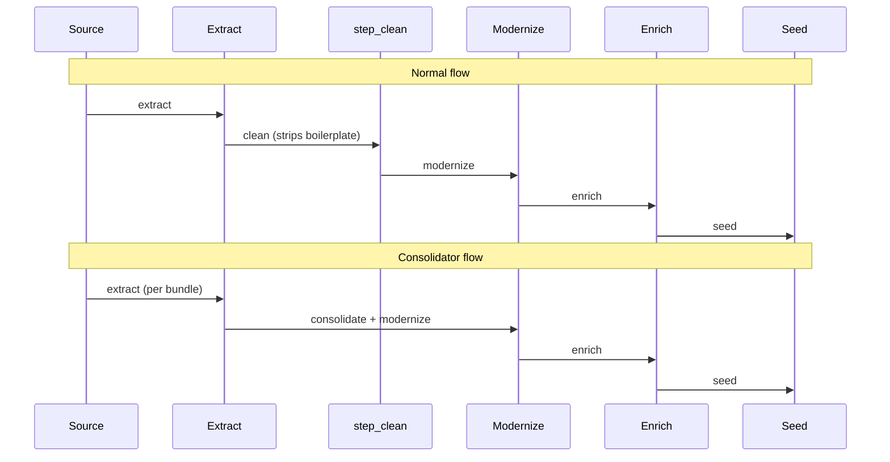

I was auditing course 936 for an unrelated formatting issue when I spotted a paragraph that did not belong.

> This workforce product was funded by a grant awarded by the U.S. Department of Labor's Employment and Training Administration. The product was created by the grantee and does not necessarily reflect the official position of the U.S. Department of Labor.

That's a TAACCCT grant disclaimer. It belongs on the original source materials, not inside a learner-facing lesson body. The strange part: it was repeating, almost verbatim, three times across four lessons. Course 936 was at 100% boilerplate density at the section level — almost every lesson opened or closed with grant-acknowledgement language.

So I ran an audit across the rest of the catalog. The result was worse than I expected.

**212 of 662 published courses (32%) contained raw TAACCCT or DOL grant boilerplate. 56 of those were at 100% density.**

This is the postmortem: the two bugs that let it through, the 18-pattern regex I built to strip it, and the bulk SQL operation that cleaned the corpus without re-running the pipeline.

## §1 The discovery

Course 936 is a Diesel Technician Part 1 course, consolidated from a public-domain TAACCCT bundle. TAACCCT (Trade Adjustment Assistance Community College and Career Training) was a US Department of Labor grant program that funded community-college course development. Every output deliverable was required to carry a federal-funding disclaimer.

That disclaimer is fine — required, even — on the original PDF, the SCORM package, the syllabus PDF. It is not fine when it gets ingested as lesson body text and shown to a learner as if it were instructional content.

Here is what an affected lesson looked like before the cleanup:

> ### Lesson 3.2 — Diagnosing Air-Brake Faults
>
> This workforce product was funded by a grant awarded by the U.S. Department of Labor's Employment and Training Administration. The product was created by the grantee and does not necessarily reflect the official position of the U.S. Department of Labor. (DOL grant agreement TC-26450-14-60-A-XX.)
>
> Air-brake systems use compressed air to apply braking force...
>
> *This work is licensed under a Creative Commons Attribution 4.0 International License except where otherwise noted.*

Three things wrong with that block. The grant-acknowledgement paragraph is metadata, not instruction. The grant agreement number is internal grant-administration data the learner doesn't need. The CC license text is correct attribution, but it belongs in a footer, not at the top of every lesson.

Multiply that across 212 courses and you have a corpus that reads like it was scraped, not curated. Painful to look at.

## §2 How wide does it go?

I wrote an audit script that scanned every published course for known boilerplate patterns and classified them by domain cluster. The result table:

| Domain cluster | Courses | Contaminated | Density |
| --- | --- | --- | --- |
| Healthcare / Medical | 142 | 38 (27%) | mid |
| Manufacturing / Skilled Trades | 118 | 54 (46%) | high |
| IT / Networking | 89 | 22 (25%) | mid |
| Energy / Renewables | 71 | 31 (44%) | high |
| Transportation / Logistics | 58 | 27 (47%) | high |
| Agriculture | 47 | 18 (38%) | mid |
| Business / Soft Skills | 64 | 11 (17%) | low |
| Other | 73 | 11 (15%) | low |
| **Total** | **662** | **212 (32%)** | — |

The pattern lined up with which TAACCCT round funded what. Manufacturing, Transportation, and Energy had the heaviest concentration because those domains were funded most aggressively in TAACCCT rounds 3 and 4, and the grantees were the most diligent about boilerplating every output.

That percentage breakdown was the moment "this is a discovery" became "this is a corpus problem."

## §3 Bug 16 — the publish_as_is bypass

The first bug was in the pipeline router. Qualora's pipeline has a step called `step_clean` that runs `strip_metadata.py` (now also `strip_grant_boilerplate.py`). It's supposed to run on every course before modernize.

But there's a `publish_as_is` route. The intent was sensible: if a course already arrives in clean, modernize-ready shape — which happens when a course was authored natively for our platform — the operator can skip cleaning and go straight to enrich-and-seed.

The bug: `publish_as_is` skipped *all* of `step_clean`, including the contamination guard.

Pseudocode of the offending branch:

```python
def route_course(course_id, route):
    if route == "publish_as_is":
        # Skip step_clean, go straight to enrich
        return run_step("enrich", course_id)
    elif route == "modernize":
        run_step("step_clean", course_id)  # <-- guard lives here
        run_step("modernize", course_id)
        return run_step("enrich", course_id)
```

The router treated cleaning as optional when it was actually load-bearing. `publish_as_is` was right in spirit — those courses don't need *modernize* — but it should never have skipped *contamination check*.

> [!CAUTION]
> Whenever a "skip the cleanup" route exists in your pipeline, audit what cleanup actually does. If even one of those substeps is a safety guard, your shortcut is a contamination vector.

The fix moved the contamination guard out of `step_clean` and into a step that runs on every route, regardless of `publish_as_is`. Cleanup is optional. Contamination check is not.

## §4 Bug 17 — the consolidator's amnesia

The second bug was worse, because it had been there longer and affected more courses.

A lot of published courses were built by `consolidate_courses.py`, which merges multiple source bundles into one course. (Example: a TAACCCT grantee shipped twelve separate SCORM packages for a single curriculum; we consolidate them into one Qualora course.)

`consolidate_courses.py` calls `modernize.py` directly. It doesn't call `step_clean`. It doesn't call `strip_metadata.py`. It bypasses the entire data-cleaning phase.

Sequence diagram of normal flow vs consolidator flow:



See the gap. The consolidator path skips C entirely. Every consolidated course was unfiltered, all the way through to seed, all the way through to publish.

This was the architecture-level cause of most of the 212 contaminated courses. They weren't random — they were almost all consolidated multi-bundle courses, and the consolidator's amnesia meant the cleaning step never ran.

## §5 The cleaning regex (with intentional non-matches)

The strip script is an 18-pattern regex. The patterns are easy. The harder design call was what to deliberately *keep*.

```python
# strip_grant_boilerplate.py — 18 patterns
PATTERNS = [
    # TAACCCT funding acknowledgement (full + abbreviated)
    r"This (workforce |educational )?product was funded by a grant awarded by the U\.S\. Department of Labor.*",
    r"This product was created by the grantee.*does not necessarily reflect.*",
    # DOL grant numbers
    r"TC-\d{5}-\d{2}-\d{2}-A-\d{2}",
    r"DOL grant (agreement|number)\s*[:#]?\s*[A-Z0-9-]+",
    # CC license boilerplate (when isolated, not in attribution context)
    r"This work is licensed under a Creative Commons Attribution.*License.*",
    r"Except where otherwise noted, this content is licensed under.*",
    # Workforce Innovation Opportunity Act references
    r"This project is funded.*Workforce Innovation Opportunity Act.*",
    # Equal-opportunity boilerplate
    r"The .*is an equal opportunity employer.*auxiliary aids.*",
    # "100% federally funded" disclaimers
    r"This (project|product|course) is 100% (federally )?funded.*",
    # Trademark/copyright notices that drift into body
    r"(©|\(c\)|Copyright)\s*\d{4}.*All rights reserved\.",
    # ... 8 more domain-specific patterns ...
]

# DELIBERATELY NOT MATCHED — these stay
KEEP = [
    "instructor:",          # KEEP: real attribution to course author
    "merlot.org",           # KEEP: real source attribution
    "doi.org",              # KEEP: academic citation
    "Course developed by",  # KEEP: instructor credit
    "Originally taught at", # KEEP: provenance
]
```

The non-matches are the more interesting design call. Plenty of grant-funded courses are also legitimately attributed to the original instructor or the original college. We deliberately don't strip those. `instructor: Jane Doe` stays because it's real attribution. `merlot.org/...` stays because MERLOT is a real source repository for some of our materials and we want the citation to survive.

The line is: **strip metadata that exists only because of the funding mechanism. Keep metadata that exists because of human contribution.**

Same line you'd draw filtering PII while preserving authorship, or filtering license text while preserving citation. The patterns differ. The principle is the same: be specific about what you're removing and why, and keep an explicit "what we deliberately keep" list in the same file as your strip patterns.

## §6 The bulk SQL strip — Option D

I wrote up four remediation options:

| Option | Description | Cost | Risk |
| --- | --- | --- | --- |
| A | File-by-file rerun through the pipeline | High (re-extract + re-modernize 212 courses) | Modernize is non-deterministic; we'd lose copy edits already made |
| B | Queue everything for re-extraction at next bundle wave | Highest | Same as A; longer timeline |
| C | Per-course manual review | Highest staffing | Lowest risk; impractical at this scale |
| D | Bulk SQL strip on the live database, file-aware | Lowest | Reversible if we snapshot first |

Option D won. Production-tested, reversible (snapshot the affected rows before update), and it does not regenerate any LLM content — the strip is purely deletion of regex-matched substrings. Anything we miss can be re-stripped. Anything we over-strip can be restored from the snapshot.

The core query, simplified:

```sql
-- bulk_strip_grant_boilerplate_db.py — core update
WITH affected AS (
  SELECT
    cm.id,
    cm.course_id,
    cm.body,
    REGEXP_REPLACE(cm.body, $1, '', 'g') AS cleaned_body
  FROM course_materials cm
  WHERE cm.course_id IN (SELECT id FROM published_courses_to_strip)
    AND cm.body ~ $1
)
UPDATE course_materials
SET body = a.cleaned_body,
    metadata = jsonb_set(metadata, '{boilerplate_stripped_at}', to_jsonb(now()))
FROM affected a
WHERE course_materials.id = a.id;
```

The `metadata.boilerplate_stripped_at` field gives us a forensic trail: every row that the bulk strip touched has a timestamp, so we can audit what changed and roll back per-course if needed.

## §7 Course 936 as proof-of-concept

Before running the bulk strip on 212 courses, I ran it on course 936 alone as a sanity check.

Result: **13K characters stripped. 4 lessons cleaned. Course flipped from `published` back to `draft` for re-review.** Re-audit showed zero remaining boilerplate matches.

Two commits land the work:

```
1a833ab3  scripts: strip_grant_boilerplate.py (file-based, 18 patterns)
8ad84ac8  scripts: bulk_strip_grant_boilerplate_db.py (SQL, course-list aware)
```

Diff snippet from one of the lessons (course 936, Lesson 3.2 — Diagnosing Air-Brake Faults), showing what the strip removed:

```diff
 ### Lesson 3.2 — Diagnosing Air-Brake Faults

-This workforce product was funded by a grant awarded by the U.S. Department of Labor's
-Employment and Training Administration. The product was created by the grantee and does
-not necessarily reflect the official position of the U.S. Department of Labor. (DOL grant
-agreement TC-26450-14-60-A-XX.)
-
 Air-brake systems use compressed air to apply braking force. The compressor draws air
 from the atmosphere, pressurizes it, and stores it in reservoir tanks until needed.

-This work is licensed under a Creative Commons Attribution 4.0 International License
-except where otherwise noted.
```

The instruction is intact. The boilerplate is gone. The strip is conservative — when in doubt, the regex does not fire and the boilerplate gets flagged for human review instead.

## §8 The transferable lesson

Two takeaways worth carrying out of this.

**One: contamination guards belong at boundaries, not after enrichment.** The Bug 16 fix worked because we moved the guard into a step that runs on every route. Bug 17's lesson is the same — the consolidator was a *boundary* (multiple sources merging into one course), and contamination guards belong at every boundary, not just the obvious ones. If a piece of content can enter your system through more than one path, every path needs the guard.

**Two: when designing pipelines that handle real-world content, write down what you keep.** The "DELIBERATELY NOT MATCHED" list is as important as the regex. Six months from now someone will look at `instructor:` not being stripped and assume it is a bug. The KEEP list is the answer to that question, and it lives in the same file.

This generalizes. PII filters need a "we deliberately keep public business names" list. License-clearance pipelines need a "we deliberately keep CC-BY attribution" list. Secret-scanners need a "we deliberately keep the public-key fingerprint" list. The keep list is part of the spec, not an afterthought.

<div className="my-12 rounded-2xl border border-brand-teal/30 bg-brand-teal/5 p-8">
  <h3 className="text-xl font-semibold text-white">Pipeline-engineering as a service</h3>
  <p className="mt-3 text-white/70">If your LLM pipeline runs on real-world content — public-domain coursework, scraped corpora, regulatory documents — contamination guards at every ingest boundary are the actual work. That's what Go7Studio does. Small studio, real receipts.</p>
  <Link href="/contact" className="btn-primary mt-6 inline-flex">Talk to Go7Studio</Link>
</div>

The 212-course corpus is now stripped. The bulk operation takes about three minutes to run. Both route bugs are closed. Each got a canary test planted in `run_canaries.py` so they can't recur silently.

That last part — the canary — is the rule I now run every postmortem against. Every postmortem must plant a test, or it will recur. That's the topic of [the 19-bug failure-pattern atlas](/blog/nineteen-bugs-failure-pattern-atlas).
