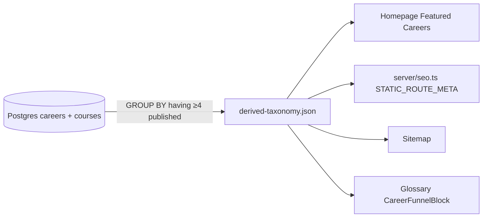

## The signal

I pulled GSC. It said 8 indexed careers. I pulled the admin dashboard. It said 31 published.

<Image src="/images/blog/gsc-vs-admin-careers.png" alt="GSC indexed careers count of 8 next to admin dashboard published count of 31" />

When two numbers should agree and don't, the question is which one is lying. The database was right. The 8 came from somewhere else. The hunt for "where" took longer than the fix.

## Where the hardcoded array lived

The same eight career slugs were copied across four files.

```typescript
// client/src/App.tsx
const FEATURED_CAREERS = [
  'medical-coding',
  'emt',
  'cybersecurity',
  'phlebotomy',
  'cnc-machining',
  'welding',
  'commercial-driving',
  'medical-billing',
];
```

```typescript
// server/seo.ts — STATIC_ROUTE_META
const CAREER_ROUTES = [
  '/careers/medical-coding',
  '/careers/emt',
  // ... 6 more, identical list
];
```

```typescript
// scripts/generate-sitemap.ts
const SITEMAP_CAREERS = [
  'medical-coding',
  'emt',
  // ... same 8
];
```

```typescript
// client/src/components/glossary/CareerFunnelBlock.tsx
const KNOWN_CAREERS = ['medical-coding', 'emt', /* ...same 8 */];
```

Four copies of the same array. None of them imported from a shared module. If you added a career to one, it had to be added to the other three. Nobody had added a career to any of them in months because the production seeder publishes career pages directly off database state — and that flow had been working fine.

So new careers shipped. They rendered fine for a user who landed on `/careers/<slug>`. They just never made it into the homepage's "Featured Careers" grid, the sitemap, the static-route metadata, or the glossary funnel. From Google's perspective, the database had 31, but the only ones it could discover from internal links and the sitemap were the original 8.

## The inferCategory() fallback that masked the bug

There was a worse layer underneath. In `App.tsx`, when a route didn't match any of the eight in `FEATURED_CAREERS`, an `inferCategory()` fallback returned a generic category and let the page render anyway.

```typescript
function inferCategory(slug: string): CareerCategory {
  const known = FEATURED_CAREERS.find((c) => c === slug);
  if (known) return CATEGORY_MAP[known];
  return { label: 'Career Pathway', icon: 'briefcase' }; // generic fallback
}
```

Because the page rendered with a generic category, nobody on the team had a way to notice. The career was live. It looked fine. Internal links from the homepage didn't include it. The sitemap didn't include it. The schema markup pulled from the generic fallback, so structured data was wrong too.

This is the worst kind of bug: nothing 500s, nothing logs, the page is up. It just isn't discoverable.

## The /blog/:slug ghost route

The same antipattern showed up on a different route. The SSR layer was generating schema markup for `/blog/:slug` for any slug — even slugs the SPA had no matching post for. So Google was fetching SSR markup for blog routes that returned a 404 to a real browser.

> [!WARNING]
> If your SSR layer generates schema for routes the SPA can't render, Google will index ghosts. Then de-index them as soft 404s. Then trust your structured data less.

The fix was simple: SSR has to be able to confirm the route resolves to real content before it emits schema. We added a guard that 404s the SSR response if the slug doesn't match a published post. Schema only ships for routes that resolve.

## The 170-line LEGACY_CAREER_PATHWAY_CONFIGS dead fallback

While ripping out the hardcoded arrays, I found a dead one. `LEGACY_CAREER_PATHWAY_CONFIGS` — 170 lines of config object — imported in the client bundle, read by nothing.

```typescript
// shared/legacyCareerPathways.ts — 170 lines, ZERO consumers
export const LEGACY_CAREER_PATHWAY_CONFIGS = {
  'medical-coding-old': { /* ... */ },
  // ... 170 lines, nothing imports any of it
};
```

A grep for `LEGACY_CAREER_PATHWAY_CONFIGS` returned exactly one file: the file that defined it. The bundle was carrying it for nothing. Deleted in the same PR. The kind of thing you only find when you have to touch the surrounding code anyway.

## The replacement — taxonomy derived from data

The fix was the obvious one: don't hardcode taxonomy. Derive it from the data.

```sql
-- Career is "live" if it has 4+ published courses.
SELECT
  c.slug,
  c.title,
  c.summary,
  c.icon,
  COUNT(DISTINCT cc.course_id) AS course_count
FROM careers c
JOIN career_courses cc ON cc.career_id = c.id
JOIN courses co ON co.id = cc.course_id AND co.status = 'published'
GROUP BY c.id
HAVING COUNT(DISTINCT cc.course_id) >= 4
ORDER BY c.priority DESC;
```

That query is the source of truth. It runs at build time, the result is materialized into a JSON file the homepage and sitemap read, and re-runs nightly so a career graduating to live (its 4th course publishing) shows up in tomorrow's sitemap automatically.



One query, one JSON, four consumers. Adding a career is `INSERT INTO careers; ASSOCIATE 4 published courses;` and the next nightly build picks it up. No code changes required.

The `≥4 published` threshold is deliberate. A career page that shows up on the homepage with one course gets a thin-content tag from Google. Four published courses is roughly the floor where a career page has enough to look like a real pathway. We have **31 active careers** above that threshold today and **28 READY** — careers with content drafted but not yet at four published courses each. They get pulled in automatically as their fourth course ships.

<div className="my-12 rounded-2xl border border-brand-teal/30 bg-brand-teal/5 p-8">
  <h3 className="text-xl font-semibold text-white">See it live on Qualora</h3>
  <p className="mt-3 text-white/70">Career-aligned courses, free lesson sampler, no signup needed to try.</p>
  <Link href="https://qualora.io/quiz/sampler" className="btn-primary mt-6 inline-flex">Try a free lesson</Link>
</div>

## Generalizable lesson

If your taxonomy lives in code, your taxonomy is stale. Every taxonomy I've ever hardcoded has eventually drifted from reality. The pattern is consistent — somebody adds a thing to the database, the thing is real, the thing renders, but the array of "things we know about" never gets updated, so internal navigation, sitemaps, and SEO surfaces all silently miss it.

The fix is always the same shape. Move the source of truth into a query. Materialize at build time so production isn't paying query cost on every page render. Re-run nightly so changes propagate.

| | Before | After |
|---|---|---|
| Sitemap careers | 8 | 31 |
| Homepage Featured Careers | 8 | up to 12 (rotated) |
| `STATIC_ROUTE_META` careers | 8 | 31 |
| Glossary funnel target list | 8 | 31 |
| Adding a new career | 4-file PR | 0 code changes |

The migration was a one-PR rip-and-replace. The hardcoded arrays came out, the derived JSON went in, the four consumers each switched their import from `FEATURED_CAREERS` to the materialized list. Took an afternoon. The 23 careers that had been hiding from Google for months were in the sitemap by the next nightly build.

If you're shipping anything where new entities (products, locations, courses, careers, ingredients, models) land in a database and your homepage / sitemap / SEO layer has a list, audit it today. Search your codebase for any array literal that has more than three slugs in it. If you find one, that's almost certainly a future stale-taxonomy bug. Move it to a query before it costs you index coverage.
