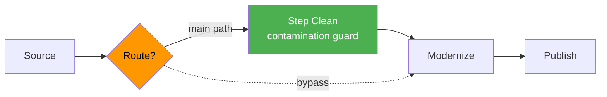
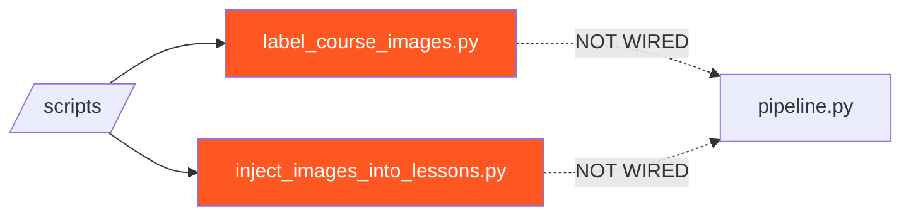
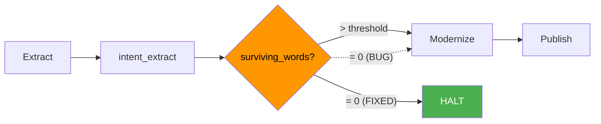
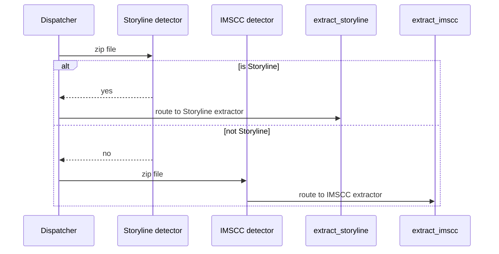
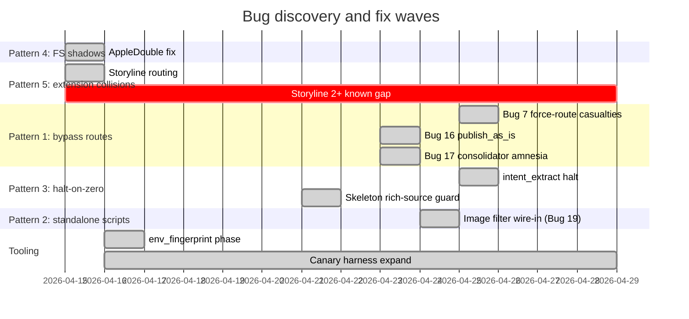

Nineteen bugs. Three months. One pipeline. Every fix has a real commit and a real postmortem behind it.

One at a time, they're not interesting. Together they're a debugging vocabulary — they cluster into five recurring failure families, and once you can name the family, you can spot the next instance before it ships.

A postmortem without a canary is just a story. Each of these bugs has a canary test that runs before any pipeline-touching merge — the test is the rule that says "this specific failure cannot recur silently." There are 39 of them now. They all pass.

Here's the atlas, the five families, and the recognition checklist.

## §1 Atlas at a glance

| # | Bug | Class | Symptom | Fix file:line | Canary |
| --- | --- | --- | --- | --- | --- |
| 1 | AppleDouble shadow files | FS shadow | `extract_imscc` failing on `._foo.imscc` | `pipeline.py:147` | `canary_appledouble_filter` |
| 2 | `audit_format.py` REMOVE on substantive syllabus | Heuristic over-reach | EASA Fiber Optics 4928-word syllabus deleted | `audit_format.py` | `canary_syllabus_word_count_floor` |
| 3 | `extract_storyline.py` not wired into dispatcher | Misrouting | Storyline zips routed to IMSCC extractor | `pipeline.py` `_detect_storyline_zips()` | `canary_storyline_routing` |
| 4 | `ingest_audio.py` ThreadPoolExecutor import | Broken module | 5 video items failed audio routing | `ingest_audio.py` | `canary_ingest_audio_imports` |
| 5 | `consolidate_courses.py` skips `step_clean` | Bypass route | Bundle-merged courses unfiltered (Bug 17) | `consolidate_courses.py` | `canary_consolidator_runs_clean` |
| 6 | `publish_as_is` skips contamination guard | Bypass route | Pre-cleaned courses unfiltered (Bug 16) | router | `canary_publish_as_is_guard` |
| 7 | `--force-route=modernize` bypasses `consolidate_first` | Bypass flag | 12 fabricated courses, 9 published | router | `canary_force_route_guard` |
| 8 | `intent_extract surviving_words=0` continues | Halt-on-zero | Modernize fabricated content from titles | `intent_extract` | `canary_halt_on_zero_words` |
| 9 | `skeleton_modernize` accepts rich source silently | Routing logic | 94K-word IMSCC lost on skeleton path | `skeleton_modernize.py` rich-source guard | `canary_skeleton_rich_source_guard` |
| 10 | `label_course_images.py` not wired into pipeline | Standalone backfill (Bug 19a) | Junk images shipped (HIT 101: 206) | `pipeline.py` `filter_junk_images` | `canary_image_labeler_in_pipeline` |
| 11 | `inject_images_into_lessons.py` not wired in | Standalone backfill (Bug 19b) | Junk image refs in lessons | wired into `filter_junk_images` step | `canary_image_injector_in_pipeline` |
| 12 | `consolidate_courses.py` missed embedded-DOCX images | Path traversal (Bug 18) | HIT 101/105 lost 311 images | `consolidate_courses.py` | `canary_consolidator_walks_embedded_images` |
| 13 | `~/.codex/config.toml` `model_reasoning_effort = "xhigh"` | Env drift | All audits 20× slower | `env_fingerprint` step | `canary_codex_config_normal` |
| 14 | Glossary duplicate rows (course 856 had 17 copies) | DB constraint | Module pages duplicated definitions | partial unique index + `seed-qualora.ts:1672` | `canary_glossary_unique_per_section` |
| 15 | `extract_imscc` recursion only one level deep | Format nesting | Rich sources hidden in queue | `extract_imscc.py` | `canary_imscc_recursion_full_depth` |
| 16 | Blackboard-wrapped IMSCC unparseable | Format nesting | CLC HET medical series blocked | known gap | `canary_blackboard_wrapped_imscc_routing` |
| 17 | TAACCCT/DOL grant boilerplate in body | Contamination | 212 of 662 courses, 32% (Bug 16+17 combined) | `strip_grant_boilerplate.py` | `canary_grant_boilerplate_strip` |
| 18 | `extract_pptx` not populating content field | Output-shape contract | PPTX-derived lessons empty | `extract_pptx.py` | `canary_extractor_output_shape` |
| 19 | `WMF` images breaking media upload | Format gap | `upload_media` choking on WMF | WMF filter | `canary_upload_media_format_filter` |

Different surfaces. Five underlying patterns. Walk each.

## §2 Pattern 1 — Bypass routes are guards you don't have

Bugs 5, 6, 7 belong to one family. Every one of them was a "shortcut" route through the pipeline that skipped a step the operator thought was optional but was actually load-bearing.

**Bug 6 — `publish_as_is`:** intended to skip the `modernize` step for courses that arrived already cleanly authored. It also skipped `step_clean`, which contained the contamination guard. 56 of the 212 contaminated courses came through this route.

**Bug 5 — `consolidate_courses.py`:** a separate code path that merges multi-bundle courses. Calls modernize directly. Never calls `step_clean`. Most of the 212 contaminated courses came through this route. Same family as Bug 6, different mechanism.

**Bug 7 — `--force-route=modernize`:** an operator CLI flag intended for unblocking individual stuck courses. It bypassed the `consolidate_first` decision, which exists to make sure multi-bundle courses get consolidated *before* being modernized. Twelve courses got force-routed past the consolidator. Modernize generated coherent prose from the first bundle's titles only. Nine of those twelve got published before the bypass was caught.

The pattern card:



Every dashed-line "bypass" arrow is a guard you don't have. The shortcut is the bug.

The fix in every case was the same shape: move the guard *out of* the optional step and *into* a step that always runs, no matter the route. Cleanup is optional. Contamination check is not. Consolidation before modernize isn't optional either, no matter how badly the operator wants to unblock the queue.

> [!CAUTION]
> Audit your pipeline for "skip" flags, "force" flags, and "as-is" routes. For each, list every substep that flag bypasses. Any safety check on that list belongs on the *required* path, not the bypassable one.

## §3 Pattern 2 — Standalone backfill scripts are pipeline gaps in disguise

Bugs 10 and 11 are a different family. Both were finished, working, valuable scripts. Both lived in `/scripts`. Neither was wired into the pipeline.

`label_course_images.py` calls DeepInfra's Gemma 3 12B vision model at $0.000022/image to classify every image in a course (logo, decorative, instructional, diagram, screenshot, etc.). `inject_images_into_lessons.py` injects classified instructional images into lesson bodies and skips logos and decoratives via a `SKIP_CATEGORIES` set.

Both were run manually for months. Both did 70% of the image-quality work. Neither ran in the pipeline.

Discovery moment: HIT 101 published with 206 images, most of them logos and decorative. HIT 105 published with 271 images, same problem. Pipeline never filtered. The standalone scripts had been doing the filtering when I ran them manually — and I'd just stopped running them.



The fix: a new pipeline step `filter_junk_images` between `convert_audio` and `upload_media`. Thin wrapper at `scripts/filter_junk_images.py` calls the existing labeler and injector. Now the filter runs on every course, every time.

Result: HIT 101 dropped from 206 images to 70 (66% reduction). HIT 105 dropped from 271 to 85 (69% reduction). Quarantine to `processed/_image_quality_quarantine/<category>/` so we can audit what got removed. Audit log at `processed/image_filter_audit.json`.

The deeper failure mode: a standalone script is *not a backup* for a pipeline gap. It is the gap. There's a longer post on this exact pattern at [Standalone backfill scripts are pipeline gaps in disguise](/blog/standalone-backfill-scripts-pipeline-gaps).

## §4 Pattern 3 — Halt-on-zero or hallucinate

Bug 8 is the most expensive bug in this atlas. It's also the most systemic.

`intent_extract` runs early in the pipeline. It takes the raw extracted content and produces a structured "intent" — what is this lesson about, what are the learning objectives, what is the source material. Downstream steps consume this.

When `intent_extract` was given source material it could not parse (or material that had been silently emptied by an earlier extractor bug, e.g. the Storyline misrouting in Bug 3), it returned `surviving_words=0` and continued. The pipeline kept running. Modernize generated fluent, plausible lesson content from titles and standard learning objectives — content with no relationship to the actual source material.

Twelve courses bypass-routed via Bug 7, plus an unknown count from earlier waves, hit this. The output was *coherent*. Native English. Pedagogically reasonable. Completely fabricated.



The fix is a halt-condition, not a logging fix. `surviving_words=0` now stops the pipeline for that course and routes it to a triage queue. The retry budget allows three attempts at extraction with different extractor strategies. After three, the course is held for human review.

The principle is general: **halt is a design choice, not a panic.** Every step in your pipeline should be able to answer "should I refuse?" before answering "what is my output?" If a step cannot refuse, it cannot be safe.

## §5 Pattern 4 — File-system shadows that look like data

Bug 1 is small in scope and large in lesson. AppleDouble files are macOS's `._foo.ext` shadow files — the resource-fork data that gets written when you copy a file to a network share that doesn't support HFS+ extended attributes. They look like real files. Their names match real-file globs.

When operators dragged `.imscc` archives onto our NAS from macOS Finder, the network share got both `course.imscc` (real) and `._course.imscc` (shadow). The pipeline's source-file dispatcher iterated `*.imscc` and picked the first match — which, depending on filesystem ordering, was sometimes the shadow.

`extract_imscc` would then try to parse the shadow file as an IMSCC archive and fail on what was actually encoded HFS+ resource-fork data. Silent extraction failures with no indication that the real source file even existed elsewhere.

Fix at `pipeline.py:147`:

```python
# pipeline.py:147
def _is_macos_shadow(path: Path) -> bool:
    """AppleDouble shadow files (._*) and .DS_Store from macOS network copies."""
    name = path.name
    if name.startswith("._"):
        return True
    if name == ".DS_Store":
        return True
    return False
```

Applied to nine file-enumeration sites — four detector functions plus the extract step's `rglob` calls for `*`, `*.mbz`, and `*.imscc`. Real `ls -la` from a NAS-copied bundle showing the shadow:

```
$ ls -la /Volumes/public/LMS/wave11_in/
total 8048
-rw-r--r--@  1 ops  staff  4096  ._BLD-161.imscc    <-- shadow
-rw-r--r--@  1 ops  staff  4123456  BLD-161.imscc
-rw-r--r--@  1 ops  staff  4096  ._BLD-168.imscc    <-- shadow
-rw-r--r--@  1 ops  staff  3987234  BLD-168.imscc
```

The pattern beyond this specific bug: **anything your file system shows you that isn't actually data will eventually pretend to be data.** macOS shadows. Windows `Thumbs.db`. Editor backup files. Lock files. Hidden directories with archive contents. The dispatcher should know about all of them, and the rule for adding a new source format should always include "and add the shadow filter to the dispatcher's enumerator."

## §6 Pattern 5 — Extension collisions between extractors

Bug 3 is in the same family as Bug 1, but the mechanism is different. Articulate Storyline outputs a `.zip` file. IMSCC packages are also `.zip` files (renamed `.imscc`, but the dispatcher accepted both extensions historically).

Older Storyline output uses an internal structure of `sco_content/en/xml/cw01/pgN.xml` — readable, parseable, similar enough to IMSCC that our IMSCC extractor would *not* error, just return empty content.

So Storyline zips were silently routed to the IMSCC extractor. Empty content. Pipeline continued. Halt-on-zero (Bug 8) was the only thing that stopped them, and only after fix #8 landed.

The fix: Storyline detection runs *before* IMSCC dispatch. New helper `_detect_storyline_zips()` runs first, looks for the Storyline-specific signature files (`scormcontent/`, `meta.xml`, `sco_content/` paths), and routes to `extract_storyline.py` if matched.



Order matters. Detection runs in specificity order. Most-specific format first; if no match, fall through to next-most-specific. Default fallback is "halt with reason," not "extract anyway."

> [!CAUTION]
> Known gap: Storyline 2+ uses an HTML5/JS `data.js` eval-pack format. Our detector routes it correctly to `extract_storyline.py`, which then returns empty content because it only handles the older XML format. Items 223, 4229, and 4976 (a medical training series) are blocked on this. The detector is right; the extractor is incomplete. The known-gap note is in [the 16-extractor cost matrix post](/blog/sixteen-extractors-eight-formats-cost-matrix).

The pattern: **two extractors that share a file extension is a routing problem, not a parsing problem.** The detection logic that decides *which* extractor sees the file is itself safety logic. Treat it that way.

## §7 The canary harness rule

Every postmortem in this atlas has a row in the canary table at the top. That isn't bookkeeping — it's the rule.

The rule: **every postmortem must plant a canary, or the bug will recur.**

The canary harness is a single file, `run_canaries.py`, that runs before any pipeline-touching merge. Each canary is a small synthetic test that recreates the exact conditions of the original bug and asserts the fixed behavior. Right now there are 39, and they all pass:

```
$ python run_canaries.py
[1/39] canary_appledouble_filter ............................ PASS
[2/39] canary_syllabus_word_count_floor ..................... PASS
[3/39] canary_storyline_routing ............................. PASS
[4/39] canary_ingest_audio_imports .......................... PASS
[5/39] canary_consolidator_runs_clean ....................... PASS
[6/39] canary_publish_as_is_guard ........................... PASS
[7/39] canary_force_route_guard ............................. PASS
[8/39] canary_halt_on_zero_words ............................ PASS
[9/39] canary_skeleton_rich_source_guard .................... PASS
[10/39] canary_image_labeler_in_pipeline .................... PASS
[11/39] canary_image_injector_in_pipeline ................... PASS
[12/39] canary_consolidator_walks_embedded_images ........... PASS
[13/39] canary_codex_config_normal .......................... PASS
[14/39] canary_glossary_unique_per_section .................. PASS
[15/39] canary_imscc_recursion_full_depth ................... PASS
...
[39/39] canary_visual_kickoff_payload_complete .............. PASS

39/39 passed in 8.4s
```

The rule isn't "fix the bug." The rule is "make the bug impossible to recur silently." Those are different things. A fix without a canary depends on the next operator remembering. A fix *with* a canary depends on the next operator running `run_canaries.py`, which they already do because it gates merges.

Wave-by-wave timeline of when each pattern family started showing up and getting fixed:



The pattern of the patterns: discovery comes in waves. We don't find one bug at a time — we find a wave of related bugs as soon as we touch a code path that touches them all. The atlas grew by category, not by count.

<div className="my-12 rounded-2xl border border-brand-teal/30 bg-brand-teal/5 p-8">
  <h3 className="text-xl font-semibold text-white">Pipeline-engineering as a service</h3>
  <p className="mt-3 text-white/70">If your content pipeline is leaking money — fabricating where it should halt, bypassing where it should guard, or running standalone scripts that should be pipeline steps — that's the work I do at Go7Studio. Every fix gets a canary. Small studio, real receipts.</p>
  <Link href="/contact" className="btn-primary mt-6 inline-flex">Talk to Go7Studio</Link>
</div>

## §8 Pattern recognition checklist

When the next postmortem lands, the question is: which of the five families does this belong to?

- **Pattern 1 — Bypass routes.** Is this bug behind a "skip", "force", "as-is", or operator-flag route? Walk every step that route bypasses. Any of them a guard?
- **Pattern 2 — Standalone backfill scripts.** Was the bug "we forgot to run X"? Was X a manual script in `/scripts`? It belongs in the pipeline.
- **Pattern 3 — Halt-on-zero.** Did a step return zero, empty, null, or a default-on-error and the pipeline kept running? That step needed a halt condition, not a log line.
- **Pattern 4 — File-system shadows.** Did the dispatcher pick a file that wasn't actually data? Add the shadow filter to the enumerator.
- **Pattern 5 — Extension collisions.** Did one extractor receive a file meant for another, and produce empty content rather than erroring? The detection logic is the bug, not the extractor.

If a new postmortem doesn't slot into any of these five, that's interesting too — you have a sixth pattern and the atlas just grew. Add it. Plant a canary. Move on.

The discipline of writing the atlas down is what makes the next bug findable. Postmortems on their own are stories. Postmortems organized by pattern family are a debugging vocabulary.
