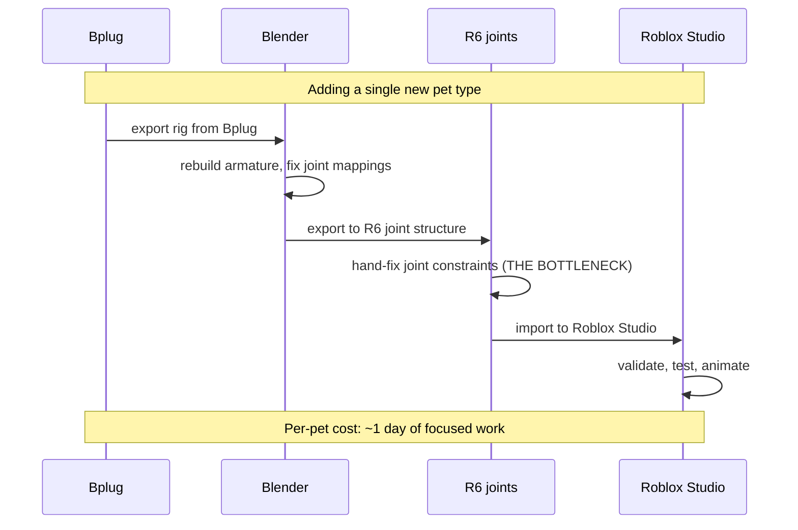

# The Game I Won't Ship: Why Pet Paradise Is on Hold

Pet Paradise is the most complete unshipped game in the studio. 814 files, 7.3MB of integrations, ~80-90% done on the systems side. Pet-breeding mutation system functional. Visual hook validated through playtests. Everything ready except one bottleneck.

The category benchmark — Pet Sim X, the obvious comparable on Roblox — reportedly earns around $1M per month. Capturing 1% of that is more than everything else in the studio combined.

So why is it frozen?

## The math is the prettiest in the portfolio

| Game | Status | Lifetime revenue | Theoretical ceiling |
|---|---|---|---|
| Empire Tycoon | Live | $339.56 | Modest idle-game revenue |
| **Pet Paradise** | **On hold (80-90%)** | **$0** | **~$10k/mo at 1% of category benchmark** |
| Sortbloom | In development | $0 | Modest casual-puzzle revenue |
| Rampart | Pre-launch | $0 | Modest wave-defense revenue |
| SlimeSlip | In development (60-70%) | $0 | Casual platformer, paced for learning |

Even with conservative assumptions, Pet Paradise dominates the portfolio's theoretical upside by an order of magnitude. The honest reading is: if any single game in the studio justifies focused attention on its own, this is the one.

That makes the freeze a real decision, not a default. The freeze is not "I'll get to it eventually." The freeze is "the unit economics of finishing it now do not work, and here are the four conditions that would change that."

## What's already built

| System | Status |
|---|---|
| Pet breeding mutation system (dog head + cat body, etc.) | Functional |
| Visual hook (pet appearance variation) | Validated in playtest |
| Networking + DataStore plumbing | Done |
| Monetization scaffolding | In place, needs final balance pass |
| Animation pipeline for new pet types | **Bottleneck** |

Eighty to ninety percent on the systems side. The remaining ten to twenty percent is not evenly distributed across systems — it's concentrated in one place, and that one place is the entire reason for the freeze.

## The bottleneck — a 4-tool animation chain

Adding a new pet type requires walking a four-tool chain:



Each step is solvable individually. The chain is what's slow. Until the chain is industrialized — until I can drop a new pet model into Bplug and have it land in Roblox Studio with working joints in under an hour — every new pet costs a day. The hand-fix step at R6 joints is the worst link, and it doesn't yield to automation in 2-hour daily blocks. It needs a 2-week uninterrupted block to industrialize.

## The opportunity-cost equation

Empire Tycoon makes $5-7/day. It runs unattended. It takes under 30 minutes/day to maintain. The next phase — endgame design with Sovereign Institutions — compounds revenue per session and per buyer.

Pet Paradise wants a 2-week uninterrupted block to industrialize the animation pipeline, plus another 4-6 weeks of polish, marketing, and Roblox-specific traction work to reach the category-benchmark scale where the theoretical revenue actually exists.

| Project | Daily revenue today | Time cost today | Compounding rate |
|---|---|---|---|
| Empire Tycoon (next phase) | $5-7 | <30 min/day | Each new player session contributes |
| Pet Paradise (thaw + ship) | $0 | 2-week block + 4-6w | Compounds only after launch |
| Portfolio total | $5-7 | bounded | Stable |

The honest math is that shipping Empire's next phase first compounds harder over the next 90 days than the equivalent time spent thawing Pet Paradise. The Pet Paradise revenue is gated on a multi-month runway I don't have to spend yet — and may never need to spend, if the resume conditions don't fire.

## Resume criteria — the 4-condition gate

I unfreeze Pet Paradise when all four are true. Three of four is not enough. The gate exists so that "thawing" is a decision with criteria, not a mood.

```text
RESUME CRITERIA — all four must be true
[ ] Empire Tycoon revenue stable at $500+/month
[ ] Next in-development title (Sortbloom) launched
[ ] A 2-week uninterrupted block is open on the calendar
[ ] Animation pipeline prototyped on a non-Pet Paradise project
```

The fourth condition is the most important and the easiest to skip. If I show up to Pet Paradise with the same animation chain, I will hit the same bottleneck on day one of the thaw. Prototyping the pipeline on a smaller, lower-stakes project first means the thaw can spend the 2-week block on Pet Paradise content, not Pet Paradise tooling.

## The "freeze, don't kill" rule

Most advice for solo developers is "ship anything." That advice is wrong for category-benchmark games. Shipping Pet Paradise at 90% in a category where the top games are at 99% is asymmetric loss — the worse-than-competitor experience defines the brand for the people who try it, and they don't come back when the better version eventually ships.

> [!TIP]
> Deleted projects can't be unfrozen. Frozen projects compound — I can use Pet Paradise's R6 work to learn the animation chain on something else. Every paused project gets a written resume gate. Without the gate, frozen drifts into abandoned.

The freeze is also doing work I can't see directly. The R6 joint work I did for Pet Paradise is teaching me the animation chain even when I'm not actively in the project, because the lessons get re-applied every time I touch a Roblox-shaped problem. Killed projects cannot teach. Frozen projects keep teaching.

## When not-shipping is the right call

```mermaid
quadrantChart
    title When to ship vs freeze
    x-axis Low completion --> High completion
    y-axis Low category competition --> High category competition
    quadrant-1 Freeze (high comp, high comp)
    quadrant-2 Ship if motivated
    quadrant-3 Cut losses
    quadrant-4 Ship and iterate
    Pet Paradise: [0.85, 0.92]
    Empire Tycoon: [0.95, 0.55]
    Sortbloom: [0.6, 0.4]
    SlimeSlip: [0.65, 0.4]
```

Top-right quadrant is where Pet Paradise lives — high completion, high category competition. That's exactly the quadrant where shipping at 90% is worse than not shipping, because the asymmetric loss from a sub-competitor experience exceeds the asymmetric win from any compounding effect.

Empire Tycoon sits in the bottom-right — high completion, lower category competition — which is exactly the quadrant where shipping and iterating is the correct strategy. Different quadrants, different rules. Pet Paradise's quadrant says: freeze, gate, wait for the four conditions, then thaw with intent.

The portfolio metric isn't "things shipped this quarter." It's "things ready to thaw when the gate trips, and shipping when the math works." Pet Paradise will thaw when the math works. Until then, the freeze is the right call.

<div className="my-12 rounded-2xl border border-brand-teal/30 bg-brand-teal/5 p-8">
  <h3 className="text-xl font-semibold text-white">See what 37 strangers paid for</h3>
  <p className="mt-3 text-white/70">Empire Tycoon is the game that did ship — the daily revenue that gates whether Pet Paradise thaws this year. Free to play, monetized with rewarded ads and IAPs.</p>
  <Link href="https://play.google.com/store/apps/details?id=com.go7studio.empire_tycoon" className="btn-primary mt-6 inline-flex">Get Empire Tycoon</Link>
</div>
