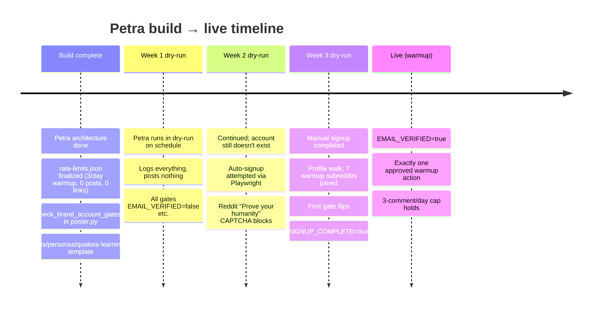

# I Built a Social Posting Agent Before I Had Social Accounts. Here's the Awkward Repair.

Petra was the publish tier of a three-agent SEO pipeline. Architecture finished early. Then she sat in dry-run mode for roughly three weeks because the Reddit account she'd post to didn't exist yet.

The repair, when it finally happened, was awkward: an automated signup attempt that hit a CAPTCHA wall, a manual completion of the human-verification step, and a careful warmup phase that's still going. The lesson wasn't "build less" — Petra is good code that does her job. The lesson was about sequencing (credentials before code, accounts before agents) and how a gate-state architecture turned what could have been a clean failure into a productive idle.

<HeroCallout
  eyebrow="Gate-state architecture"
  title="Accounts before agents, credentials before code."
  body="Petra stayed safe because every outbound action routed through gates. Missing credentials became a readable idle state instead of a broken deployment."
/>

<KeyTakeaways title="Why the idle was productive" items='[{"title":"Default deny","body":"With gates false, the scheduled agent logged and exited instead of forcing work."},{"title":"Progressive enablement","body":"Each credential transition unlocked exactly one more allowed behavior."},{"title":"Human boundary","body":"Signup verification stayed manual because the platform is designed that way."},{"title":"Warmup cap","body":"Rate limits stayed conservative while the new account earned trust."}]' />

## Three weeks of dry-run



Petra was "live" the entire time — the agent ran on schedule, walked her decision tree, and posted nothing because every gate evaluated to false. Dry-run mode wasn't a special state. It was the *default* state, given that no gate had flipped to true yet.

That distinction matters. Petra didn't need a special "wait for account" code path. The gates were already there for safety reasons. No credentials meant every gate said no, so Petra said no. The agent was correct. The world she was waiting for didn't exist yet.

## What Petra had ready

```python
# poster.py — gate function (signature simplified)

def check_brand_account_gates() -> GateState:
    """Returns the current gate state for any brand account.
    Every gate must be true before any output action is approved.
    """
    return GateState(
        SIGNUP_COMPLETE=env_bool("SIGNUP_COMPLETE"),
        EMAIL_VERIFIED=env_bool("EMAIL_VERIFIED"),
        PROFILE_SETUP_COMPLETE=env_bool("PROFILE_SETUP_COMPLETE"),
        LINK_SHARING_APPROVED=env_bool("LINK_SHARING_APPROVED"),
        POSTING_APPROVED=env_bool("POSTING_APPROVED"),
        INTERNAL_ONLY=env_bool("INTERNAL_ONLY"),
        PHASE=env_str("PHASE"),  # warmup | normal | restricted
    )

# rate-limits.json — warmup tier
# {
#   "comments_per_day": 3,
#   "posts_per_day": 0,
#   "links_per_day": 0,
#   "max_subreddits_engaged_per_day": 2
# }
```

Petra's safety floor was a function call away from being readable as a status check. When all gates returned false, correct behavior was log and exit. When the first gate flipped, exactly one action became eligible. When the next flipped, two. Progression from dry-run to live was a sequence of explicit gate transitions, not a deploy event.

The persona file (`secrets/personas/qualora-learning.env`) was templated at mode 600 (owner read-write only). The rate-limits file was locked at warmup levels: 3 comments/day, 0 posts, 0 link shares. Everything that would matter when the gates flipped was already correct. The only thing missing was the account.

## Reddit signup that didn't work

First attempt at the awkward repair was automated signup — Playwright in a clean Chrome profile, navigating to Reddit's signup form with a brand email.

It blocked at "Prove your humanity." The CAPTCHA fired before the email field even rendered for input. No path through it for an automated browser — and there shouldn't be. That's exactly the failure mode the CAPTCHA exists to catch.

> [!CAUTION]
> Automated signup is the wrong tool for brand-account creation. Platforms specifically design CAPTCHAs to block automated agents from creating accounts, and the failure is the platform working as designed. Manual signup is the right tool. Treating it otherwise is fighting the platform.

Petra caught the failure cleanly, logged it, and reported back: "automated signup not viable; account creation requires human." Then she kept running in dry-run on schedule, gates all false, doing exactly what she was supposed to do.

## The manual repair

The human-verification step had to be completed by a human. Once that was done, the rest of the profile walk could be a partnership between the human signup completion and the agent's profile-setup discipline.

```text
PROFILE WALK CHECKLIST — completed by hand, validated by agent

[x] Display name set: "Qualora Learning"
[x] About text: brand-appropriate, links to qualora.io
[x] Custom social link added (canonical brand URL)
[x] Joined 7 warmup subreddits relevant to brand topics
[x] Initial state captured:
    - 1 karma
    - 0 contributions
    - 0d account age
[x] Email verified
[x] Env file updated:
    - SIGNUP_COMPLETE=true
    - PROFILE_SETUP_COMPLETE=true
    - EMAIL_VERIFIED=true
    - PHASE=warmup
```

The orchestrator updated the env files. Petra's next scheduled run picked up the new gate state. The first gate that mattered for output (`EMAIL_VERIFIED`) had flipped to true. The rate-limits.json constrained the next 24 hours to exactly three comments, zero posts, zero links. Petra approved exactly one warmup action — a draft comment — and held it for human review.

## The gates that turned the gap into a feature

| Gate | Value before signup | Value after signup | Action enabled |
|---|---|---|---|
| `SIGNUP_COMPLETE` | false | true | Account-aware logging |
| `EMAIL_VERIFIED` | false | true | First warmup comment eligible |
| `PROFILE_SETUP_COMPLETE` | false | true | Profile-aware draft generation |
| `LINK_SHARING_APPROVED` | false | false (still warmup) | (link sharing remains gated) |
| `POSTING_APPROVED` | false | false (still warmup) | (posting remains gated) |
| `INTERNAL_ONLY` | true | false | Outbound action allowed |
| `PHASE` | (unset) | `warmup` | Warmup-tier rate limits apply |

The gate architecture turned a missing-credentials situation into a productive idle. While the account didn't exist, every gate was false and Petra correctly did nothing. As credentials became available, gates flipped one at a time, and exactly the right amount of capability came online.

This inverts the way I used to think about agents — "build the agent, then turn it on." The gate-state architecture replaced that with: "build the agent with explicit gates that everything routes through, and let the agent come online progressively as the world catches up to it." Missing credentials became the gating mechanism, not a bug.

## The sequencing rule

> [!IMPORTANT]
> Credentials before code, accounts before agents. The rule isn't "build less." It's "build the credential prerequisite first, or accept that the agent will idle until it lands." Petra idled productively because of gate-state architecture. Scout and Ivy ([disabled before they posted anything](/blog/scout-ivy-disabled-before-posting)) didn't have the same gate architecture, so the safe move was to disable them outright.

The two stories — Petra's productive idle and Scout/Ivy's hard disable — are the same lesson at different scales. Both happened because the agent build preceded the surface build. The difference was that Petra had gate-state architecture making the idle period safe, useful, and ready to flip live the moment the surfaces were real. Scout and Ivy didn't, so the safe move was to leave them off until their surfaces caught up.

The corrected sequence going forward:

1. Identify the destination (which account, which page, which channel).
2. Create the destination — credentials, profile, gates documented.
3. Wire the routing (the connector layer that gets approved output to live).
4. Build the agent with gates that route through every credential check.

Step 4 before steps 1-3 is what produced three weeks of dry-run for Petra. Gate-state architecture was the safety net that kept those weeks useful instead of wasted. Without the gates, the same situation would have produced 21 days of agent runs hitting fail conditions and burning LLM calls — the exact situation Scout and Ivy were saved from by being disabled outright.

The publish tier is in warmup now. The middle and top tiers come back online when the warmup phase completes. The whole pipeline will be live within weeks — not because anyone built faster, but because the surfaces finally caught up to the agents that were ready to fire on them.

<div className="my-12 rounded-2xl border border-brand-teal/30 bg-brand-teal/5 p-8">
  <h3 className="text-xl font-semibold text-white">Get the next AI Lab post</h3>
  <p className="mt-3 text-white/70">One post every couple of weeks from a one-person studio that's been sequencing agents long enough to know when to wait. Gate-state architecture, agent design, and the routing stack behind it all.</p>
  <Link href="/ai-lab" className="btn-primary mt-6 inline-flex">Subscribe to AI Lab</Link>
</div>
