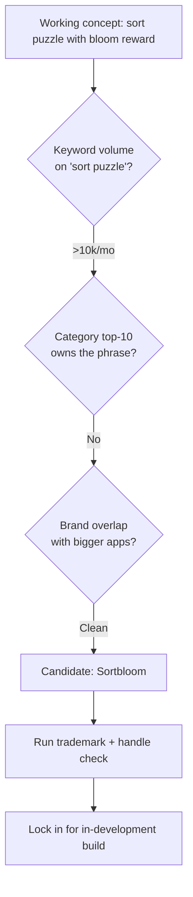
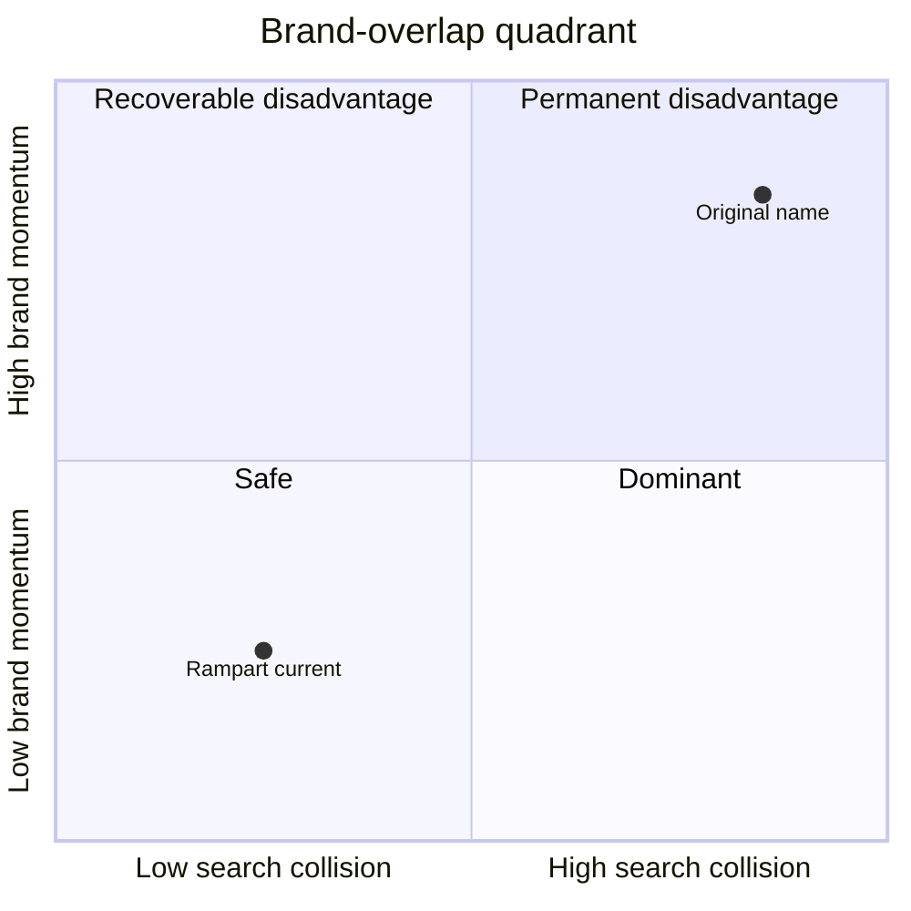

# How I Pick Names for My Mobile Games (After Getting It Wrong Twice)

For years I picked names because they sounded right. Two of my in-development titles had to be renamed mid-build because the names couldn't carry traffic. Neither game has launched yet — these are the lessons from doing the renames twice while there was still time to fix it cheap.

This post is the decision input I now use before I commit a package name to AdMob, Play Console, or any social handle. It is not advice for naming companies, novels, or anything else. It is specifically about mobile games on Play Store and App Store, where ASO surface area decides whether anyone finds you.

## I picked names from vibes for years

Two-panel sketch of how I used to think about naming:

```text
Panel 1: vibe naming
  "What sounds cool?"
  → Stakd. Cool. Short. Real-feeling.
  → Lock it in. Buy domain. Commit package.

Panel 2: ASO naming
  "What do players search for?"
  → Run keyword volume on the genre.
  → Run category top-10 collision.
  → Run brand-search overlap.
  → Pick a name that survives all three.
```

I was running panel 1 for years. The first time it cost me was when a working name with no search surface had to be replaced after the play test verdict came back. The second time was when I realized the game I was about to ship had brand-overlap with a much bigger franchise that would outrank me on my own brand search forever.

## ASO research — the inputs I actually use

| Input | Question | Decision impact |
|---|---|---|
| Keyword volume | Does anyone search the genre this name implies? | Below ~1k searches/month, the name carries no traffic on its own |
| Category saturation | How many games already own the obvious phrases? | Top-10 owning your phrase = you're invisible at launch |
| Brand-search overlap | Does the name collide with bigger apps? | Losing your own brand search to a bigger app is permanent |

These three inputs, in this order, are the entire decision framework. Vibes still matter — at the end I pick between two or three ASO-clean candidates by feel — but no name reaches that final round if it fails any of the three filters.

## The Stakd rename (in development)

Stakd was on the repo, the AdMob unit, the test builds, and the package `com.go7studio.stakd`. The play test verdict came back: "EXTREMELY basic, crazy easy, no allure." When I redesigned the gameplay as a Zen-Garden sort puzzle with anchor-to-accent ratios, the word "Stakd" no longer mapped to what the game did. A "Stakd" implies stacking. The redesigned game doesn't stack — it sorts and blooms.

The redesign demanded a new working name. I ran the ASO research:



The new working name (Sortbloom, still in development) maps to "sort" plus "bloom" — two real keywords with real ASO surface. The package was renamed before any public listing, which kept the cost low.

## The Rampart rename (in development)

Rampart is a wave-defense game in pre-launch. The first working name had brand-overlap risk with a much bigger franchise — when a player searched for the franchise, the bigger app would always rank above mine, and worse, when they searched for *my* brand, the franchise would still outrank me on its own SEO momentum.



The original name landed in the top-right quadrant: high collision with a high-momentum brand. That's the permanent-disadvantage zone — I would have spent the entire life of the game fighting for my own brand search. Renaming pre-launch was the only sane move.

## The four rename signals

I rename when at least two of these four signals fire. One alone is not enough — every name has minor friction somewhere, and you can't chase it.

```text
SIGNAL 1: Gameplay shifted away from name
  The game does something different now than what the name implies.

SIGNAL 2: Keyword volume is zero
  Nobody searches anything related to this name.

SIGNAL 3: Category top-10 owns the phrase
  Bigger games already rank for what the name implies; you're invisible.

SIGNAL 4: Brand-search overlap loses your own traffic
  When a player searches for *you*, a bigger app outranks you forever.
```

Stakd hit signals 1 and 2 (gameplay shifted, original "stakd" had no search surface). The Rampart original hit signal 4 (brand-search overlap with a bigger franchise). Two signals, both times, both renames cleanly justified.

## Pre-launch vs post-launch rename math

| Cost element | Pre-launch | Post-launch |
|---|---|---|
| Repo + package name | Low | Low |
| AdMob unit reconfig | Low | Medium |
| Test build redistribution | Low | Medium |
| Social handle availability | Low | Medium-high |
| App store listing rebuild | n/a | High |
| Review carryover loss | n/a | High |
| Ranking momentum lost | n/a | Very high |
| **Total ratio** | **~1×** | **~3× and up** |

The ratio is conservative. I have read post-launch rename horror stories where the ranking loss was worse than starting fresh — old reviews stick to the old store ID, the new ID launches with zero reviews, and the pre-rename install momentum evaporates. Pre-launch is the cheap window. Post-launch is the window where rename cost has climbed past the cost of just living with the bad name.

## The 7-item checklist before committing a package name

```text
NAMING CHECKLIST — run all 7 before committing a package name
[ ] Keyword volume on the implied genre is ≥1,000 searches/month
[ ] Category top-10 does not already own the obvious phrase
[ ] Brand-search clean: "<name> + game" doesn't surface a bigger app
[ ] Domain is available (or affordable)
[ ] Social handles available on the 3 platforms you'll actually use
[ ] No trademark collision (USPTO TESS basic search)
[ ] Name still describes the gameplay after a redesign-stress test
```

The redesign-stress test is the one most people skip. Ask yourself: if the gameplay pivots in three months — and it usually does — does this name still fit? If the answer is "only if the pivot stays in the same genre," the name is fragile. If the answer is "yes, because the name is about a feeling rather than a mechanic," the name is durable.

Empire Tycoon survived its first try. Stakd and Rampart did not. The difference was that Empire Tycoon's name described a feeling (acquiring stuff, building a business empire) rather than a mechanic. The other two were named for mechanics, and mechanics shift.

The rule I keep at the top of the naming doc now: **name for the feeling, not the mechanic, and run all seven checks before you commit anything to a package identifier.** Cheaper now than later, every time.

<div className="my-12 rounded-2xl border border-brand-teal/30 bg-brand-teal/5 p-8">
  <h3 className="text-xl font-semibold text-white">See what 37 strangers paid for</h3>
  <p className="mt-3 text-white/70">Empire Tycoon is the in-market name that survived the first try. Free to play, monetized with rewarded ads and IAPs.</p>
  <Link href="https://play.google.com/store/apps/details?id=com.go7studio.empire_tycoon" className="btn-primary mt-6 inline-flex">Get Empire Tycoon</Link>
</div>
