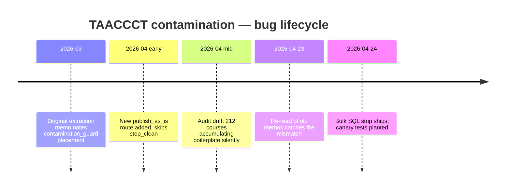

# Reading My Own Audit Logs Is the Highest-ROI Habit I Have

Yesterday I caught myself debugging a sanitize bug for the second time. I wrote the fix eighteen days ago and forgot. The fix was already in a memory file with a one-line summary in my MEMORY.md index. The thirty seconds I would have spent reading that index would have saved the two hours I spent re-deriving the same answer.

This post is about that thirty seconds.

> [!WARNING]
> If you've solved it before, you've stored the receipt. If you don't read the receipts, you're paying twice. Re-discovery is the most expensive bug in a long-running solo workflow.

## The fix — a MEMORY.md index that points at every audit, alert, and pipeline lesson

At the top of my memory directory there's a single file, `MEMORY.md`. Every topical memory file I write gets one line in it: the link, a hyphen, and a one-sentence summary of what's inside. No more, no less.

```markdown
- [Qualora Pipeline Wave 2026-04-21](qualora-pipeline-2026-04-21-wave.md) — skeleton_modernize generates from titles; <5K words → skeleton, ≥20K → content-first rebuild. Rich-source guard now in place.
- [Qualora TAACCCT Contamination Audit 2026-04-23](qualora-taaccct-contamination-2026-04-23.md) — 212/662 published courses contained DOL grant boilerplate; Bug 16 (publish_as_is skips contamination_guard) + Bug 17 (consolidate_courses bypasses step_clean).
- [Qualora Pipeline HIT Wave 2026-04-24](qualora-pipeline-2026-04-24-hit-wave.md) — Bug 18 (consolidator missed embedded-DOCX images) + Bug 19 (label_course_images and inject_images_into_lessons not wired into pipeline).
- [AppleDouble shadow filter (pipeline.py 2026-04-15)](qualora-appledouble-fix.md) — _is_macos_shadow() helper at pipeline.py:147 filters macOS ._* AppleDouble + .DS_Store at 9 enumeration sites.
```

That's a real excerpt. The MEMORY.md index loads automatically every time I boot a session, so the entire backlog of "what I've learned, with pointers to the receipts" is the first thing on screen.

## The shape of an audit log entry

Every topical memory file follows the same shape so I can scan them in seconds. Header line, one paragraph of context, a list of what changed, and a status note.

```markdown
## [Topic] — [Date]

**Trigger:** what kicked this off (incident, audit, decision request).

**What changed:**
- Files touched (with line numbers when load-bearing).
- Bugs caught (numbered).
- Canary tests added.

**Status:** shipped / in-flight / blocked-on-X / rolled-back.

**Cross-references:** related memory files.
```

Predictable shape, predictable scan path. After thirty topical files I can find any past decision in under a minute by scanning the index. The audit-log compound isn't the writing — it's the re-reading.

## The compound — 30+ topical files, 60-second scan

Today the directory has 30+ topical memory files indexed in MEMORY.md, plus 101 daily memory files going back to 2026-02-01. The compound effect was already obvious by file 15 and is now structural to how I work.

```text
$ ls memory/projects/ | wc -l
30
$ ls memory/ | grep -E '^[0-9]{4}-' | wc -l
101
```

The directory is plain markdown. No database. No proprietary format. `grep` works. Diffs work. Cold-reading works.

## A concrete example — TAACCCT contamination

On 2026-04-23, an audit caught 212 of 662 published courses containing raw TAACCCT/DOL grant boilerplate — government disclaimer text that should have been stripped at extraction. The cause was traced not by debugging the current code, but by re-reading old extraction-step memory files. The bug had been a known unknown that drifted into a known: a route called `publish_as_is` skipped the `contamination_guard` step, and `consolidate_courses.py` bypassed `step_clean` entirely.



Without the audit log, I would have re-derived this from scratch. The cost would have been days, not hours.

## The shell alias

The actual habit is one alias and one rule. The alias greps the memory directory for any keyword. The rule is "run the alias before opening any pipeline script."

```bash
# ~/.zshrc
alias memo='grep -ri --include="*.md" -l'

# usage
$ memo "consolidate_courses" memory/
memory/projects/qualora-pipeline-2026-04-23.md
memory/projects/qualora-pipeline-2026-04-24-hit-wave.md
memory/projects/qualora-taaccct-contamination-2026-04-23.md
```

Three results. Sixty seconds to scan. Then I open the script knowing every prior decision that affected it.

## Why this is the highest-ROI habit

I have run this experiment two ways. The weeks I scan first save me hours per week. The weeks I skip the scan and just dive in re-derive the same lessons every two weeks. The interval is consistent — eighteen days for the most recent re-discovery.

The keystroke cost is the alias. The cognitive cost is sixty seconds. Everything else compounds.

<div className="my-12 rounded-2xl border border-brand-teal/30 bg-brand-teal/5 p-8">
  <h3 className="text-xl font-semibold text-white">Get the next AI Lab post</h3>
  <p className="mt-3 text-white/70">The lab covers memory architecture, agent failure modes, and the routing stack behind a one-person studio. New post every couple of weeks.</p>
  <Link href="/ai-lab" className="btn-primary mt-6 inline-flex">Subscribe</Link>
</div>
