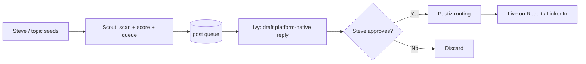

# I Built Two SEO Agents and Disabled Them Before They Posted Anything

Scout and Ivy were architecturally finished. Tests passed. Cron lines were ready. Both were about to push content to brand accounts on a recurring schedule.

I disabled both on day two of their build, before they posted a single word. This post is why — and the four-question pre-flight test that would have caught it earlier than day two.

## Two finished agents on the shelf

Scout and Ivy were the first two-thirds of a three-stage SEO pipeline. Scout would scan target communities (Qualora-relevant subreddits, Quora topics) on a six-hour cron, score posts, and fill a queue. Ivy would pick from the queue, draft platform-native replies, and hold them for human approval.

```text
# Cron lines, both currently disabled

# Scout — every 6 hours
# 0 */6 * * * cd /workspace && python3 scout.py >> logs/scout.log 2>&1

# Ivy — 4× daily, slightly offset
# 30 1,7,13,19 * * * cd /workspace && python3 ivy.py >> logs/ivy.log 2>&1
```

Eight runs per day combined. Both agents had clean test suites, brand-voice guidelines wired in, rate-limit gates configured. The architecture was solid. The wiring was complete. They never ran in production.

## What they were supposed to do



The intended flow: Scout scans every 6 hours, fills a scored queue. Ivy fires 4× daily, drafts replies for the highest-scored items. I approve. The approved items route through Postiz to brand accounts on Reddit and LinkedIn. Eight runs per day, hold-for-approval discipline, brand-voice consistency.

The architecture was clean. The business case was clear (Qualora's organic distribution needed a top-of-funnel). The agents themselves did their jobs.

## Why I disabled them

| Prerequisite | Status on day 2 | What it meant |
|---|---|---|
| Reddit account | Did not exist | Scout would queue posts; nothing could publish |
| LinkedIn brand page | Not connected to routing | Ivy would draft; nothing could route |
| Postiz routing | Not yet wired | Approved drafts had no destination |
| Daily reply cap (Reddit) | Defined (3-5/day) | Theoretical, untested against real account |

An agent without an output channel generates cost without value. Eight runs/day at LLM-call rates is non-trivial spend with no offsetting output. Worse, an agent drafting into an empty downstream pipeline produces a queue that grows indefinitely, dry-run logs that fill disk, and the *appearance* of productivity while accomplishing nothing.

The decision became obvious within hours. Disable both. Document the prerequisites. Wait until the surfaces are real. Re-enable when the four-question pre-flight passes.

## The 4-question pre-flight test

```text
PRE-FLIGHT — run before turning cron back on

[ ] 1. Does the surface exist?
    Is there a real account, page, or destination this agent's output
    will land on? Hypothetical surfaces don't count.

[ ] 2. Does the worker have somewhere to put output?
    Is the routing layer (Postiz, scheduler, queue, repo) wired and
    receiving? Generating output that no one consumes is a leak.

[ ] 3. Does failure get surfaced?
    If the agent breaks, will I know? Is there a log location, an alert,
    or a STATUS.md that surfaces failures within 24 hours?

[ ] 4. Do I want this output read?
    Even with 1-3 yes, is the brand ready for this voice? If the post
    going live tomorrow would embarrass the brand or violate platform
    norms, the answer is no.
```

Any "no" means don't run. Scout and Ivy failed Q1 (surfaces didn't exist) and Q2 (routing wasn't wired). They passed Q3 (logging was set up) and Q4 (brand voice was tuned). Two of four was an automatic disable.

## What I learned after 6 months

> [!IMPORTANT]
> Build the surface, then audit whether it deserves to be live. Most failed agents weren't bad code — they were correct code without a real-world hook. Scout and Ivy will come back online after Petra's warmup phase completes ([the awkward repair on the publish tier](/blog/petra-reddit-signup)).

The deeper lesson is about the order I built things in. I built the agents before I built the accounts. That feels backwards now, but in the moment it felt natural — agents are the interesting work, accounts are paperwork. The result: the agents were ready to fire before there was anywhere for them to fire at. That's exactly the failure mode the pre-flight test catches.

The corrected order, going forward:

1. Decide the destination (account, page, channel).
2. Create the destination — get the credentials, verify the gates, do the paperwork.
3. Wire the routing (Postiz, scheduler, whatever the connector is).
4. *Then* build the agent that fills the destination.

The publish tier (Petra) is now mid-warmup on a real Reddit account. Once Petra's gates clear, Scout and Ivy come back online — not because the agents got better, but because the surfaces caught up.

## Fire-able-agent criteria

The pre-flight test is one half of the discipline. The other half is knowing when an already-running agent has drifted into uselessness:

```text
FIRE-ABLE SIGNALS — take this agent offline

[ ] Stuck in identical-output loop (same diff, same brief, same query — 3+ runs in a row)
[ ] Overrides classifier without justification (forces a route the system says doesn't apply)
[ ] Output channel idle (last consumer activity > 7 days)
[ ] Dry-run-mode for >30 days without a re-enable plan
[ ] Heartbeats green but no novel output for >14 days (cognition dead)
```

Cron-running agents with no fire-able output are worse than no agents — they generate cost, fill logs, and produce a false sense of activity that masks the real bottlenecks. Better to disable cleanly with a written re-enable plan than to keep them running because shutting them down feels like admitting failure.

Scout and Ivy weren't a failure. They were a sequence error. The fix is the four-question test, applied before the cron starts firing. The agents will run when the surfaces deserve them.

<div className="my-12 rounded-2xl border border-brand-teal/30 bg-brand-teal/5 p-8">
  <h3 className="text-xl font-semibold text-white">Get the next AI Lab post</h3>
  <p className="mt-3 text-white/70">One post every couple of weeks from a one-person studio that's been disabling its own agents long enough to know when to. Agent design, fire-able signals, and the routing stack behind it all.</p>
  <Link href="/ai-lab" className="btn-primary mt-6 inline-flex">Subscribe to AI Lab</Link>
</div>
