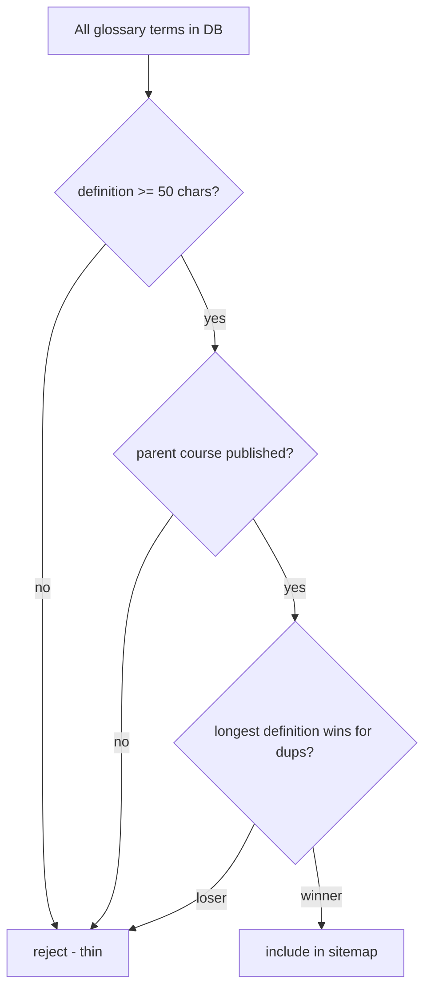

## Starting state

244 URLs in the sitemap. 6,173 GSC impressions over 90 days. 8 clicks. 0.13% CTR.

<Image src="/images/blog/gsc-90day-pre-sitemap.png" alt="GSC dashboard showing 90-day window with 6,173 impressions and 8 clicks" />

The 244 URLs were almost entirely course indexes — `/courses`, `/courses/<id>`, the section index per course. The career pages were missing because of the hardcoded-taxonomy bug (different post). The glossary URLs were missing because nobody had ever added them to the sitemap generator.

That last one was the opportunity. We had **15,000+ glossary terms already published** and rendering at canonical URLs. They had real definitions, sourced from real instructor materials and SkillsCommons content. They were just not in the sitemap, so Google could find them only by crawling internal links — which it does, but slowly, and incompletely.

The question was whether to add them all at once. The aggressive SEO answer is "yes, ship every URL." The more cautious answer is "no, you'll get a thin-content penalty." The right answer turned out to be a third one.

## Expansion source — glossary quality already done

We had already done the quality work on the glossary itself. Every term has:

- a structured `(title, definition, sources)` tuple
- a `parent_course_id` linking back to the source content
- O\*NET-style career associations (top-3 careers most relevant to the term)

A glossary entry on Qualora isn't a thin definition. It is a 100–300-word explanation reshaped from real human sources with cross-links to careers and courses. By the time we considered adding them to the sitemap, the underlying content was already published. The sitemap addition was an indexing question, not a content question.

## The quality filter

Three rules at the sitemap-generator boundary.



1. **Definition ≥50 chars.** Anything shorter is a stub. Reject.
2. **Parent course must be published.** If the course is unpublished or archived, the term is orphaned content. Reject.
3. **Longest definition wins for duplicates.** Even after the dedup work, identical-by-coincidence definitions exist (clean, verified). Pick the canonical one — the longest, with the most context — for the sitemap entry. Same canonical rule that drives the partial unique index in our database.

15,358 glossary terms passed all three filters. That is the bulk of the new sitemap volume.

## Priority budgeting

Sitemaps support a `<priority>` value per URL. Google treats it as a hint about your own ranking of importance, not a guarantee of rank. The advice that doesn't get repeated enough is that **Google trusts your sitemap less if you mark everything as priority 1.0**. If every URL is critical, none of them are.

We set explicit caps.

| Section | Priority cap | Rationale |
|---|---|---|
| Course indexes | 0.8 | Highest-converting URLs, the conversion target |
| Career pages | 0.7 | Primary internal-link hubs but secondary conversion |
| Glossary | 0.3 | High volume, lower per-URL conversion, supports Discovery |
| Static (about, blog index) | 0.5 | Standard navigation surfaces |

Glossary terms cap at 0.3 because they are a long tail. Each individual term doesn't drive primary conversion. In aggregate, they drive Discovery traffic that funnels to glossary → career → course. Priority 0.3 says "yes, please index, but the 244 URLs above this matter more."

## The 410 Gone strategy for orphan routes

While auditing the sitemap, we found ~30 orphan course-module routes from old curricula. Old shapes like `/modules/<slug>` that had been deprecated when we restructured courses around sections.

Those routes had been 301-redirecting to `/courses` to avoid hard 404s. Reasonable on the face of it. Google's behavior on it is the trap.

> [!IMPORTANT]
> A 301 to a generic index that doesn't include the redirected content is treated as a **soft 404** by Google, not a redirect. The indexed URL gets dropped *and* counts against your site's perceived quality.
>
> The right answer for permanently retired URLs is **410 Gone**. It tells Google "this URL is permanently retired, drop it cleanly," with no quality signal cost.

We switched the orphan course-module routes from 301 to 410. The soft-404 issue cleared on the next crawl cycle.

```typescript
// before — 301 to index = soft 404 from Google's perspective
app.get("/modules/:slug", (req, res) => {
  res.redirect(301, "/courses");
});

// after — 410 Gone = clean retirement
app.get("/modules/:slug", (req, res) => {
  res.status(410).send("Gone");
});
```

## The 6-day reindex curve

We deployed the sitemap expansion plus the 410-Gone fix in the same window as the App.tsx race fix and the glossary canonical refactor (covered in their own posts). The combined GSC effect was visible within **6 days**.

<Image src="/images/blog/gsc-6day-reindex-curve.png" alt="GSC line chart showing 6-day reindex curve with clicks rising from 8 to 19" />

| Metric | Before | After (6d) | Change |
|---|---|---|---|
| Sitemap URLs | 244 | 15,602 | +63× |
| GSC clicks | 8 | 19 | +138% |
| GSC CTR | 0.13% | 0.20% | +54% |

Two things to note about that table.

First, the +138% clicks number is a 6-day window measured against a 90-day prior. The base is small. The signal is real and ongoing, but it's a turnaround indicator, not a steady-state. We expect it to converge somewhere between the 0.13% baseline and a benchmark CTR around 0.5–1.0% as the new URLs accumulate impressions.

Second, the 64× sitemap expansion did **not** trigger a thin-content penalty. We watched for it. The quality filter at ingestion is doing its job — the new URLs are passing GSC's freshness and content-quality bar.

<div className="my-12 rounded-2xl border border-brand-teal/30 bg-brand-teal/5 p-8">
  <h3 className="text-xl font-semibold text-white">See it live on Qualora</h3>
  <p className="mt-3 text-white/70">Career-aligned courses, free lesson sampler, no signup needed to try.</p>
  <Link href="https://qualora.io/quiz/sampler" className="btn-primary mt-6 inline-flex">Try a free lesson</Link>
</div>

## Quality gates beat volume gates

The aggressive SEO playbook says ship every URL. The defensive playbook says be conservative with what you index. We tested neither and ran a third option: **quality gates at ingestion, not at the sitemap boundary**.

The difference is operational.

- **Volume-gated sitemap** — generate every possible URL, then filter at the sitemap step. The filter has to evaluate every candidate URL on every regen.
- **Quality-gated content** — content has to clear quality bars to be published at all. Sitemap then includes everything published.

We do quality work in the production pipeline (the 6-pass and 7-pass processes for course bundles, the dedup-and-canonical work on glossary, the threshold-based publishing for careers). By the time something is `published: true` in the database, it has already cleared quality. The sitemap generator's job is to reflect what's published, with a couple of structural filters (thin-definition cut, longest-wins canonical, retired-URL handling).

That's how a sitemap goes from 244 to 15,602 without spam. The 15,358 glossary URLs we added were already passing quality bars; the bar was applied at content-production time, not at sitemap-emission time.

Two follow-ups still on the list. First, structured-data validation across the 15K added URLs — we ran spot checks but not full coverage. Second, the priority-budget tuning: if the 0.3 cap on glossary turns out to be too low after a few months of indexing data, we'll bump it to 0.4. The right number is whatever GSC actually rewards for our query mix, which we will only know after the indexed volume stabilizes.

For now, the sitemap is doing its job. Google sees what we publish. Clicks doubled inside a week. The compound win comes from continuing to publish quality, not from gaming volume.
