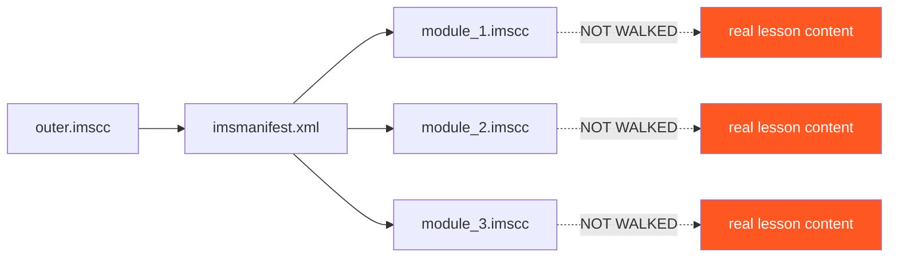
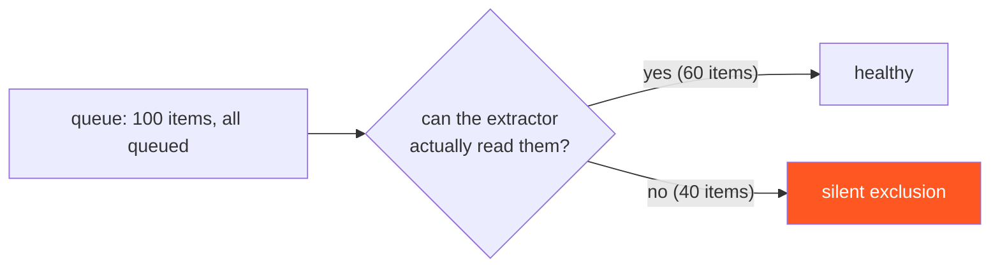
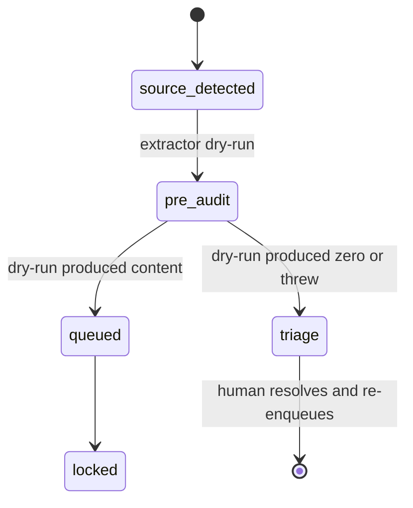

The dashboard said 662 courses, healthy backlog, all green. The pipeline was processing items. Statuses moved. Logs accumulated. From the outside, the system was working.

It was lying.

A `.imscc` recursion bug was hiding rich source files inside the queue. Items looked in-flight, with statuses transitioning and locks rotating, but the extractor couldn't reach the actual content. Every "in queue" item was potentially unprocessable, and there was no field on the dashboard that would tell us which ones.

This post is the postmortem on a class of bug I've started to call *silent exclusion* — when your queue contains items that are technically there, technically tracked, technically progressing through statuses, but architecturally unreachable.

## §1 The dashboard that lied

Six hundred and sixty-two rows. All in motion. Status distribution looked normal — most in `extracted` or `modernizing`, a handful in `halted` waiting for retry. No alarms. The orchestrator was happy. The retry budget was fine.

The thing the dashboard didn't show, because we had no field for it: how many of those items were *extractable*. Not "have we tried to extract" — that was a column. Not "is there a source file" — that was also a column. *Extractable*. Has there been a successful extraction with surviving content above threshold?

Because that wasn't a column, it wasn't a filter, and it wasn't a histogram. The dashboard reported queue health. It did not report queue *processability*.

That gap is the bug class.

## §2 The .imscc recursion bug

The triggering bug was specific. IMSCC files can wrap other IMSCC files. A common Blackboard or Moodle export pattern: the outer `.imscc` is a course manifest pointing to inner `.imscc` files for individual modules. Each inner file has its own manifest and its own resource tree.

`extract_imscc.py` was looking one level deep. It walked the outer manifest. It found resource references. When those resource references were themselves `.imscc` files, the extractor read them as opaque blobs rather than recursing in to extract their contents.



The outer manifest produced a clean output that *looked* like extraction had succeeded. Title was extracted. Section structure was extracted. Module titles were extracted. The actual lesson content lived one level deeper, inside each `module_N.imscc`, and the extractor never got there.

Downstream, the pipeline saw a course with titles, structure, and zero lesson content. With Bug 8 (`intent_extract surviving_words=0` continued — see [the 19-bug atlas](/blog/nineteen-bugs-failure-pattern-atlas)), the modernize step then generated coherent generic content from the titles. With Bug 8 fixed, those courses now halt at extract — but only after we shipped the halt-on-zero patch. Before that, they shipped fabricated.

The fix: full-depth recursion in `extract_imscc.py`. When the manifest references a `.imscc` resource, recurse in, parse its inner manifest, extract its resources, merge into the outer course's content.

## §3 Blackboard-wrapped IMSCC — CLC HET series

A separate but related instance: Blackboard exports wrap their `.imscc` outputs in a `.zip` containing additional Blackboard-specific metadata. The structure looks like:

```
clc_het_medical_assistant.zip
├── BlackboardCourseExport.xml      <-- Blackboard-specific metadata
├── csfiles/                          <-- Blackboard course files
├── resources.xml                    <-- Blackboard resource catalog
└── package.imscc                    <-- nested IMSCC (the actual content)
    ├── imsmanifest.xml
    ├── lessons/
    └── media/
```

Our IMSCC extractor expects `imsmanifest.xml` at the root. It does not handle Blackboard-wrapped IMSCC. When we hand `clc_het_medical_assistant.zip` to `extract_imscc.py`, it reads `BlackboardCourseExport.xml`, finds no `imsmanifest.xml` at the root, and fails.

The CLC HET medical-assistant series — eight courses — is blocked on this. The same pattern as the AppleDouble bug (file-system shadows that look like data) and the Storyline-zip bug (extension collisions that misroute) — *format inheritance breaks dispatch*.

```
$ unzip -l clc_het_medical_assistant.zip | head
Archive:  clc_het_medical_assistant.zip
  Length      Date    Time    Name
---------  ---------- -----   ----
        0  2025-09-12 14:22   csfiles/
   234567  2025-09-12 14:22   csfiles/lecture_audio_1.mp3
        0  2025-09-12 14:22   resources/
     1842  2025-09-12 14:22   BlackboardCourseExport.xml
     8743  2025-09-12 14:22   resources.xml
  1245832  2025-09-12 14:22   package.imscc
```

The fix needs a two-step dispatcher: detect Blackboard wrapping (presence of `BlackboardCourseExport.xml` at root), unwrap to find inner `.imscc`, then dispatch the inner package to the IMSCC extractor with the Blackboard csfiles binaries injected as supplementary media. Not yet shipped. Items remain in triage.

## §4 "In queue" is a wish, not a status

The deeper failure was in our status vocabulary.

Our state machine has 12 statuses: `queued`, `locked`, `extracting`, `extracted`, `preflighting`, `preflighted`, `composing`, `composed`, `modernizing`, `modernized`, `enriching`, `seeding`, `seeded`, `halted`, `triage`. Each describes intent or progress. None describes *processability*.

A queue of unprocessable items looks identical to a queue of healthy ones in this vocabulary:



`queued` means "we have intended to process this." It does not mean "we have proven this is processable." That distinction did not exist in our schema. The dashboard was reporting the wrong thing because the schema did not have a field for the right thing.

This is a vocabulary problem with status fields. Names like `queued`, `pending`, `in_progress`, `complete` describe operator intent. They do not describe verifiable facts about the artifact.

## §5 The pre-queue audit

The fix is a new step that runs *before* an item enters `queued`: dry-run extractor on the source files, count surviving words, refuse to enqueue if zero.

| Audit trigger | Behavior | Outcome |
| --- | --- | --- |
| No source file present | Refuse enqueue | Item rejected with reason |
| Source file is shadow / Thumbs.db | Refuse enqueue | Item rejected with reason |
| Format detector returns "unknown" | Refuse enqueue, route to triage | Triage with suggested-extractor metadata |
| Dry-run extract returns `surviving_words=0` | Refuse enqueue, route to triage | Triage with extractor + reason |
| Dry-run extract throws | Refuse enqueue, route to triage | Triage with stack trace |
| Dry-run extract succeeds with content | Enqueue as `queued` | Healthy enqueue |

The audit is cheap — about 30 seconds per item — because it runs the extractor on the file but stops after extraction (no LLM calls, no enrichment). It turns silent failure into loud refusal.

A new status, `pre_audit`, sits between source detection and `queued`. The state-machine diagram now begins:



The semantic shift: `queued` now means "we have proven this is extractable." Items that previously sat in `queued` invisibly broken now show up in `triage` immediately, with the diagnostic that explains why.

When we ran the audit retroactively against the existing 662 items, dozens surfaced — IMSCC files with the recursion bug, Blackboard-wrapped IMSCCs that couldn't be parsed, AppleDouble-shadow source files that had been silently picked up. All visible now. All routed for human resolution.

## §6 The principle

Status names should describe verifiable facts, not operator intentions.

`queued` is a wish unless it means "we have proven this is processable." `pending` is a wish unless it means "all prerequisites have been verified." `in_progress` is a wish unless it means "we have evidence the worker is making progress."

The cure is an audit step at the boundary where intent becomes status. Run the cheap version of the work. Verify the precondition is real. Only then move into the status. Anything that fails the audit goes to triage with a diagnostic — *loudly*, not silently.

Otherwise your dashboards are full of beautifully colored cells that don't mean what their column headers say.

<div className="my-12 rounded-2xl border border-brand-teal/30 bg-brand-teal/5 p-8">
  <h3 className="text-xl font-semibold text-white">Pipeline-engineering as a service</h3>
  <p className="mt-3 text-white/70">If your pipeline dashboards report "all green" but you don't know which items are actually processable, your status vocabulary is the bug. That's what we fix.</p>
  <Link href="/contact" className="btn-primary mt-6 inline-flex">Talk to Go7Studio</Link>
</div>
