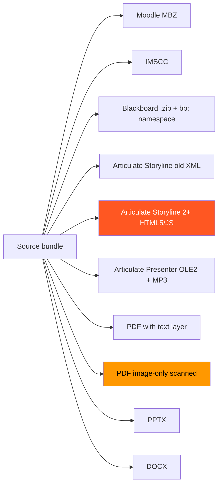
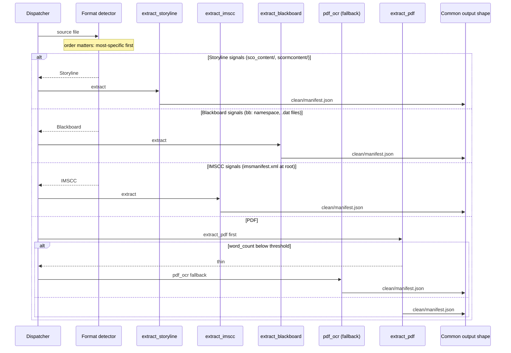

When you ingest real public-domain courses — not curated benchmark datasets — they don't arrive in one format. They arrive in eight.

I've ended up with sixteen extractors across those eight formats, plus an OCR fallback for the cases where there isn't actually any text in the file. This is the cost matrix: what each format looks like in the wild, which extractor handles it, real per-course numbers, and the gotchas I learned the hard way. The Storyline 2+ gap is real and currently unfixed.

## §1 The format zoo

Real public-domain content arrives in whatever the original grantee, instructor, or community college had on their authoring tool when they hit export. Eight years of TAACCCT-funded courseware means eight years of every authoring tool in education shipping its preferred format.



The orange highlight on Storyline 2+ is the known gap. The amber on image-only PDF is what OCR fallback solves. The rest are working, with extractor-specific quirks documented per script.

## §2 The 16 extractors

Each extractor has its own quirks — its own format-specific tricks for digging actual content out of whatever the source authoring tool produced.

| Extractor | Format | Notable tricks |
| --- | --- | --- |
| `extract_moodle.py` | Moodle MBZ | Walks `course/sections/` and `activities/` trees; merges `mod_label` instructions into adjacent lessons |
| `extract_imscc.py` | IMSCC | Parses `imsmanifest.xml`, walks resource tree, handles nested IMSCC (recursion) |
| `extract_blackboard.py` | Blackboard | Handles `bb:` namespace, parses `.dat` resource files, extracts csfiles binaries |
| `extract_storyline.py` | Storyline (older) | Reads `sco_content/en/xml/cw01/pgN.xml`, joins to lesson manifest |
| `extract_presenter.py` | Articulate Presenter | OLE2 binary parsing for slide content, MP3 audio extraction, DeepInfra Whisper transcripts, lesson-to-slide anchor matching |
| `extract_pdf.py` | PDF (text layer) | PyMuPDF text extraction, table detection, footnote handling |
| `pdf_ocr.py` | PDF (image-only) | DeepInfra Llama-3.2-90B-Vision fallback when text-layer extraction returns under threshold |
| `extract_pptx.py` | PPTX | Slide text + speaker notes, image extraction, layout-aware ordering |
| `extract_docx.py` | DOCX | Paragraph + heading hierarchy, embedded image walk, table extraction |
| `extract_storyline_html5.py` | Storyline 2+ | Detected and routed correctly; extractor incomplete (known gap) |
| `extract_video.py` | MP4/WebM | DeepInfra Whisper transcripts via `ingest_audio.py` |
| `extract_audio.py` | MP3/WAV | DeepInfra Whisper |
| `extract_html.py` | Standalone HTML | DOM walk, heading hierarchy, embedded media |
| `extract_epub.py` | EPUB | Spine walk, chapter ordering |
| `extract_youtube_dump.py` | Captioned video URLs | YT-DLP + caption tracks |
| `extract_zip_generic.py` | Unknown zip | Last-resort walker; emits diagnostic, halts to triage |

The dispatcher decides which one runs. Output-shape contract is identical across all sixteen — every extractor produces `clean/manifest.json`, `clean/lessons/*.json`, `_manifest_docs/`, and `media/`. That contract is what lets a 19,482-word Moodle MBZ and a 1,710-word OCR'd PDF feed into the same modernizer downstream.



## §3 The cost matrix

Real per-course numbers from production runs. Costs include LLM calls (modernize, intent extraction, OCR where applicable). Time is wall-clock end-to-end on production worker.

| Format | Example course | Words | Cost | Time | Notable |
| --- | --- | --- | --- | --- | --- |
| Moodle MBZ | course 6702 | 19,482 | $0.01 | ~6 min | Fast path; extractor produces clean manifest with no OCR needed |
| IMSCC | various | 8K-30K | $0.01-$0.02 | 5-10 min | Median; depends on nested recursion depth |
| Blackboard | CLC HET medical (when not wrapped) | 12K-18K | $0.02 | 8-12 min | `.dat` parsing slower; csfiles binaries add time |
| Articulate Presenter | medical-imaging series | 15K-25K | $0.05-$0.10 | 15-30 min | Whisper transcripts dominate cost |
| PDF (text layer) | various syllabi | 3K-12K | $0.005-$0.01 | 3-5 min | Fast path |
| PDF (image-only OCR) | SME Review PDF | 1,710 | $0.008 | ~4 min | DeepInfra Llama-3.2-90B-Vision @ ~$0.001/page |
| PDF (OCR'd, longer) | HIS-280 series | 5K-15K | $0.05-$0.20 | 10-25 min | OCR scales linearly with page count |
| PPTX | various | 4K-18K | $0.01 | 4-8 min | Fast path; speaker notes carry most content |
| DOCX | various | 3K-25K | $0.01 | 3-7 min | Fast path |
| Storyline (older XML) | a few CADD courses | 8K-15K | $0.02 | 6-10 min | Working but rare |
| Storyline 2+ HTML5 | items 223 / 4229 / 4976 | 0 | — | — | **Known gap; produces empty content** |

The two anchor numbers worth remembering:

- **Course 6702 (Moodle MBZ): 19,482 words at $0.01.** The fast path. Most of the cost is the modernize LLM call; extraction itself is essentially free.
- **SME Review PDF: 1,710 words at $0.008.** This was an image-only scanned PDF that produced zero words on the text-layer extractor. OCR fallback at ~$0.001/page recovered the entire document. It cost roughly the same as a 1,710-word text-layer PDF would have cost.

Cost-per-word for OCR is higher than text-layer — about 4× — but the alternative is zero words. The economics are clean: **OCR is the unlock, not the optimization.** Image-only PDFs produced nothing before this fallback existed.

## §4 PDF-OCR economics

The OCR fallback is the single most impactful extractor in the matrix. It's also the cheapest LLM-vision call we make.

```python
# extract_pdf.py — OCR fallback decision
def extract_with_ocr_fallback(pdf_path: Path) -> ExtractedContent:
    text_layer_result = extract_text_layer(pdf_path)
    if text_layer_result.word_count >= MIN_WORDS_FOR_TEXT_LAYER:
        return text_layer_result

    # Below threshold — scanned / image-only / corrupted text layer
    log.info(
        "pdf text layer thin (%d words) — falling back to OCR via DeepInfra",
        text_layer_result.word_count,
    )
    return pdf_ocr.run(pdf_path, model="meta-llama/Llama-3.2-90B-Vision-Instruct")


MIN_WORDS_FOR_TEXT_LAYER = 200  # under this, OCR fallback
```

DeepInfra's Llama-3.2-90B-Vision at ~$0.001 per page. A typical 50-page community-college syllabus PDF costs about $0.05 to OCR. A short 8-page reference handout runs under a cent.

Validation cluster: AGRI domain validated at 88.6% real-content recovery via OCR fallback. HIS-280 — a multi-course historical-document series with all-image PDFs — went from 0% real content to 100% real content. That before-after on HIS-280 is the strongest single argument for adding OCR fallback to any pipeline that ingests real-world PDFs.

## §5 Dispatcher order matters

Dispatching is routing logic, but it's also safety logic.

Articulate Storyline output is a `.zip` file. IMSCC packages are also `.zip` files (renamed `.imscc`, but `.zip` works too — and historical Articulate exports sometimes ship as plain `.zip`). For a long time, the dispatcher tried IMSCC extraction first because it was the most common case. When a Storyline zip arrived, IMSCC extraction wouldn't error — it would just return empty content. Pipeline continued. Modernize generated coherent garbage from the titles.

The fix: Storyline detection runs *before* IMSCC dispatch. Specificity-first ordering. The dispatcher now looks for Storyline-specific signature paths (`sco_content/`, `scormcontent/`, `meta.xml` with Articulate signatures) and routes to `extract_storyline.py` if any match. Only if no match does it fall through to IMSCC.

The same pattern for image-only PDFs: text-layer extraction first, OCR fallback only if word count is below threshold. The fallback isn't the default because OCR is 4× more expensive per word; it's the safety net for when the default produces nothing useful.

> [!CAUTION]
> Detection order is a contract. Adding a new extractor means deciding where it goes in the order, not just appending it. The detector should be *specific*: it should match files of the new format and *only* files of the new format. If your new detector also matches some files of an existing format, you have routed those existing files to the wrong extractor.

## §6 Known gap — Storyline 2+ HTML5

Older Articulate Storyline produces zip files with an internal structure of `sco_content/en/xml/cw01/pgN.xml`. Readable. Parseable. Our `extract_storyline.py` handles it.

Storyline 2+ produces a different structure. Lesson content lives in a `data.js` file as an eval-pack — JavaScript that, when evaluated, produces the lesson's runtime state. The HTML player loads `data.js` and reconstructs the lesson on demand.

Our detection logic correctly identifies Storyline 2+ files (signature paths in the zip — `mobile/`, `lib/`, `assets/data.js` with eval-pack signatures) and routes them to `extract_storyline.py`. The extractor then returns empty content because it only handles the older XML format.

Real impact: items 223, 4229, and 4976 — a medical training series — are blocked. Detection is right; extraction is incomplete. The detection-correct-extraction-empty pattern looks identical to "this format isn't supported" until you read the dispatcher logs and see "routed to extract_storyline" and "returned 0 words" and realize it tried.

```python
# extract_storyline.py — current state
def extract(zip_path: Path) -> ExtractedContent:
    structure = detect_storyline_version(zip_path)

    if structure == "older_xml":
        return _extract_older_xml(zip_path)

    if structure == "html5_evalpack":
        # KNOWN GAP: HTML5/JS data.js eval-pack
        # Needs headless V8 evaluation; not yet implemented.
        log.warning(
            "Storyline 2+ HTML5/JS detected (%s). Routing correct, "
            "extractor incomplete. Halting to triage.",
            zip_path.name,
        )
        return ExtractedContent.empty(reason="storyline_html5_unimplemented")

    return ExtractedContent.empty(reason="storyline_unknown_structure")
```

The fix is a Storyline-2+-specific extractor that boots a headless V8 (Node.js with `vm.Script` or Bun's runtime equivalent) to evaluate `data.js`, snapshot the resulting state, and walk the lesson tree from the snapshot. Probably $0.05/course at scale once it's built. Worth it for the medical-series blockers.

## §7 Validation by domain cluster

Validating extractors course-by-course is too noisy. We validate by domain cluster.

The pattern: ingest a cluster of related courses (e.g. AGRI — agriculture coursework from a TAACCCT round), run the full pipeline, sample-audit a percentage, compute "real content recovery rate" = words in published lessons / words in source materials.

AGRI cluster validation: 88.6% real-content recovery. That number is good. It tells us that the extractor + modernize + validate combination preserves the source content faithfully across a domain.

Course 6702 — 19,482 words of Moodle MBZ — was the spot-check inside the AGRI cluster, costing $0.01 end-to-end. HIS-280 hit 100% real content recovery via OCR fallback (the cluster validation that broke when we hadn't yet built OCR; once OCR shipped, HIS-280 went from blocking to anchor).

Twenty-nine regression tests exist across the extractor suite. Most are extractor-specific synthetic-input tests; a few are domain-cluster integration tests that check end-to-end recovery on a known-good corpus.

## §8 What I'd build next

The biggest single unlock for the next 100 courses is the Storyline 2+ extractor. Headless V8 to evaluate `data.js`, snapshot state, walk the lesson tree. The medical-series blockers (items 223 / 4229 / 4976) are high-value courses sitting in triage waiting on this.

Second priority: a `.dat` parser improvement for Blackboard. The current implementation handles the common case. Some Blackboard exports use newer `.dat` schemas with embedded XML islands; we currently pass those to the generic walker and lose structure. About 12 courses in triage are blocked there.

Third priority: a real EPUB extractor for the long-form coursework that arrives as EPUBs. There's a thin wrapper around the spine but it loses embedded media. Probably 6-8 courses blocked.

The pattern across all three: each new extractor is a constant cost ($0.01-$0.10/course) for an entire blocked cluster. Single-digit dollars to unlock dozens of courses. Compared to the cost of *not* extracting them — zero published content from those bundles — the math is straightforward.

<div className="my-12 rounded-2xl border border-brand-teal/30 bg-brand-teal/5 p-8">
  <h3 className="text-xl font-semibold text-white">Pipeline-engineering as a service</h3>
  <p className="mt-3 text-white/70">Storyline 2+ is on the roadmap. If your corpus is blocked on a format I haven't covered yet — Captivate, Lectora, custom HTML5 wrappers, anything — that's the kind of work Go7Studio takes on. Small studio, real receipts.</p>
  <Link href="/contact" className="btn-primary mt-6 inline-flex">Talk to Go7Studio</Link>
</div>
