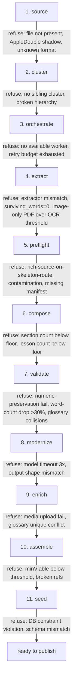
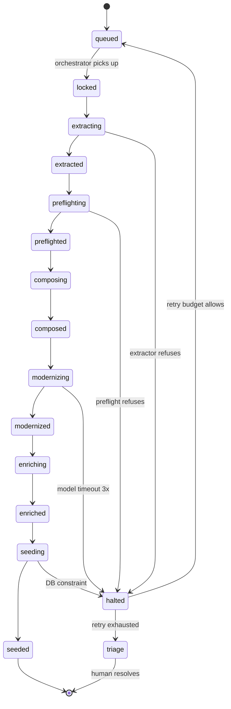
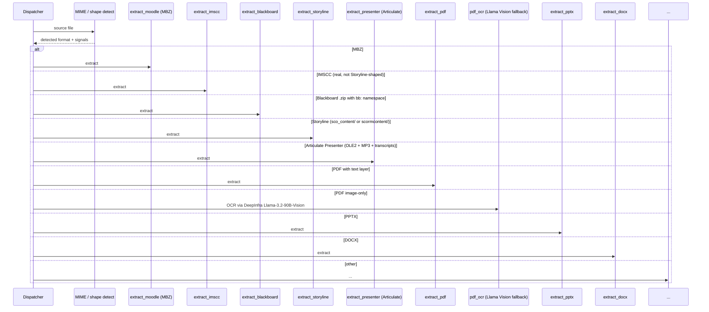

There are over sixty Python scripts in this pipeline. They have moved more than 700 public-domain courses from raw bundles to publishable lessons. The whole thing is operated by one person.

That last sentence is doing a lot of work. The reason it works is that the pipeline is not a script. It is a state machine with refusal rights, scripts hanging off it, and a contract for what each script promises and what it can refuse to produce.

This post is the tour. The 11 phases. The 12-status state machine that came after script 40 and rewrote how the rest of the system worked. The 16 extractors hidden behind one dispatcher. The halt conditions per phase that turn silent failure into loud refusal. And the canary harness that keeps every postmortem from recurring.

If you are designing a content pipeline that has to survive real-world inputs — public-domain coursework, scraped corpora, customer-supplied bundles, anything that arrives in shapes you didn't choose — this is the architecture I'd build today.

## §1 Factory floor

Sixty-plus scripts, seven hundred-plus courses, one operator. That ratio only works because the pipeline is not a sequence of scripts strung together by an orchestration script. It is a contract between phases.


Each phase has a narrow job. Each phase has the right to refuse. The orchestration layer doesn't push work through; it asks each phase, "given what arrived from the previous phase, can you produce a valid output, or should I halt this course?"

Refusal is a feature, not a failure. Half the value of the pipeline is in *what doesn't get published* — courses that look fine to a human reading metadata but that the validators caught with zero surviving words, or thin sources, or contamination, or extractor mismatch. The shape of the system is built around making refusal easy and silent-acceptance hard.

## §2 The 11 phases

Each phase is a contract. One job. Strict input shape. Strict output shape. Refusal rights documented and tested.



Walk through what each phase actually owns:

**1. source.** Detect that source files exist, are readable, are not macOS shadows, and are in a recognized format. Outputs: source manifest with declared format. Refuses: missing files, AppleDouble shadows, unknown extensions, zero-byte files.

**2. cluster.** Group source files into sibling clusters. A "course" might be a single bundle or a dozen bundles that need consolidation. Outputs: cluster definition with member files. Refuses: ambiguous membership, broken parent-child hierarchies.

**3. orchestrate.** Allocate work to a worker, manage retry budget, manage triage queue for repeatedly-failing courses. Outputs: locked work item with TTL. Refuses: no worker available, retry budget exhausted, lock-already-held.

**4. extract.** Dispatch to one of 16 extractors based on detected format. Produce normalized output (titles, lesson bodies, manifest docs, media references) regardless of source format. Outputs: extracted clean directory. Refuses: extractor mismatch, `surviving_words=0`, image-only PDF over OCR threshold.

**5. preflight.** Decide which downstream route the course takes (skeleton-modernize vs content-first), strip contamination, validate manifest. Outputs: route decision plus cleaned source. Refuses: rich source on skeleton route (without operator override), contamination patterns, missing manifest entries.

**6. compose.** Assemble the high-level structure — sections, lessons, ordering. Outputs: composition manifest. Refuses: section count below floor, lesson count below floor, orphan content.

**7. validate.** Cross-check the composition against the cleaned source. Numeric-preservation audit (no regulatory paraphrasing), word-count delta check, glossary uniqueness. Outputs: validation report with halt-or-continue. Refuses: numeric preservation failures, word-count drop greater than 30%, glossary key collisions.

**8. modernize.** LLM rewrite of lesson bodies for clarity, tone, and consistency. Outputs: modernized lesson bodies. Refuses: model timeouts (after retry), output shape mismatch with input contract.

**9. enrich.** Add glossary, summaries, learning objectives, image classifications, audio transcripts, media uploads. Outputs: enriched lesson + media catalog. Refuses: media upload failures, glossary conflicts.

**10. assemble.** Pull modernized lessons and enrichment data into the seed-ready payload. Outputs: QCF JSON payload. Refuses: minViable below threshold, broken media references.

**11. seed.** Write to database. Outputs: published-state course. Refuses: DB constraint violations, schema mismatch.

Each "refuses" is not aspirational — it is a halt condition with a canary test that fires if the refusal stops working.

## §3 The pipeline_items state machine

The state machine arrived after script #40. Before that, "what's the status of course X?" was answered by reading log lines from N different scripts. After that, it was answered by `SELECT status FROM pipeline_items WHERE course_id = $1`.

State is data, not log lines.



Twelve statuses. Lock TTL on `locked`, `extracting`, `composing`, `modernizing`, `enriching`, `seeding` so a crashed worker releases the lock automatically. Retry budget enforced by the orchestrator on each transition into `halted`.

When this table got created, the operator had 772 in-flight courses scattered across log files and ad-hoc tracking spreadsheets. The backfill was its own multi-day project: parse every log file, parse every spreadsheet, reconcile against the actual database state, write 772 rows with the best-known status. A consolidation guard prevented two backfill rows from overwriting each other when the same course appeared in two log streams.

The lesson from the backfill: **state is data, not log lines.** Once the state machine existed, every script that previously printed `[INFO] course 789 starting modernize` could just call `transition(789, "modernizing")` and let the table be the truth. Logs became telemetry. Status became a query. The 60+ scripts didn't need to coordinate — they just needed to write to the same table.

The other lesson: **don't add a state machine first.** It would have been over-engineering at script #5. By script #40 the cost of *not* having it was visible — debugging a stuck course took an hour of grepping logs. The state machine made that a 10-second query.

## §4 The extractor zoo

Sixteen extractors. Eight formats. One dispatcher.



Output-shape contract: every extractor produces the same directory structure: `clean/manifest.json`, `clean/lessons/*.json`, `_manifest_docs/` (rich source PDFs/PPTX), and `media/`. MBZ extraction and PDF-OCR converge into the same modernizer because they produce the same shape.

The dispatcher is itself safety logic. Two postmortems (Bug 1 — AppleDouble shadows being picked up; Bug 3 — Storyline zips being routed to IMSCC) came from the dispatcher making the wrong routing decision before the extractor could refuse. The dispatcher now runs in specificity order: most-specific format first, fall through to next-most-specific, default fallback is "halt with reason."

The 16-extractor cost matrix is its own post — see [the extractor cost analysis](/blog/sixteen-extractors-eight-formats-cost-matrix). The short version: per-course economics range from $0.008 (a 1,710-word SME Review PDF that needed OCR) to $0.01 (a 19,482-word Moodle MBZ on the fast path). DeepInfra Llama-3.2-90B-Vision OCR fallback at ~$0.001/page is what unlocked the image-only-PDF cluster — those courses produced zero words before the OCR fallback existed.

## §5 Halt conditions

Every phase gets to refuse. The halt-condition table is the contract.

| Phase | Trigger | Behavior on refuse | Canary |
| --- | --- | --- | --- |
| source | AppleDouble shadow file matched | Skip and log | `canary_appledouble_filter` |
| source | Unknown format | Move to triage | `canary_source_format_recognized` |
| extract | `surviving_words=0` | Halt course, retry budget | `canary_halt_on_zero_words` |
| extract | Image-only PDF over OCR threshold | Route to `pdf_ocr.py` fallback | `canary_pdf_ocr_fallback` |
| preflight | Rich source on skeleton-modernize route | Halt unless `QUALORA_ALLOW_SKELETON_WITH_RICH_SOURCE=1` | `canary_skeleton_rich_source_guard` |
| preflight | Contamination pattern matched | Strip; halt if density > 50% | `canary_grant_boilerplate_strip` |
| compose | Section count below floor | Halt course | `canary_section_floor` |
| validate | Numeric-preservation fail | Halt course | `canary_numeric_preservation` |
| validate | Word-count drop > 30% | Halt course | `canary_word_count_delta` |
| modernize | Model timeout 3x | Halt to triage | `canary_modernize_retry_budget` |
| enrich | Glossary unique conflict | Halt course | `canary_glossary_unique_per_section` |
| seed | DB constraint violation | Halt with diagnostic | `canary_seed_constraint_diagnostic` |

The biggest historical bug in this table is the `intent_extract surviving_words=0 → continue` (Bug 8). It was supposed to halt and didn't. Modernize generated coherent garbage from titles. Twelve courses bypass-routed past the consolidator made it through to publish before the halt-condition was wired correctly.

The general rule: **every step in your pipeline should be able to answer "should I refuse?" before answering "what is my output?"** If a step cannot refuse, it cannot be safe.

## §6 The canary harness

Every postmortem plants a test.

That's the rule. We've shipped 39 canaries against this pipeline, one per fixed bug plus a handful of broader integration canaries. They run before any pipeline-touching merge. They run in 8 seconds.

```
$ python run_canaries.py
[1/39] canary_appledouble_filter ............................ PASS
[2/39] canary_source_format_recognized ...................... PASS
[3/39] canary_storyline_routing ............................. PASS
[4/39] canary_halt_on_zero_words ............................ PASS
[5/39] canary_pdf_ocr_fallback .............................. PASS
[6/39] canary_skeleton_rich_source_guard .................... PASS
[7/39] canary_grant_boilerplate_strip ....................... PASS
[8/39] canary_section_floor ................................. PASS
[9/39] canary_numeric_preservation .......................... PASS
[10/39] canary_word_count_delta ............................. PASS
[11/39] canary_modernize_retry_budget ....................... PASS
[12/39] canary_glossary_unique_per_section .................. PASS
[13/39] canary_consolidator_runs_clean ...................... PASS
[14/39] canary_publish_as_is_guard .......................... PASS
[15/39] canary_force_route_guard ............................ PASS
[16/39] canary_image_labeler_in_pipeline .................... PASS
[17/39] canary_image_injector_in_pipeline ................... PASS
[18/39] canary_consolidator_walks_embedded_images ........... PASS
[19/39] canary_codex_config_normal .......................... PASS
[20/39] canary_imscc_recursion_full_depth ................... PASS
...
[39/39] canary_visual_kickoff_payload_complete .............. PASS

39/39 passed in 8.4s
```

A canary is small. Twenty to a hundred lines. Synthetic input. Recreates the original bug's exact conditions. Asserts the fixed behavior. Doesn't touch the database or the live filesystem (mocks where it has to).

The discipline is "fix-plus-canary," not just "fix." A fix without a canary depends on the next operator remembering. A fix with a canary depends on the next operator running `run_canaries.py`, which they already do because it gates merges.

The [19-bug failure-pattern atlas](/blog/nineteen-bugs-failure-pattern-atlas) is the long version of this — one row per canary, mapped to five recurring failure families.

<div className="my-12 rounded-2xl border border-brand-teal/30 bg-brand-teal/5 p-8">
  <h3 className="text-xl font-semibold text-white">Subscribe to the AI Lab</h3>
  <p className="mt-3 text-white/70">Pipeline architecture, agent failure modes, harness engineering — published as we ship them. No fluff, all from real production work.</p>
  <Link href="/ai-lab" className="btn-secondary mt-6 inline-flex">Read the AI Lab</Link>
</div>

## §7 env_fingerprint and the cost/quality budget

This phase exists because of one bad afternoon.

Every audit step was running 20× slower than baseline. Modernize took longer than usual. Validate took twice as long. The canaries passed but the wall-clock numbers were terrible.

Diagnosis: `~/.codex/config.toml` had `model_reasoning_effort = "xhigh"` set globally. Nobody changed it on purpose — it had drifted from a previous experiment and stayed. Every audit step that called Codex was paying for high-reasoning when it didn't need it.

The fix is two parts. One: per-call `reasoning_effort` parameter passed through to `openai_generate_via_codex` (low/medium/high). Two: an `env_fingerprint` step that runs at pipeline start and snapshots the relevant configuration:

```python
# env_fingerprint.py — sketch
def fingerprint_environment() -> dict:
    return {
        "codex_config_reasoning_effort": _read_codex_config_value(
            "model_reasoning_effort"
        ),
        "deepinfra_model": os.environ.get("DEEPINFRA_VISION_MODEL"),
        "qualora_skeleton_override": os.environ.get(
            "QUALORA_ALLOW_SKELETON_WITH_RICH_SOURCE"
        ),
        # ... 8 more fields ...
    }


def assert_environment_normal(fingerprint: dict) -> None:
    if fingerprint["codex_config_reasoning_effort"] == "xhigh":
        raise EnvironmentDriftError(
            "~/.codex/config.toml has model_reasoning_effort=xhigh. "
            "This will slow audits 20x. Reset to 'medium' or pass per-call."
        )
    # ... other assertions ...
```

Snapshot at start. Compare against the assertions. Halt if drift detected. Failed assertions show up in `STATUS.md` with a clear remediation note.

This generalizes. Anywhere your pipeline depends on environmental configuration that lives outside the repo — model defaults, API keys, env-flag overrides, system Python versions — fingerprint it and assert at startup. If it's worth being a config option, it's worth being a fingerprinted assertion.

## §8 What I'd build first if starting over

If I were starting this pipeline today, knowing what I know now, the order would be:

1. **State machine first.** Before any extractor, before any modernize, before any seed. The `pipeline_items` table with statuses, lock TTL, and retry budget is the foundation. Every script writes to it. Every query reads from it. Without this, you can't even see your queue.

2. **Halt-on-zero by default.** Every step that consumes input from the previous step gets a "should I refuse?" check. Refuse on empty, refuse on shape mismatch, refuse on threshold violation. Default to halt; require explicit opt-in to continue past a refusal condition.

3. **Canaries before code.** Before writing the second script in the pipeline, build `run_canaries.py`. Add a canary for the contract between phase 1 and phase 2 *before* writing phase 2. Now every phase has a test before it has dependents.

4. **One dispatcher per fan-out.** When you have multiple extractors for one input shape, write the dispatcher with explicit detection-order and "halt if no match." Don't let any extractor be the silent default.

5. **Env fingerprint as a phase.** As soon as you depend on any config-file or env-var setting, fingerprint it at pipeline start and assert.

6. **Standalone scripts are pipeline gaps.** Audit `/scripts/` quarterly. Anything doing real value must be wired in or deleted. Standalone scripts that quietly carry the system are debt that compounds.

You don't need 60 scripts to start. You need a state machine, a halt-on-zero default, and one canary. The 60 scripts will arrive on their own as the catalog grows. The architecture decides whether they're a working pipeline or a stack of duct tape.

<div className="my-12 rounded-2xl border border-brand-teal/30 bg-brand-teal/5 p-8">
  <h3 className="text-xl font-semibold text-white">Pipeline-engineering as a service</h3>
  <p className="mt-3 text-white/70">If your content pipeline is leaking money, that's what we do. Talk to Go7Studio.</p>
  <Link href="/contact" className="btn-primary mt-6 inline-flex">Talk to Go7Studio</Link>
</div>
