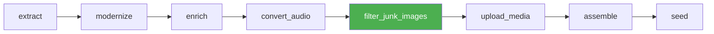

Two scripts I wrote months ago for a one-off image-quality cleanup. Both lived in `/scripts`. Both ran when I remembered to run them. Both were doing 70% of the image-quality work for the entire pipeline.

Neither was wired in.

When I stopped triggering them manually — because I'd moved on to other work, because they'd become invisible, because they did exactly the right thing every time and never needed attention — the pipeline silently regressed. Two courses shipped with 206 and 271 images respectively, most of them logos and decorative junk.

That regression is the topic. The pattern is general: **standalone scripts that quietly carry the system are pipeline gaps with extra steps.**

## §1 Two scripts I forgot about

The two scripts:

```
$ ls -la scripts/ | grep -E '(label_course_images|inject_images)'
-rwxr-xr-x  1 ops staff  4842  Jan 18  2026  label_course_images.py
-rwxr-xr-x  1 ops staff  3274  Jan 22  2026  inject_images_into_lessons.py
```

`label_course_images.py` walks a course's media directory, calls DeepInfra's Gemma 3 12B vision model on every image, and classifies each one as one of: `logo`, `decorative`, `instructional`, `diagram`, `screenshot`, `equation`, `chart`, `photograph`, or `other`. Cost: $0.000022 per image. About half a cent for a course with 200 images.

`inject_images_into_lessons.py` reads the labels, walks the lesson manifest, and injects classified instructional images into lesson bodies at appropriate positions. It already had a `SKIP_CATEGORIES = {"logo", "decorative"}` set — meaning it already filtered out junk. It just had to be run.

Both scripts were written for a one-off image-quality cleanup back in January. They worked. They produced clean output. I'd run them manually after each ingestion wave, watch the junk-image counts drop, move on.

Then I stopped running them. Other work. Other waves. The scripts didn't change. The pipeline didn't change. And gradually it became invisible that the pipeline didn't include image classification at all — all the image-quality work was being done by muscle memory.

## §2 Discovery — Bug 19

HIT 101 published. 206 images on the course. Most of them logos. Some decorative shapes lifted from the original PowerPoint backgrounds. A handful of actual diagrams, buried in the noise.

HIT 105 followed: 271 images. Same problem. Logos repeated across every lesson because the original course used the institution's letterhead as a slide template. Decorative arrows and bullet markers extracted as standalone PNGs because the source PPTX put them in the wrong layer.

I went to look at why the image filter wasn't running. There was no image filter. There never had been an image filter *in the pipeline*. It was sitting in `/scripts`, waiting for me to remember to run it.

That moment — looking at the pipeline DAG and seeing no node for the work that was clearly happening every time we shipped a clean course — was the discovery. The script wasn't a backup. The script was the *pipeline gap*. The whole time I'd been "running it manually," I was patching a hole I hadn't admitted existed.

## §3 The wire-in

The fix was small, because the existing scripts already worked. New step in the pipeline DAG between `convert_audio` and `upload_media`:



The `filter_junk_images` step is a thin wrapper at `scripts/filter_junk_images.py` that calls the existing `label_course_images.py` and `inject_images_into_lessons.py` in sequence. It does not duplicate logic. It just wires the existing tooling into the orchestrator.

Behavior on the wire-in:

- Every image in the course is labeled (DeepInfra Gemma 3 12B vision)
- Images in `SKIP_CATEGORIES = {"logo", "decorative"}` are quarantined to `processed/_image_quality_quarantine/<category>/`
- Lesson bodies and `processed/qcf-payload*.json` are scrubbed of references to quarantined images
- Audit log written to `processed/image_filter_audit.json` for forensic review

Position matters. It runs *after* `convert_audio` so any audio-derived screenshots are present. It runs *before* `upload_media` so junk images never get uploaded to the CDN — quarantine is local-only, no media upload, no DB row.

## §4 The result

Numbers from the first two courses ingested with the wired step:

| Course | Images before filter | Images after filter | Reduction |
| --- | --- | --- | --- |
| HIT 101 | 206 | 70 | 66% |
| HIT 105 | 271 | 85 | 69% |

The 66-69% reduction is what was previously happening when I ran the scripts manually. The same numbers, now happening every time, automatically, on every course.

Quarantine inspection on HIT 101 (136 images removed):

| Category | Count |
| --- | --- |
| logo | 78 |
| decorative | 51 |
| instructional (false-positive review) | 7 |

The "instructional false-positive" bucket is what gets human review. Seven images on HIT 101 the model tagged as decorative that probably weren't. The audit log makes that bucket findable. Across HIT 101 and HIT 105 the false-positive rate is sitting around 4-5%, which is acceptable for a first-pass filter — the alternative is shipping 200+ images per course on the assumption that everything is instructional.

## §5 The economics

Cost of running this on every course:

```python
# label_course_images.py — economics
DEEPINFRA_GEMMA_VISION_COST_PER_IMAGE = 0.000022  # USD


def estimate_cost(image_count: int) -> float:
    return image_count * DEEPINFRA_GEMMA_VISION_COST_PER_IMAGE


# HIT 101: 206 images
estimate_cost(206)  # = $0.00453

# HIT 105: 271 images
estimate_cost(271)  # = $0.00596

# Annual: ~700 courses * ~150 images avg = $2.31/year for the entire catalog
```

Two-tenths of a cent per typical course. About $2/year to run this on the whole catalog at current volume.

The cost of *not* running it: 136 junk images shipped to learners on HIT 101, 186 on HIT 105. User-facing cost is real (cluttered pages, slow load, weird logos repeated everywhere). CDN cost is real (storing and serving images nobody is supposed to see). Cost of fixing it after publish is huge (un-publishing, re-running, re-publishing, link rot).

Two-tenths of a cent versus all of that. It's one of the cheapest pipeline steps I run, and it was the most expensive one I wasn't running.

## §6 The audit pattern

The recurrence rule we now use: **every quarter, walk `/scripts/`. For each script, ask the same question.**

- [ ] Is this script run as part of the pipeline?
  - If yes: delete the standalone copy or symlink it from the pipeline location. Eliminate the duplicate.
  - If no: why not? Is it doing real value? If yes, wire it in. If no, delete it.
- [ ] Has this script been run manually in the last 90 days?
  - If yes: that's a signal it's doing pipeline-shaped work. Wire it in.
  - If no: probably safe to delete.
- [ ] Does this script touch production data, the database, or media?
  - If yes: it should not be a `/scripts/` standalone. Either it's a pipeline step or a developer tool. Pick one.
- [ ] Is there a canary test for the work this script does?
  - If no, and it's pipeline-shaped: write the canary first, then wire it in.

The principle is *pipeline-or-delete*. A `/scripts/` directory is a fine place for one-off operator tools, ad-hoc explorations, and developer utilities. It is not a place for work that the pipeline depends on. If the pipeline depends on it, it goes in the pipeline.

## §7 The deeper failure mode

The standalone script wasn't a backup. It *was* the pipeline gap.

That sentence is the lesson. Every standalone script doing real value is a pipeline gap with extra steps — the script exists because the pipeline doesn't, and once the script exists, the absence of the pipeline node becomes invisible.

The discovery moment for Bug 19 was looking at the DAG and seeing what wasn't there. No node for image filtering. No node, despite three months of consistently shipping clean courses. The clean courses were happening *despite* the pipeline, not *because of* it.

When the operator stops being the pipeline node, the pipeline regresses. That's not a flaw in the operator. That's a flaw in an architecture that depended on the operator's invisible labor.

<div className="my-12 rounded-2xl border border-brand-teal/30 bg-brand-teal/5 p-8">
  <h3 className="text-xl font-semibold text-white">Pipeline-engineering as a service</h3>
  <p className="mt-3 text-white/70">If your `/scripts` directory has tools doing pipeline-shaped work, those are pipeline gaps. Go7Studio wires them in, plants canaries, and makes the work invisible to the operator the right way — by automating it. Small studio, real receipts.</p>
  <Link href="/contact" className="btn-primary mt-6 inline-flex">Talk to Go7Studio</Link>
</div>
