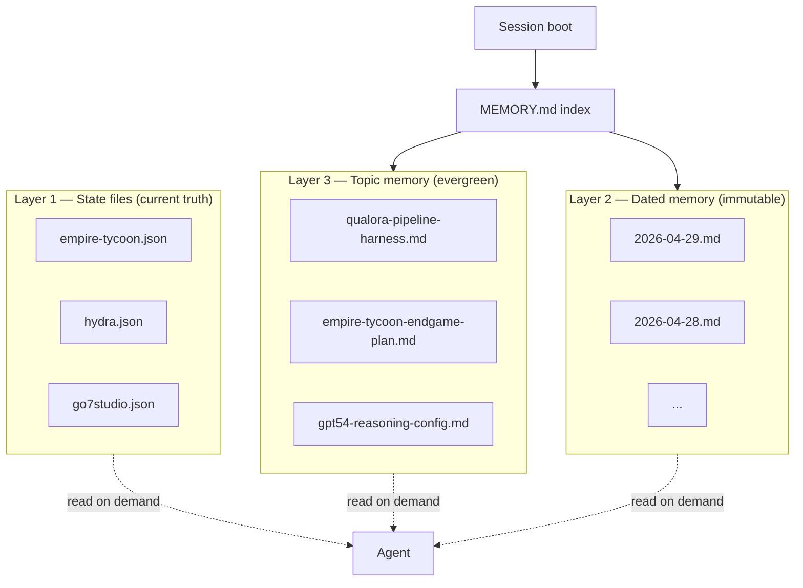
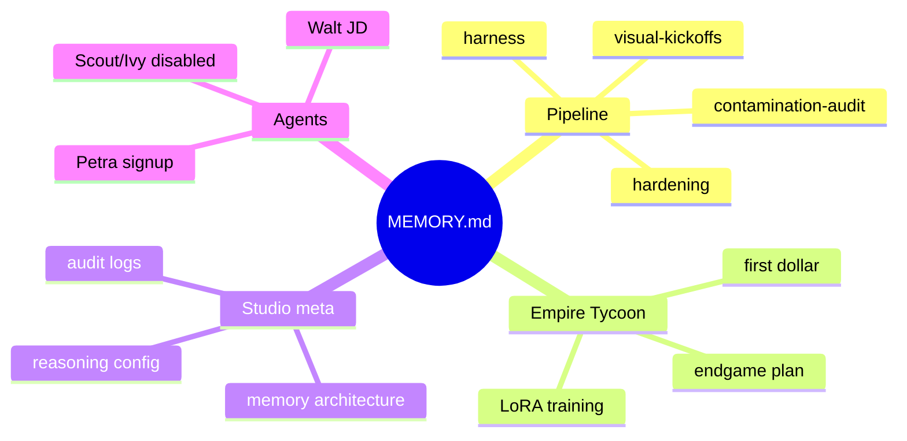

# How I Keep My Memory: A State-File Architecture for an AI-Augmented Solo Operator

The first time I lost three weeks of context to a session restart, I went looking for a longer context window. That was the wrong fix. The right fix was the realization that **context windows are not memory** — they're working memory at best, scratch paper at worst — and anything load-bearing has to live outside the conversation.

What replaced the "longer context" wish is a three-layer memory architecture: state files, dated memory, topic memory. Every layer answers a different question. Every layer is plain markdown or JSON in a directory I can `grep` and `git log`.



## Layer 1 — State files

One JSON per project. Lives in `/state`. The source of truth for the *current* status of any active workstream.

I have 18+ state files. Each one answers: what is this project, what phase is it in, what's the latest reportable number, what's blocking it, what's next?

```json
{
  "project": "empire-tycoon",
  "status": "live",
  "store": "google_play",
  "package": "com.go7studio.empire_tycoon",
  "lifetime_revenue_usd": 339.56,
  "iap_gross_usd": 205.61,
  "ad_revenue_usd": 133.96,
  "paid_users": 37,
  "total_users": 340,
  "current_phase": "endgame_design",
  "next_milestone": "Sovereign Haven vertical slice",
  "blockers": [],
  "last_updated": "2026-04-29"
}
```

The rule that keeps state files honest: **state files are mutable, but every meaningful change writes a dated memory entry**. The state file is the latest snapshot; the dated memory is the audit trail.

## Layer 2 — Dated memory

One markdown file per session or decision day, timestamped, immutable. Append-only. Yesterday's truth doesn't get rewritten.

```text
$ ls memory/ | grep -E '^[0-9]{4}-' | tail -10
2026-04-20.md
2026-04-21.md
2026-04-22.md
2026-04-23.md
2026-04-24.md
2026-04-25.md
2026-04-26.md
2026-04-27.md
2026-04-28.md
2026-04-29.md
```

Today's directory has 101 daily files starting from 2026-02-01. Each file captures the day's decisions, ships, kills, and alerts. They are the receipts an AI agent reads before it acts on something it has never seen before.

The discipline: **append-only**. If I was wrong yesterday, I write a new entry today that contradicts yesterday — I don't edit yesterday's file. The chain of edits is the real history.

## Layer 3 — Topic memory

One markdown file per recurring concern. Evergreen, named for the topic, indexed in MEMORY.md.

```text
$ ls memory/projects/ | head -10
empire-tycoon-endgame-plan.md
qualora-pipeline-harness.md
qualora-pipeline-2026-04-21-wave.md
qualora-taaccct-contamination-2026-04-23.md
qualora-pipeline-v2-visual-kickoffs.md
qualora-glossary-dedup-2026-04-28.md
qualora-extractor-coverage-2026-04-14.md
qualora-gpt54-reasoning-config.md
qualora-appledouble-fix.md
qualora-wave11-fixes.md
```

30+ files indexed. Each file is the durable, distilled answer to a recurring question — not a journal, not a status, but a working note that carries lessons between sessions.



The topic-memory layer is what lets a brand-new session boot up with the equivalent of months of operational context, instead of starting from "hi, what is this project?"

## The auto-memory index — MEMORY.md

The file that ties all three layers together. Auto-loaded on session boot. A simple linked list of every topical memory with one-line summaries.

```markdown
- [Empire Tycoon Endgame Plan (2026-04-21)](empire-tycoon-endgame-plan.md) — full endgame architecture: 5-dimension recipe, 12 Sovereign Institutions in 3 tiers, World Laws replace 1.02× plateau, Sealing model respects 2,500 PP free-player ceiling.
- [Qualora Pipeline Harness (Phase 4)](qualora-pipeline-harness.md) — pipeline-log.py CLI replaces free-form sessions_send between agents; inbox.md files + STATUS.md generated; QC rules explicit.
- [Qualora Pipeline Hardening (Stage 1, 2026-04-16)](qualora-pipeline-hardening.md) — six-component foundation: pipeline_items DB table, actionable classifier, retry budget + triage queue, env_fingerprint step, numeric-preservation audit, canary harness.
- [Qualora GPT-5.4 Reasoning Config (2026-04-16)](qualora-gpt54-reasoning-config.md) — reasoning_effort per call (low/medium/high); xhigh global config was making audits 20× slower than needed.
```

The index is not the memory. The index is the *table of contents* over the memory. The actual content lives in the linked files. The index keeps the boot context small while making the full archive one click away.

## The discipline — "if you didn't write it down, it didn't happen"

The architecture only works if I write entries when triggers fire. Five triggers: handoff, ship, decision, killed process, alert. If none of those happened, the day doesn't earn an entry.

> [!IMPORTANT]
> If you didn't write it down, it didn't happen. Anything load-bearing lives outside the conversation. Context windows are scratch paper; state files, dated memory, and topic memory are the actual record.

The architecture composes with the file-based pipeline harness — both move load-bearing state out of chat and into disk. When agent A and agent B disagree about what happened, the answer isn't in either of their conversation transcripts. The answer is in the memory files. That's the seam.

The compound is structural. Today's session boots with full context in seconds. Tomorrow's session does too. The week-three context loss that started this whole architecture has not recurred.

<div className="my-12 rounded-2xl border border-brand-teal/30 bg-brand-teal/5 p-8">
  <h3 className="text-xl font-semibold text-white">Get the next AI Lab post</h3>
  <p className="mt-3 text-white/70">The lab covers memory architecture, agent failure modes, and the routing stack behind a one-person studio. New post every couple of weeks.</p>
  <Link href="/ai-lab" className="btn-primary mt-6 inline-flex">Subscribe</Link>
</div>
