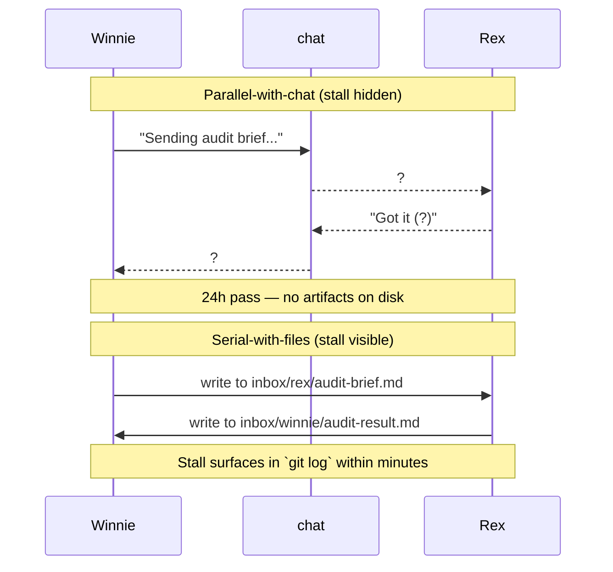

# Three Conversations I've Stopped Having (And the Reframes That Replaced Them)

Three sentences I used to say at least once a week:

| Old conversation | New conversation |
|---|---|
| ~~"We need to add another agent."~~ | **"Audit the existing agent's job description."** |
| ~~"We need a better model."~~ | **"We need a halt condition."** |
| ~~"Run it in parallel."~~ | **"Make the handoff a file, not a chat."** |

Each reframe came from a real failure that capacity couldn't fix. The receipts are below. The meta-pattern is at the bottom: the upgrade is almost always discipline, not capacity.

## Reframe 1 — Add another agent → Audit the JD

Two SEO agents, Scout and Ivy, were architecturally finished. Scout would scan target communities on a six-hour cron; Ivy would draft platform-native replies. Both had tests, both had cron lines, both were ready to fire on day two of their build.

I disabled them both before they posted anything.

The fix wasn't a third agent to coordinate them. The fix was an audit of whether the first two had a real surface to act on. They didn't — Reddit accounts didn't exist, LinkedIn was unconnected, the routing platform wasn't wired. Adding a third agent on top of two agents with no output channel would have multiplied cost and produced zero output.

| Symptom | Used-to-do | Now-do | Outcome |
|---|---|---|---|
| Agent stuck in dry-run for weeks | Add a coordinator agent | Audit JD: "does the surface exist?" | Cut 8 wasted runs/day; pause until prerequisites land |
| Output queue empty | Add another generator | Audit JD: "does this agent own a real output?" | Disabled cleanly; resumes when conditions met |
| Coordination drift | Add an orchestrator | Tighten Walt's JD | Walt stops doing other agents' work |

The principle: **more agents multiply coordination cost; tighter JDs reduce it.** Walt's JD ([Wrote My AI Agent a Job Description](/blog/agent-job-description)) is the positive version of the same lesson — Scout and Ivy are the disabled twins.

## Reframe 2 — Better model → Halt condition

Nine fabricated courses shipped to production because a pipeline step returned `surviving_words=0` and the next step continued anyway. Those nine courses were generated from titles and metadata alone — fluent, plausible, completely unrelated to the actual source content. They got past every model-quality check because the input itself was empty.

A bigger model wouldn't have helped. The modernize step did exactly what it was asked to do: take the input it received and produce a coherent course. The input was nothing. The output was nothing dressed up as something.

> [!CAUTION]
> When the input is zero, no model is good enough. Halt-on-zero is a contract between every pipeline step. Any step returning zero primary output halts unless an explicit `--allow-empty-output` flag is set on that step's run config.

The fix shipped as inversion of the default. Previously: zero-output continued unless flagged. Now: zero-output halts unless flagged. Same interface, opposite behavior, every pipeline step gets a refusal right.

The full postmortem lives in [My AI Agent Wrote Nine Courses From Nothing](/blog/agent-wrote-nine-courses-from-nothing).

## Reframe 3 — Run in parallel → Make the handoff a file

On 2026-04-11, two agents stalled in parallel for 24 hours. Winnie was waiting for an audit from Rex. Rex was waiting for a handoff from Winnie. Both reported "in progress." Neither had written anything to disk. The chat-based handoff was a free-form `sessions_send` exchange with no proof of receipt.

The fix was `pipeline-log.py` — a 200-line Python harness that replaced free-form chat with file-based inboxes. Every handoff is a commit. Every agent's `STATUS.md` is generated from the log. Drift surfaces in 30 seconds.

The harness ships with 23/23 tests passing. The Winnie-Rex stall has not recurred. The principle: **parallelism without durable handoffs produces ghost work; serial-with-files beats parallel-with-chat.**

Full receipts: [The Day I Realized My AI Agents Were Lying to Each Other](/blog/agents-lying-to-each-other).

## The meta-pattern

Each reframe trades capacity for discipline.

| Reframe | Discipline added | Capacity it replaced |
|---|---|---|
| Audit the JD | Tighter scope | More agents |
| Halt condition | Harder refusals | Bigger models |
| File handoff | Durable seam | More parallelism |

The temptation in AI work is always to add. More agents, bigger models, more parallel runs. The leverage is almost always in subtracting — tighter scope, harder halts, durable handoffs. The conversations I used to have were about adding things. The conversations I have now are about whether what's already there has been audited, gated, and committed to disk.

Three sentences, three reframes, one pattern. The pattern is older than AI. The receipts above are just where it most recently bit me.

  <h3 className="text-xl font-semibold text-white">Get the next AI Lab post</h3>
  
The lab covers agent design, harness engineering, and the routing stack behind a one-person studio. New post every couple of weeks.

  <Link href="/ai-lab" className="btn-primary mt-6 inline-flex">Subscribe</Link>

