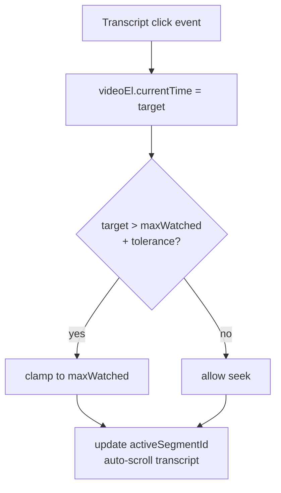

There's a moment in every client demo where you find out whether you've shipped.

For our [NEALAC Learning Hub](https://drannnealac.com) build with Dr. Ann Leonard-Zabel, that moment came at minute four. She paused the video, clicked a sentence in the transcript pane, and the video jumped to that timestamp. She watched the seek happen, looked back at me, and said yes.

Three UX choices closed that demo. None of them are novel. All of them are missing from the default video player every other CE platform ships. Here's the engineering breakdown.

<HeroCallout eyebrow="Client-signoff UX" title="The closer was not the video player. It was learner control." body="Click-to-seek, auto-scroll, and a sticky transcript turned the lesson from passive playback into a study surface the client could evaluate in one demo." />

<KeyTakeaways title="Why the player changed the demo" items='[{"title":"Transcript became navigation","body":"Learners moved by sentence instead of dragging a scrubber through a long lecture."},{"title":"Compliance stayed local","body":"The same seek listener handled useful backtracking and clamped jumps past unwatched content."},{"title":"Correct time beat clever UI","body":"Fixing the chapter clock from wall time to video time made the player feel trustworthy."},{"title":"One component owned seek","body":"UX and enforcement shared the player layer, so future edits had one contract to preserve."}]' />

## Section 1: Default video UX is for entertainment, not learning

The YouTube-shaped video player assumes the viewer is along for the ride. You hit play, you watch, you might scrub a little, you finish. The interaction model is sequential.

A learner is not along for the ride. A learner is asking:

- "Wait, what did she say about anosognosia?"
- "Where was that part about TBI prognosis at 30 days vs 6 months?"
- "I missed that case study — let me back up."

The default player makes them scrub. They drag the seek bar around, watching frames flash by, hoping to land on the right point. They miss it, overshoot, scrub back, miss again. After three rounds of that, they give up and watch the section over from the start.

That's a 15-minute cost on a 60-second question. It's the friction that makes professional learners hate online CE — and quietly walk away from any platform that ships it.

The fix is to give them the document — the transcript — as the navigation surface, and tie it to the video. The video plays linearly; the transcript is searchable, scrollable, and clickable. When you click a sentence, the video moves there. When the video reaches a sentence, the transcript highlights it. Two surfaces, one source of truth.

## Section 2: The three changes

That's the headline. Here's the implementation breakdown.

**1. Auto-scroll.** As the video plays, the transcript pane scrolls so the active line stays centered. The learner doesn't chase the cursor; the cursor stays in their gaze and the text moves under it.

**2. Click-to-seek.** Click any sentence in the transcript. Video jumps to that timestamp. No scrubbing. No "approximately the right place." Sentence-precise navigation.

**3. Sticky-on-scroll.** Scroll the lesson body downward to read instructor notes or examine a diagram. The video player and transcript stay pinned to the top of the viewport. The learner never loses access to the lecture while reading the surrounding study material.

Three features. Conceptually small. UX-significant. And the same component layer hosts compliance enforcement — which is the second-order win.

## Section 3: How we built it

The transcript comes from Whisper large-v3, which gives us word-level and segment-level timestamps. We chunk the transcript into sentence-anchored segments where each segment carries a `startTs` and `endTs`.

The sync loop:

```typescript
// Inside <LessonPlayer />
useEffect(() => {
  const v = videoRef.current;
  if (!v) return;

  let frame = 0;
  const tick = () => {
    const t = v.currentTime;
    const active = transcript.findIndex(
      (seg) => t >= seg.startTs && t < seg.endTs
    );
    if (active !== -1 && active !== activeIdxRef.current) {
      activeIdxRef.current = active;
      setActiveSegmentId(transcript[active].id);
      // Scroll the transcript line into the centered viewport
      const node = document.getElementById(`tx-${transcript[active].id}`);
      node?.scrollIntoView({ block: 'center', behavior: 'smooth' });
    }
    frame = requestAnimationFrame(tick);
  };
  frame = requestAnimationFrame(tick);
  return () => cancelAnimationFrame(frame);
}, [transcript]);
```

Click-to-seek is a one-liner once the segments are anchored:

```typescript
function handleSegmentClick(seg: Segment) {
  if (videoRef.current) {
    videoRef.current.currentTime = seg.startTs;
    videoRef.current.play();
  }
}
```

Sticky-on-scroll is pure CSS. The player container uses `position: sticky` with a flexbox parent so it pins at the top of the lesson body when the learner scrolls past:

```css
.lesson-player {
  position: sticky;
  top: var(--header-offset);
  align-self: flex-start;
  background: var(--bg-elevated);
  z-index: 10;
}
```

That's it. Three features, ~40 lines of meaningful code, one Whisper transcription pass.

## Section 4: Compliance lives in the same component

This is the load-bearing point of the whole build.

The same player that handles auto-scroll and click-to-seek also enforces our two compliance hooks: **no-skip past unwatched content** and **1x speed lock**. The seek listener that powers click-to-seek is also the listener that prevents the user from seeking past `maxWatchedTime`:

```typescript
videoRef.current?.addEventListener('seeking', (e) => {
  const target = videoRef.current!.currentTime;
  if (target > maxWatchedRef.current + SEEK_TOLERANCE) {
    videoRef.current!.currentTime = maxWatchedRef.current;
  }
});
```

A click in the transcript that points to a *previously-watched* segment is allowed. A click in the transcript that points *forward of where the learner has reached* gets clamped back to `maxWatched`. Same listener; two policies.



UX and compliance share an enforcement layer. Not a coincidence — that's the design. If we'd built UX in one component and compliance in another, we'd have two implementations of "what does seek mean," they'd drift, and a future refactor would silently break one of the two contracts. By making the player layer the only place that touches `videoEl.currentTime`, both contracts hold together.

## Section 5: The chapter-time bug

Here's the small, embarrassing fix that produced the biggest perceived improvement.

Before the fix, the chapter-time display showed `36:30` — wall-clock minutes accumulated across the session, including paused time and rewinds. A learner pausing a 60-minute lecture twice for coffee saw `1:34:10` on a 60-minute video. They thought the player was broken. (It was.)

After the fix, the same display showed `5:07` — the actual in-video time of the current frame.

| | Before | After |
| --- | --- | --- |
| Display value at the demo moment | `36:30` | `5:07` |
| Source of truth | Custom counter incrementing on `timeupdate` even while paused | `videoEl.currentTime` |
| Perceived correctness | "The player is broken" | "The player works" |
| Lines of code changed | 1 | — |

One line. Biggest single perceived improvement of the whole UX pass. The lesson: the most important fixes are usually the ones that make the platform feel *correct*, not the ones that add features.

> [!TIP]
> If your buyer is a learner — or your buyer's buyer is a learner — ship transcript-aware video before you ship anything else. Three features, a day of engineering, every demo since closes faster.

## Why this is the highest-ROI feature we ship

Every client demo since NEALAC has had the same arc. We get to the lesson player. The client clicks a transcript line. The video jumps. They lean forward.

The reason it works as a closer: it solves the actual job-to-be-done in two seconds, in front of them. Most edtech demos involve a lot of words about "engagement" and "outcomes" and "retention." Click-to-seek is just the platform doing the obvious right thing, visibly, immediately.

If you're building an edtech platform, this is the thing to ship first. Whisper transcripts cost roughly $0.36 per hour of audio at large-v3. The player layer is a day. The conversion lift on demo close is the difference between "let me think about it" and "yes."

We built it for [drannnealac.com](https://drannnealac.com) because the audience is professional learners who actually *use* the transcript. Every Go7Studio edtech build since has shipped with the same player. If you want one for your platform, we'll build it.

<div className="my-12 rounded-2xl border border-brand-teal/30 bg-brand-teal/5 p-8">
  <h3 className="text-xl font-semibold text-white">Build with Go7Studio</h3>
  <p className="mt-3 text-white/70">A small AI-augmented studio that ships compliance-grade learning platforms in days, not quarters.</p>
  <Link href="/contact" className="btn-primary mt-6 inline-flex">Book a discovery call</Link>
</div>
