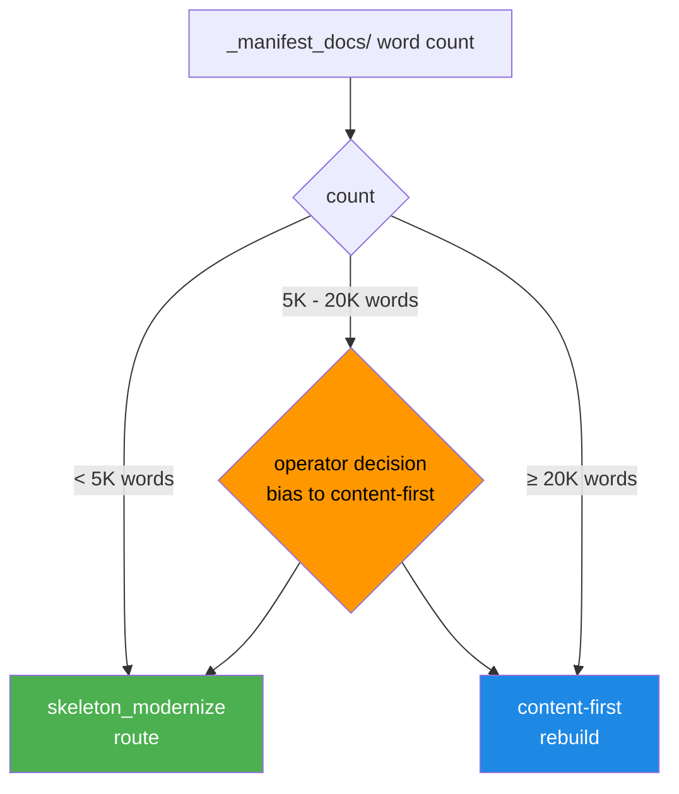

Two routes. Four courses. Two outcomes.

Two produced excellent learner-facing material. Two produced fluent, plausible, completely-disconnected-from-source garbage. The difference was a threshold I hadn't yet named, sitting quietly inside a `_manifest_docs/` word count nobody was reading.

This is the story of how I found that threshold, the rich-source guard I now require, and the 16 pipeline commits behind one routing decision.

## §1 Two pipelines, four courses

There are two routes for moving a course from extracted source to publishable lesson:

|   | Skeleton modernize works | Skeleton modernize lies |
| :-: | :-: | :-: |
| **Content-first works** | Course 769 (skeleton archetype) | Course 918 HIS 140 (94K-word IMSCC) |
| **Content-first wasteful** | Course X (thin source, content-first overkill) | n/a |

(The fourth quadrant is mostly empty for us — content-first on truly thin source is wasteful but not actively harmful.)

The two interesting cells are the diagonal: **course 769 worked on skeleton because the source was thin and the title structure was strong**, and **course 918 needed content-first because it had 94K words of real source material that skeleton would have ignored**.

The thing that surprised me: I shipped course 918 on the skeleton route initially. It produced fluent, plausible, generic survey content. Read like a textbook. Bore essentially no relationship to the actual 94K-word IMSCC source.

That was the day I learned what `skeleton_modernize` actually did.

## §2 What skeleton_modernize actually does

The misconception I'd been operating under: "skeleton_modernize uses the source material lightly — it preserves lesson structure but smooths the prose and adds modern pedagogical scaffolding."

Wrong. Here's the reality:

> [!CAUTION]
> `skeleton_modernize` does NOT consume `_manifest_docs/` PDF or PPTX content. It generates lesson bodies from titles, learning objectives, and standard pedagogical templates for the topic. The source material in `_manifest_docs/` is not in the prompt. It is not in the context. It does not influence the output.

The script's actual behavior:

```python
# skeleton_modernize.py — the prompt template (sketch)
SKELETON_MODERNIZE_PROMPT = """
You are a curriculum designer creating lesson content from a course outline.

Course title: {course_title}
Section title: {section_title}
Lesson title: {lesson_title}
Learning objectives: {learning_objectives}
Course-level summary: {course_summary}

Write a {target_word_count}-word lesson body that addresses the lesson title
and meets the learning objectives. Use standard pedagogical scaffolding:
hook, key concept, examples, common misconceptions, summary.

Do NOT cite specific facts that aren't directly implied by the lesson title.
Do NOT invent specific case studies or named examples.
"""
```

Notice what's missing: the source content. The actual material in `_manifest_docs/`. The original lessons from the source bundle.

This is *fine* when the source is thin — 1,500 words of brittle, fragmentary material with strong titles, where you want the LLM to fill in around the structural skeleton. Titles and learning objectives are real (preserved from source). Body is generated to match.

It's *catastrophic* when the source is rich — 94K words of real material that would have been the actual lesson content, replaced by a generic substitute that ignores all of it.

## §3 When skeleton works — Course 769

Course 769 was a skeleton-route success.

Source profile:

```
course_769/
  _manifest_docs/
    syllabus.pdf            (1,243 words)
    schedule.docx           (412 words)
    grading_rubric.pdf      (286 words)
  clean/
    manifest.json           (12 sections, 47 lessons)
    lessons/                (titles + LOs only, no bodies)
```

Total `_manifest_docs/` word count: ~1,941 words. Most of it administrative — syllabus, schedule, grading rubric. None of it actual lesson content. The source bundle was a course outline plus syllabus, no lesson bodies.

Skeleton modernize was the right call. The titles were strong (concrete, topic-specific). The learning objectives were real (from the syllabus). The 12-section, 47-lesson structure was reasonable. The LLM-generated bodies — using standard pedagogy and the lesson title as the topic anchor — produced coherent, useful content.

Sample lesson opening from course 769:

> ### 4.2 — Identifying Common Welding Defects
>
> Welding defects fall into a small handful of recurring categories: porosity, cracks, undercuts, incomplete fusion, and slag inclusions. A welder who can identify each by visual signature catches problems early — before they become structural failures.
>
> The most common defect by far is porosity...

That content is reasonable. It's not from any specific source — it's what a competent curriculum writer would produce for "Identifying Common Welding Defects" if asked. The pedagogy is standard. The factual claims are general and true. No fabricated specifics.

The course shipped on this route. Learner outcomes were good. **Course 769 is the skeleton-route archetype.**

## §4 When skeleton lies — Course 918 HIS 140

Course 918 was the inverse case.

Source profile:

```
course_918_HIS_140/
  _manifest_docs/
    HIS_140_full_curriculum.imscc   (94,283 words extracted)
    primary_source_readings.pdf     (4,128 words)
    instructor_lecture_notes.docx   (12,440 words)
  clean/
    manifest.json                   (16 modules, 89 lessons)
    lessons/                        (titles + LOs only)
```

Total `_manifest_docs/` word count: ~110,851 words. The IMSCC alone had 94K words of real lesson content — primary source excerpts, instructor commentary, discussion questions, document analysis frameworks.

Skeleton modernize on this course produced a generic American History 140 survey. Fluent, plausible, completely disconnected from the actual primary-source-driven curriculum the original instructor had built.

Side-by-side comparison of the same lesson title, skeleton output vs content-first output:

**Skeleton output (course 918, lesson 7.3 — "Reconstruction's Failure: Whose Fault?"):**

> Reconstruction failed for many reasons. The federal government's commitment wavered as Northern attention shifted to economic concerns. Southern white resistance, including violence by groups like the Ku Klux Klan, undermined Black political participation. The withdrawal of federal troops in 1877 marked a turning point...

That's a textbook paragraph. Accurate. Also generic. Any high-school US History textbook contains a version of this paragraph.

**Content-first rebuild output (same lesson):**

> The original instructor framed this lesson around three primary sources we'll examine in sequence:
>
> 1. Frederick Douglass's 1865 speech "What the Black Man Wants"
> 2. The 1872 Mississippi Plan (excerpts)
> 3. Albion Tourgée's 1879 letter to John Sherman ("Bricks Without Straw")
>
> Each speaker frames Reconstruction's failure differently. Douglass argues for political rights as the foundation; the Mississippi Plan documents the violent strategy that undid those rights; Tourgée writes after the fact about what was lost...

That's the actual lesson the original instructor wrote. Specific. Grounded in primary sources. Teaching the lesson the original course was built to teach.

The difference isn't pedagogy. The difference is whether the LLM ever saw the source material.

## §5 The threshold

After course 918, we wrote down the routing rule:



The thresholds:

- **Less than 5K `_manifest_docs/` words → skeleton_modernize.** The source is too thin to drive a content-first rebuild. Title and learning-objective structure carry the lesson; LLM fills in coherent generic content. Course 769 archetype.
- **Greater than or equal to 20K `_manifest_docs/` words → content-first rebuild.** The source has actual lesson material. Skeleton would ignore it. Content-first rebuild ingests the source, segments it, modernizes per-segment, and re-assembles. Course 918 archetype.
- **5K to 20K words → operator decision.** Bias toward content-first. The cost of running content-first on slightly-thin source is wasted compute. The cost of running skeleton on slightly-rich source is fabricated content. The asymmetry says: when in doubt, content-first.

These thresholds are now Decisions 4b and 4c in `skills/qualora-pipeline/SKILL.md`. They appear in operator briefings. They drive the routing decision before any LLM call.

## §6 The rich-source guard

The threshold isn't enough. Operators forget. Routes get force-overridden. The threshold needs to be enforced at the script level, not just in documentation.

```python
# skeleton_modernize.py — rich-source guard
def main(course_id: int) -> None:
    workspace = load_course_workspace(course_id)
    manifest_docs_words = count_manifest_docs_words(workspace)

    if manifest_docs_words >= RICH_SOURCE_THRESHOLD:
        if not os.environ.get("QUALORA_ALLOW_SKELETON_WITH_RICH_SOURCE"):
            raise RichSourceOnSkeletonError(
                f"Course {course_id} has {manifest_docs_words:,} words of source "
                f"material in _manifest_docs/. skeleton_modernize will ignore it. "
                f"Either route to content-first rebuild, or set "
                f"QUALORA_ALLOW_SKELETON_WITH_RICH_SOURCE=1 to override (not recommended)."
            )

    # ... proceed with skeleton modernize ...


RICH_SOURCE_THRESHOLD = 20_000  # words
```

The env-flag override is the operator's accountable signal: "I know this course has rich source material, and I'm intentionally skipping it." That signal is logged, fingerprinted by `env_fingerprint`, and shows up in the post-run audit.

The guard is at the *script level*. Not at the orchestrator level, not at the route-decision level, not in a comment somewhere. The script itself refuses to run on rich-source courses unless the operator has explicitly opted in. Routing logic IS safety logic.

## §7 16 commits behind one decision

Getting from "course 918 shipped fabricated content" to "the rich-source guard is in place and the canary catches it" took 16 pipeline commits. They span April's wave runs.

| File | Purpose |
| --- | --- |
| `skeleton_modernize.py` | Rich-source guard (the decision) |
| `_detect_champ_filter.py` | Filter CHAMP framework output (separate but related guard) |
| `auto_attribution_fallback.py` | Auto-fill attribution when source has it implicitly |
| `pattern_c_guard.py` | Pattern C (mid-source-with-fabrication) detection |
| `upload_media.py` | Image-bridge fix for embedded-DOCX images |
| `quality_gate.py` | Single-section relaxation (don't halt 1-section courses on minViable) |
| `seed_error_classifier.py` | Classify DB errors for actionable triage |
| `extract_pptx.py` | WMF format filter (skip Windows Metafile images) |
| `verify_seed.py` | minViable relaxation for legitimate-thin courses |
| `seed-qualora.ts` | orderIndex fallback when source has implicit ordering |
| `domain_velocity.py` | CAD↔Manufacturing as related domains |
| `extract_pptx.py` | Content field population (was empty for some PPTXs) |
| `intent_extract.py` | Halt-on-zero (Bug 8 — covered in [the 19-bug atlas](/blog/nineteen-bugs-failure-pattern-atlas)) |
| `consolidate_courses.py` | Embedded-DOCX image walk (Bug 18) |
| `pipeline.py` | `filter_junk_images` step wired in (Bug 19) |
| `strip_grant_boilerplate.py` | TAACCCT contamination strip (covered in [the disclaimers post](/blog/government-disclaimers-hiding-32-percent-published-courses)) |

The decision wasn't a single commit. It was a 16-commit refactor of the routing layer, the validation layer, and the orchestration layer to make the rich-source guard *actually enforceable* — every adjacent edge case got plugged at the same time, because each one was a way the guard could be bypassed.

## §8 The principle

Your routing logic IS your safety logic.

When I route a course to `skeleton_modernize`, I'm making a claim: this course has thin source, and the LLM should fill in around the structural skeleton. The claim is binding. Route a course wrong and the LLM faithfully executes the wrong claim — fluently, plausibly, irrecoverably.

The 5K/20K threshold isn't a tuning parameter. It's a guard. The rich-source guard in `skeleton_modernize.py` is what makes the threshold real. The env-flag override is what makes the guard auditable. The canary test (`canary_skeleton_rich_source_guard`) is what makes the override impossible to silently regress.

In any LLM pipeline that has multiple routes — fast path / slow path, summarize / synthesize, paraphrase / rewrite — the route decision is itself a safety decision. Build the guard at the script level. Make the override accountable. Plant a canary. Then sleep at night.

<div className="my-12 rounded-2xl border border-brand-teal/30 bg-brand-teal/5 p-8">
  <h3 className="text-xl font-semibold text-white">Pipeline-engineering as a service</h3>
  <p className="mt-3 text-white/70">"When to let the LLM fill in vs when to extract real source" is the central question for any content-pipeline buyer. If your pipeline has multiple routes and the wrong one would lie convincingly, that's the work Go7Studio takes on. Small studio, real receipts.</p>
  <Link href="/contact" className="btn-primary mt-6 inline-flex">Talk to Go7Studio</Link>
</div>
