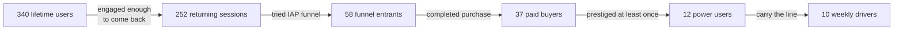

# Why I Stopped Counting Views and Started Counting Buyers

I posted a TikTok clip on Day 7 of a 30-day revenue challenge. It got 46 views in 24 hours. Earnings: $0. The same week, on a peak ad day, Empire Tycoon got 171 ad impressions and earned roughly $5. Two events. One looked like growth. The other looked like noise. The first one was the noise.

This post is the moment I swapped vanity metrics for buyer metrics, the dashboard that replaced the old one, and what optimizing for buyer activation actually changes about what I build.

## The view-count trap

> [!NOTE]
> Views feel like progress. They feel like an audience. They feel like the thing you'd brag about. Then you do the conversion math and remember that views are a leading indicator of nothing on a platform you don't own.

The clip got 46 views. The platform was TikTok, a platform I had no audience on, posting under a brand handle I had created the week before. There was no monetization on the clip itself — no ad share at that audience size, no link-in-bio engagement above noise, no measurable downstream lift on the game's install rate. Forty-six views was forty-six dopamine hits and zero dollars.

Meanwhile, on the same Tuesday, the in-game ad funnel served 171 impressions to actual players sitting inside a session. That's 171 events that monetize directly through AdMob, plus an unknown number of those same players who would later return to spend on IAPs.

## The math that broke me

| Metric | What I thought it meant | What it actually returned |
|---|---|---|
| 46 TikTok views in 24h | "Audience is forming" | $0, no install lift |
| 171 ad impressions on peak day | "Just maintenance" | $5+ AdMob earnings, real |
| 340 lifetime app users | "Market validation pending" | 37 buyers, $339.56 |

The view-to-revenue ratio is not a constant. It depends on platform economics, audience ownership, and whether the impression is on-platform-for-me or off-platform-for-me. An impression inside the game is mine. A view on a platform I don't own is not.

The week I made this swap, I stopped optimizing for clip views and started optimizing for in-game session count. The downstream effect on revenue was visible within two weeks.

## The pivot to buyer counting

Each transition is measurable. Each transition has a cost-effective lever I can pull. None of those levers look like "post more clips on a platform I don't own."

The replacement metrics:

- **DAU** — survives bot traffic, survives off-platform noise.
- **D1 / D7 retention** — early signal of whether the game is worth coming back to.
- **IAP funnel rate** — install → first session → engaged session → buyer.
- **Buyer activation events** — what the player did in the 60 minutes before they spent.
- **Time-to-first-conversion** — how long from install to first IAP.

## The honest dashboard

| Stat | Value | What it says |
|---|---|---|
| Total users | 340 | Modest cohort |
| Bounce rate | 73% | Three-quarters never return after first session |
| Engaged buyer pool | 58 | Cohort that ever entered the IAP funnel |
| Paid buyers | 37 | Cohort that converted |
| Power users | 10 | Cohort that prestiged + drives ad revenue |
| Fastest prestige | 36 min | First-session intent is real |

73% bounce was the most uncomfortable number in the dashboard, and the most useful. It said three-quarters of installs were not the audience. The remaining 27% — about 90 users — were where every meaningful metric came from. Optimizing the funnel for those 90 produced 37 buyers and $339.56 over 90 days. Optimizing for clip views would have produced 46 views and zero dollars.

## What I optimize for now

| Vanity metric | Buyer metric | Why |
|---|---|---|
| Clip views | Sessions per DAU | Sessions correlate with revenue; views don't |
| Followers | Active buyers in last 30 days | Buyers churn into and out of cohorts; followers don't |
| Impressions on social | Ad impressions in-game | One pays; the other doesn't |
| Reach | D7 retention | Reach is a wish; retention is observable |
| Engagement rate (likes/comments) | IAP funnel completion rate | Likes don't pay rent |

The right column changes what I build. When the metric is buyer activation, I spend my time on the IAP prompt placement, the rewarded-ad placement, the daily-login reward, and the prestige loop — every one of which moves a buyer metric. When the metric was clip views, I spent time on hooks, captions, and posting frequency, none of which moved a single buyer metric.

## When views still matter

There is one case where views are the right metric: when I'm using social as a top-of-funnel pipe with an in-game-attribution link, and the install rate from those views is measurable. In that case, views are a proxy for installs, and installs are a proxy for the buyer-funnel input.

The test is whether I can answer "how many of the people who watched that clip installed the game?" If yes, views are buyer-adjacent and worth tracking. If no, views are vanity. Forty-six TikTok views with no attribution link was vanity. The same forty-six views with a measurable install attribution would have been a different conversation — probably still bad numbers, but at least readable.

The shift didn't make me stop posting clips. It made me stop counting clips. The buyer metrics are what stays on the dashboard now. The clip metrics live in a separate file I check once a month, mostly to confirm that nothing surprising has changed.

  <h3 className="text-xl font-semibold text-white">See what 37 strangers paid for</h3>
  
Empire Tycoon is the funnel I optimize against. Free to play, monetized with rewarded ads and IAPs. The buyer metrics in this post are real.

  <Link href="https://play.google.com/store/apps/details?id=com.go7studio.empire_tycoon" className="btn-primary mt-6 inline-flex">Get Empire Tycoon</Link>

