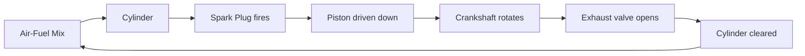
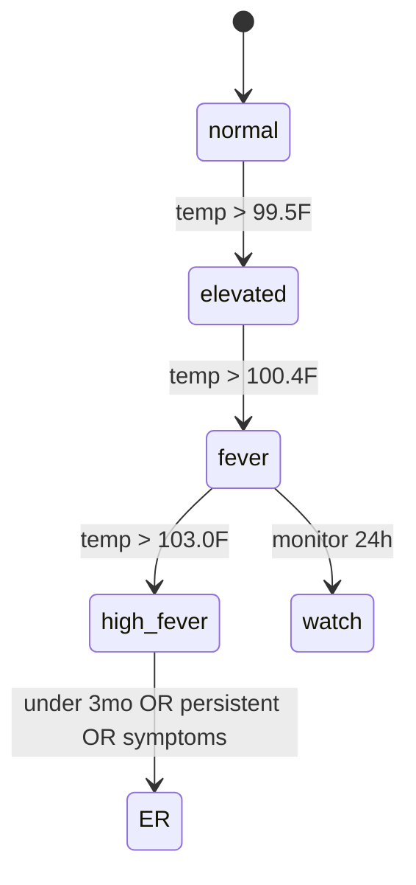
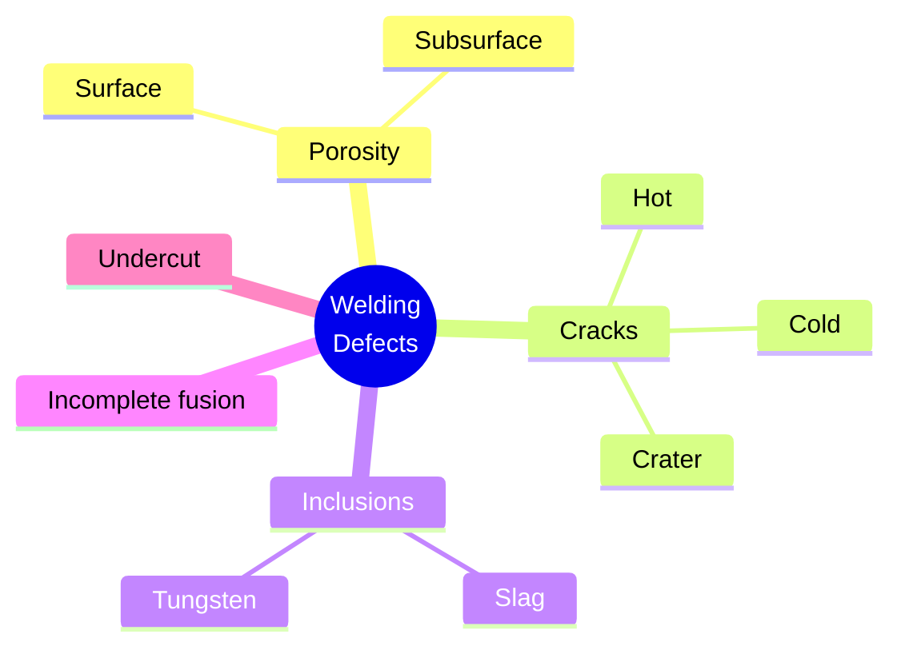
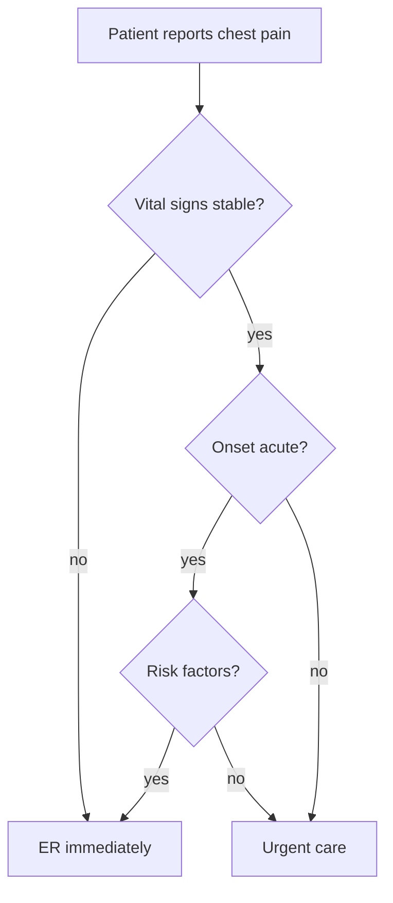
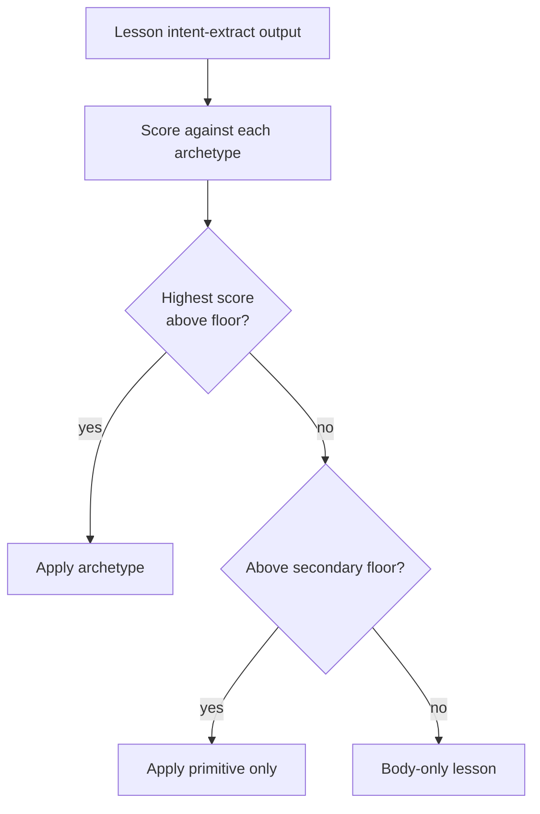
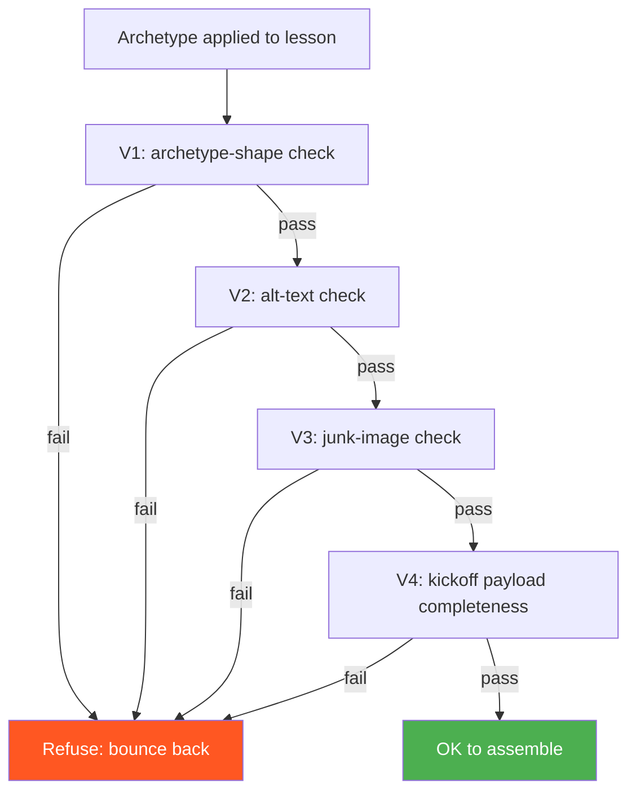

AI-generated lesson visuals have a tell.

They're flat. Decontextualized. Suspiciously similar across courses. Whatever the topic, the visual ends up as a generic concept-map shape — five circles connected by arrows, evenly spaced, all the same color, carrying no specific instructional meaning. It looks AI-generated because it *is* AI-generated, and the LLM defaults to a vocabulary of one.

The fix — at least the part I've shipped so far — is a visual-archetype system. Eight archetypes, four inline primitives, an eligibility heuristic that picks the right shape per lesson, four validators that refuse bad layouts before they ship. Here's how it works.

## §1 The default-AI-visual tell

A lesson on welding defects, generated by an unconstrained LLM:

```
[ Welding Defect ]
       |
   ----+----
   |        |
[ Cause ] [ Effect ]
       |
   ----+----
   |        |
[ Cause 2 ] [ Effect 2 ]
```

A lesson on Reconstruction-era voting rights, generated by the same unconstrained LLM:

```
[ Voting Right ]
       |
   ----+----
   |        |
[ Cause ] [ Effect ]
       |
   ----+----
   |        |
[ Cause 2 ] [ Effect 2 ]
```

A lesson on diabetes patient education, also generated by the same unconstrained LLM:

```
[ Diabetes Concept ]
       |
   ----+----
   |        |
[ Cause ] [ Effect ]
       |
   ----+----
   |        |
[ Cause 2 ] [ Effect 2 ]
```

Three different topics. Three different domains. One shape. Buyers spot this in seconds. Learners experience it as content that doesn't really know what it's teaching — because the visual structure is decoration, not pedagogy.

The fix is recognizing that a lesson on welding defects wants a *taxonomy* — categories of defects, their visual signatures, their typical causes. A lesson on Reconstruction wants a *decision-path* — choice points and consequences in the historical timeline. A lesson on diabetes patient education wants a *checklist* — actions a patient should take and verify.

Different archetypes carry different pedagogy. The right visual is the one that matches the lesson's epistemic structure, not the one the LLM defaults to.

## §2 The 8 archetypes

Eight archetypes cover the lesson-structure space we see across our catalog. Each has a specific shape, an eligibility test, and a renderer.

| Archetype | Shape | When to use | Renderer |
| --- | --- | --- | --- |
| **anatomy** | Labeled diagram with parts called out | Lesson is about identifying components of a thing | Mermaid + image overlay |
| **threshold** | Binary state diagram with a crossing condition | Lesson is about when one state becomes another | Mermaid `stateDiagram-v2` |
| **procedure** | Numbered ordered steps | Lesson is about doing something in sequence | Numbered-step cards |
| **taxonomy** | Hierarchical tree | Lesson is about classifying things into categories | Mermaid `mindmap` or tree |
| **checklist** | Verifiable list with checkboxes | Lesson is about confirming a set of conditions | GFM checklist |
| **annotated-image** | Image with callout pins | Lesson is about a specific visual artifact | Image + callout overlay |
| **decision-path** | Branching decision tree | Lesson is about choosing among options based on conditions | Mermaid `flowchart TD` |
| **code-walkthrough** | Annotated code block | Lesson is about how a piece of code works | Syntax-highlighted block + per-line annotations |

Examples of each, drawn from real lessons:

**anatomy** — "The Internal Combustion Engine":



**threshold** — "When does a fever require ER attention?":



**procedure** — "How to Replace a Brake Caliper":

```
1. Loosen lug nuts (do not remove)
2. Jack the vehicle and place on jack stands
3. Remove the wheel
4. Disconnect the brake line at the caliper
5. Remove the caliper bolts
6. ...
```

**taxonomy** — "Categories of Welding Defects":



**checklist** — "Patient Discharge Verification":

- [ ] Vital signs within target range for 30 min
- [ ] Pain score ≤ 3
- [ ] Discharge meds reconciled
- [ ] Follow-up appointment scheduled
- [ ] Caregiver instructions confirmed

**annotated-image** — "Identifying a Failed Piston Ring": image of a failed piston with five callouts pointing at scoring patterns, oil residue, ring gap, etc.

**decision-path** — "Triage: Patient Reports Chest Pain":



**code-walkthrough** — "How a SQL JOIN works":

```sql
SELECT customers.name, orders.total
FROM customers                        -- left side of the join
INNER JOIN orders                     -- inner means: only matched rows
  ON customers.id = orders.customer_id  -- join key
WHERE orders.placed_at > '2026-01-01' -- filter applies AFTER join
ORDER BY orders.total DESC;            -- sort by joined column
```

Each archetype has an eligibility test that reads the lesson's intent-extract output and decides whether the lesson qualifies. Below the floor: no archetype, just inline primitives. No forcing.

## §3 The 4 inline primitives

Smaller than archetypes. Live *inside* lesson bodies. Carry meaning at the paragraph or sub-section level.

**GFM alerts** — for caveats, warnings, callouts:

> [!CAUTION]
> This procedure assumes the system is depressurized. Do NOT attempt with system under pressure.

> [!NOTE]
> The 1869 timing of the Reconstruction Acts placed them after the Civil War but before the Grant administration's federal-troop withdrawal of 1877.

**KaTeX math** — for inline mathematical expressions:

> The thermal efficiency $\eta_{th} = 1 - \frac{T_{cold}}{T_{hot}}$ is the upper bound for any heat engine operating between two reservoirs.

**Before/after pairs** — for showing a transformation or contrast:

> **Before remediation:**
> ```
> SELECT * FROM users WHERE name = '" + input + "';
> ```
>
> **After remediation:**
> ```
> SELECT * FROM users WHERE name = ?;
> -- bound parameter: input
> ```

**Comparison cards** — side-by-side trade-offs:

| | TCP | UDP |
| --- | --- | --- |
| Reliable delivery | yes | no |
| Ordering guarantee | yes | no |
| Connection setup | required | none |
| Use case | web, file transfer | video, gaming |

These primitives can stand alone or compose with archetypes. A `decision-path` archetype can include a CAUTION alert at a critical branch. A `procedure` archetype can include KaTeX math in a calculation step.

## §4 The eligibility heuristic

Not every lesson qualifies for every archetype. The heuristic decides which (if any) fits.



Each archetype has trigger patterns — keywords, structural signals, lesson-type metadata — that the heuristic scores against. A lesson with intent like "identify the parts of an engine and their functions" scores highly against `anatomy` and moderately against `taxonomy`. A lesson with intent like "decide which patient triage level applies" scores highly against `decision-path`.

The score is a weighted sum of pattern matches. Floor is calibrated empirically — currently 0.6 for primary archetype, 0.3 for primitive fallback. Below 0.3, the lesson gets no visual treatment beyond formatting; that's fine for short concept-introduction lessons that don't need a structured visual.

The heuristic isn't perfect. Right now it assigns about 88% of lessons to a primary archetype, another 8% to primitive-only, the remaining 4% body-only. A few percent of the primary-archetype assignments are operator-overridable when the operator sees a better fit — the kickoff payload includes a list of plausible alternative archetypes per lesson.

## §5 The 4 validators

Validators run after archetype application and before the lesson is sent downstream to assemble. Any validator can refuse a lesson and bounce it back for re-generation.



**V1: Archetype-shape check.** Mermaid syntax must parse. Node count between 5 and 9 (above 9, switch to D2 or split; below 5, the archetype is too thin and we drop to primitive). Edge count must match the archetype's expected pattern — a `decision-path` requires at least one branching node, etc.

**V2: Alt-text instructional ≥ 3 words.** Every visual element must have alt text describing what the visual *teaches*, not just what it *depicts*. "diagram of an engine" fails. "labeled diagram showing how the four-stroke cycle moves air through a cylinder" passes. The three-word floor is the minimum to force operator attention; good alt text in practice runs 8-15 words.

**V3: No logo/decorative slipping in.** The image classifier has already filtered, but this validator double-checks: any image referenced in a lesson body must have a category in the allowed set. `logo`, `decorative`, `divider` get rejected. This is the validator that caught Bug 19 regressions before they shipped — see [the standalone-backfill post](/blog/standalone-backfill-scripts-pipeline-gaps).

**V4: Kickoff payload completeness.** The `visual_kickoff.json` for the course must have an entry for every lesson, every entry must have a chosen archetype, and every entry must have either a rendered visual or an explicit "primitive-only" / "body-only" decision. No silent omissions.

Each validator is also a canary. Eleven of the 39 canaries in `run_canaries.py` are visual-archetype validators that run on synthetic lessons and assert the right refusal behavior.

## §6 The kickoff payload

Per-course `visual_kickoff.json` is the contract between the archetype-application step and the renderer.

```json
{
  "course_id": 309,
  "course_title": "Internal Combustion Fundamentals",
  "kickoff_version": "v2.1",
  "lessons": [
    {
      "lesson_id": "1.1",
      "lesson_title": "How a Four-Stroke Engine Cycles",
      "primary_archetype": "anatomy",
      "alternative_archetypes": ["procedure"],
      "primitives": ["before-after-pair"],
      "rationale": "Lesson asks learner to identify the four phases; anatomy fits.",
      "rendered": true,
      "validator_status": "all_pass"
    },
    {
      "lesson_id": "1.2",
      "lesson_title": "Why Compression Ratio Matters",
      "primary_archetype": null,
      "alternative_archetypes": [],
      "primitives": ["katex-math"],
      "rationale": "Concept-introduction lesson; primitive-only.",
      "rendered": true,
      "validator_status": "all_pass"
    }
  ]
}
```

The payload has a sibling `visual_kickoff.md` written alongside it as a drop-in for `STATUS.md` and Walt's inbox. The markdown version is human-readable; the JSON version is what the renderer consumes.

The `visual_archetype` step is now wired into `pipeline.py` `STEP_ORDER` between `polish` and `assemble` (closes the 2026-04-20 TODO). It runs after polish so the lesson body is final, and before assemble so the kickoff payload is available when assemble builds the QCF JSON.

## §7 39/39 canaries

Eleven new canaries arrived with v2 of this system. They run with the rest of the pipeline canaries before any merge.

```
$ python run_canaries.py
[1/39] canary_appledouble_filter ............................ PASS
[2/39] canary_storyline_routing ............................. PASS
...
[28/39] canary_visual_archetype_anatomy_eligibility ......... PASS
[29/39] canary_visual_archetype_threshold_state_diagram ..... PASS
[30/39] canary_visual_archetype_procedure_step_count ........ PASS
[31/39] canary_visual_archetype_taxonomy_max_depth .......... PASS
[32/39] canary_visual_archetype_checklist_min_items ......... PASS
[33/39] canary_visual_archetype_annotated_image_alt_text .... PASS
[34/39] canary_visual_archetype_decision_path_branching ..... PASS
[35/39] canary_visual_archetype_code_walkthrough_lang_hint .. PASS
[36/39] canary_visual_alert_format_compliance ............... PASS
[37/39] canary_visual_katex_inline_compile .................. PASS
[38/39] canary_visual_before_after_pair_shape ............... PASS
[39/39] canary_visual_kickoff_payload_complete .............. PASS

39/39 passed in 8.4s
```

End-to-end smoke test passes on a synthetic two-lesson workspace with the LLM mocked out — the test injects pre-determined "intent" output and asserts that the right archetype is chosen, the kickoff payload is complete, and all four validators pass.

## §8 What v3 will probably need

The toolkit already has these capabilities; they just aren't wired as archetypes yet:

- **SmilesDrawer** for chemistry. The renderer has it; no archetype triggers it yet. About a dozen pharmaceutical/chemistry courses in the catalog could use it.
- **D2** for diagrams that exceed the Mermaid 5-9 node ceiling. Some of the older systems-engineering lessons have 12-15 nodes naturally; right now V1 forces them to split or fail.
- **Markmap** for mindmaps over 12 nodes. Same story.
- **Vega-Lite** for data visualization. A few statistics-heavy courses (epidemiology, market analysis) have bar/line/scatter content that currently ships as static images. Vega-Lite would make them interactive and accessible.

Each unlocks a category of lessons that v2 currently routes to "primitive only" or "body-only." V3 will be three to five new archetypes, three to five new validators, and another wave of canaries.

The pattern across versions: each version is a vocabulary expansion. V1 had five archetypes; v2 added three plus four primitives; v3 will add three to five more. Each expansion is gated on the renderer being ready, the validators being written, and canaries being planted before the archetype is allowed to flow through the pipeline.

<div className="my-12 rounded-2xl border border-brand-teal/30 bg-brand-teal/5 p-8">
  <h3 className="text-xl font-semibold text-white">Pipeline-engineering as a service</h3>
  <p className="mt-3 text-white/70">If your AI-generated content has the default-AI tell — flat shapes, decorative arrows, no pedagogy — visual archetypes are the lift. That's the kind of work Go7Studio takes on. Small studio, real receipts.</p>
  <Link href="/contact" className="btn-primary mt-6 inline-flex">Talk to Go7Studio</Link>
</div>
