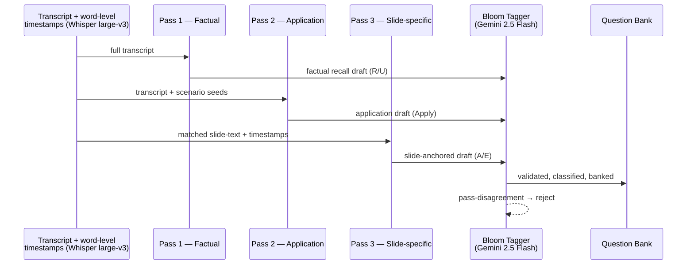

The first version of our CE quiz generator was one prompt: "read this lesson and write three quiz questions." It produced fluent, well-formatted, completely uniform output. Every question on every lesson was a "what is the definition of X" recall question.

That's the single-pass trap. One prompt → one cognitive shape. The model is doing exactly what it was asked to do, which is the problem.

This post is about the architecture we shipped instead — three passes, three prompts, one tagger, one bank — and the per-course economics that make it cheap enough to use for every CE course we build.

## Section 1: The single-pass trap

The default failure mode of LLM quiz generation is shape collapse. You ask for "three questions" without specifying their cognitive shape, and the model — trained on internet text — defaults to the most common shape: definitional recall.

Symptoms:

- Every question starts with "What is..." or "Which of the following best describes..."
- Bloom-level distribution is 100% Remember/Understand. Application questions don't appear. Analysis questions don't appear.
- Distractors are syntactically diverse but semantically near-identical (variants of correct + minor word swaps).
- The "hardest" question on the quiz is the one with the longest stem, not the one that requires deeper cognition.

> [!NOTE]
> One prompt, one shape. The model is fluent, but fluency in a single prompt produces shape uniformity. You don't fix that with better wording — you fix it with multiple passes that explicitly differ in cognitive shape.

The fix isn't a longer prompt. The fix is multiple prompts, each constrained to a single cognitive shape, with their outputs blended into a quiz at selection time.

## Section 2: The 3-pass architecture

Three passes. Three prompts. One transcript. One classifier on the back end.



The contract per pass:

- **Pass 1 — Factual.** Recall and understanding. Anchored to specific transcript timestamps so we can prove the question is grounded in the lecture.
- **Pass 2 — Application.** Scenario stems. The model is told to construct a clinical or operational scenario where the lesson concept is applied, not defined.
- **Pass 3 — Slide-specific.** Only fires when slides are present. Anchors to slide-text rather than spoken text. Catches diagram-driven content the spoken transcript misses.

After all three passes, a separate model — same family, different prompt — reads each draft and assigns a Bloom level. If the assigned level disagrees with the pass that produced the draft, the question is rejected. Same instrument, different reads, agreement gates the bank.

## Section 3: Pass 1 — Factual

The Pass 1 prompt looks roughly like this:

```python
PASS_1_PROMPT = """
You are writing factual recall questions for a continuing-education
course on {topic}. Below is the verbatim lecture transcript with
timestamps.

For each lesson section delimited by ##SECTION##, produce exactly 4
candidate multiple-choice questions that test factual recall or basic
understanding of the material in that section.

Each question MUST:
- Be answerable from the transcript text alone (no external knowledge).
- Include a transcript_anchor_ts pointing to the timestamp where the
  answer is stated.
- Have exactly 4 answer choices, exactly 1 correct, 3 plausible
  distractors.
- Each distractor must include a one-sentence rationale explaining
  why it is wrong.
- Avoid copying the transcript verbatim into the stem.

Output JSON conforming to the schema below.
"""
```

A sample row from the output, anchored at `[09:02.180]`:

```json
{
  "stem": "According to the lecture, what timeframe defines the acute phase of moderate TBI?",
  "transcript_anchor_ts": 542.180,
  "answers": [
    { "text": "First 7 days post-injury",  "isCorrect": true },
    { "text": "First 30 days",             "isCorrect": false, "rationale": "Lecture defines this as the post-acute phase." },
    { "text": "First 90 days",             "isCorrect": false, "rationale": "Lecture refers to this as the chronic phase." },
    { "text": "First 24 hours",            "isCorrect": false, "rationale": "Lecture distinguishes this as hyperacute." }
  ],
  "expected_bloom": "remember"
}
```

The transcript anchor is load-bearing. It lets us audit the question against the lecture and link to the exact timestamp from the explanation page after a student answers.

## Section 4: Pass 2 — Application

This is the prompt that produces the questions students actually find hard — and the one that distinguishes a real assessment from a vocabulary test.

```python
PASS_2_PROMPT = """
You are writing application-level questions for a continuing-education
course on {topic}. Below is the verbatim lecture transcript.

For each lesson section, produce 3 candidate multiple-choice questions
where the stem describes a clinical or operational scenario, and the
correct answer requires the student to APPLY the concept from the
section to that scenario.

Each question MUST:
- Begin with a scenario stem of at least 2 sentences (e.g., "A 62-year-old
  patient presents with...", "An organization is adopting...").
- The scenario must NOT appear verbatim in the transcript.
- The correct answer must require the student to apply, not recall, the
  lesson content.
- Distractors should be plausibly correct in adjacent scenarios but
  incorrect in this one.
- Include both the transcript_anchor_ts of the supporting concept and a
  one-sentence rationale per distractor.

Output JSON conforming to the schema below.
"""
```

The "scenario must NOT appear verbatim in the transcript" rule is what forces application. The model can't lift its scenario from the lecture; it has to construct one.

Sample output:

```json
{
  "stem": "A practitioner is evaluating a patient eight weeks post-moderate-TBI. The patient denies any cognitive deficits but family report frequent confusion. According to the framework discussed, which clinical phenomenon is most consistent with this presentation?",
  "transcript_anchor_ts": 1142.45,
  "answers": [
    { "text": "Anosognosia", "isCorrect": true },
    { "text": "Malingering", "isCorrect": false, "rationale": "Lecture describes denial in TBI as neurological, not motivated." },
    ...
  ],
  "expected_bloom": "apply"
}
```

## Section 5: Pass 3 — Slide-specific

Pass 3 only runs when the lecture has accompanying slides. We extract slide-text via the source deck and match each slide to its appearance window in the transcript by the slide-change cues in the audio.

The prompt anchors to slide-text rather than spoken text. The reason: slides often carry diagrammatic or tabular content that the speaker references but doesn't read aloud. ("As you can see in the figure...") A transcript-only generator misses that material entirely.

A slide-anchored question carries dual anchors:

```json
{
  "stem": "In the staging diagram presented in slide 14, which stage is characterized by the inflection from acute to subacute?",
  "transcript_anchor_ts": 2034.10,
  "slide_anchor": "slide_014_fig_3",
  "answers": [...],
  "expected_bloom": "analyze"
}
```

The slide-text is what the question is *about*. The transcript timestamp is when the speaker arrived at that slide, which is what powers click-to-seek navigation back to the moment of explanation.

## Section 6: Distribution-aware blending into a section quiz

After the three passes plus tagger validation, the bank looks like this for a typical lesson:

| Pass / Source       | Typical bloom output | Per-lesson yield (after audit) |
| ---                 | ---                  | ---                            |
| Pass 1 — Factual    | Remember / Understand| 3–4 questions                  |
| Pass 2 — Application| Apply                | 2–3 questions                  |
| Pass 3 — Slide-spec | Analyze / Evaluate   | 1–2 questions (when slides present) |

A section quiz of 3 questions blends one from each pass — or, if no slides, one from Pass 1 and two from Pass 2. The final exam pulls from a synthesis-tagged subset only, with disjoint-set verification (no overlap with section-quiz questions). [More on the bank model and selection logic in our Bloom-tagged question bank post.](/blog/bloom-tagged-question-bank-beats-llm-on-demand)

## Section 7: Validation and cost

Two things you want from a 3-pass generator: that it produces what it promises, and that it's cheap enough to run on every course.

For the [NEALAC TBI course](https://drannnealac.com), the verified outcome:

- 7 section quizzes × 3 questions = **21 section-quiz questions**
- **15 final-exam questions**, **11 tagged synthesize**, **0 overlap** with section-quiz questions (verified by `verify-no-final-overlap.ts`)
- 7 lessons, 65 glossary terms, 37 flashcards seeded by the same pipeline

The cost side, at the model layer:

| Stage                     | Model                | Per-lesson cost | Notes |
| ---                       | ---                  | ---             | --- |
| Whisper transcription     | Whisper large-v3     | ~$0.36 / hr-audio | One-time per lecture |
| Pass 1 — Factual          | Gemini 2.5 Flash     | ~$0.02          | Single prompt, full transcript |
| Pass 2 — Application      | Gemini 2.5 Flash     | ~$0.03          | Larger context with scenario seeds |
| Pass 3 — Slide-specific   | Gemini 2.5 Flash     | ~$0.02          | When slides are present |
| Bloom tagger              | Gemini 2.5 Flash     | ~$0.01          | Per draft, including rejected |
| **Per-lesson total**      |                      | **~$0.10**      | At Gemini 2.5 Flash list rates |
| **Per-course total (7 lessons)** |               | **~$0.70**      | Plus ~$0.36 for the lecture transcription |

> [!TIP]
> About a dollar at the model layer to turn an hour of lecture into a 21-question CE course with a Bloom-balanced bank, transcript anchors, and a verified disjoint final exam. The platform-engineering work around it is the real cost; the model spend is rounding error.

The reason cost matters: it lets the same architecture be used for every course we build. There's no "premium tier where we run the proper generator." Every course gets the 3-pass treatment because the marginal cost is sub-dollar. The expensive thing is shaping the prompts the first time. After that, the pipeline runs.

If you're building a CE platform, an L&D platform, or any assessment engine with a regulator looking over your shoulder, this is the architecture we recommend. If you'd rather have us build it, we will.

<div className="my-12 rounded-2xl border border-brand-teal/30 bg-brand-teal/5 p-8">
  <h3 className="text-xl font-semibold text-white">Build with Go7Studio</h3>
  <p className="mt-3 text-white/70">A small AI-augmented studio that ships compliance-grade learning platforms in days, not quarters.</p>
  <Link href="/contact" className="btn-primary mt-6 inline-flex">Book a discovery call</Link>
</div>
