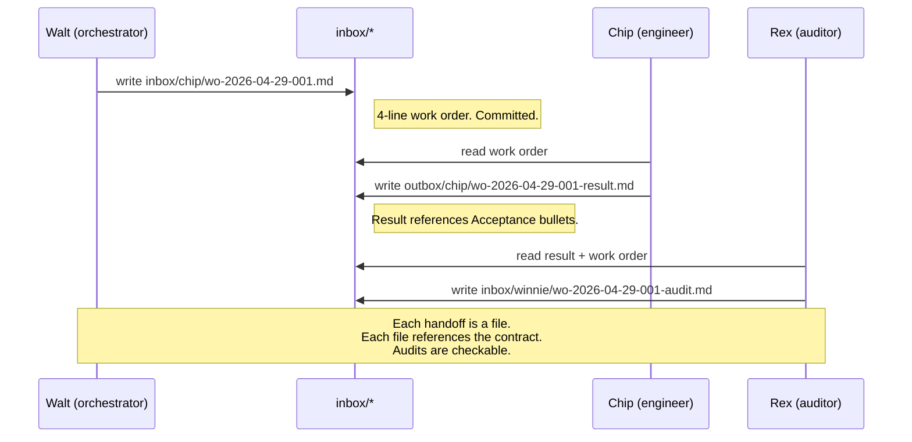

Three quarters of my agent failures used to come from one source: a work order vague enough to be read multiple correct ways.

The agent did something plausible. The plausible thing wasn't what I wanted. A file got modified, a test got added, a commit landed. Then I'd read the diff and realize the agent had answered a different question than the one I asked.

That's the worst kind of agent failure. It doesn't look like a failure. It looks like a feature.

## Three quarters of my agent failures

The fix isn't a smarter model. It's a more specific brief.

| Bad work order | Good work order |
|---|---|
| Audit Qualora SEO and fix what you find. | **Objective:** Reduce orphan-page count by 50%. **Acceptance:** Sitemap reports < 100 orphan URLs; no soft 404s in `wrangler tail` for 24h. **Files:** `server/seo.ts`, `client/src/seo/STATIC_ROUTE_META.ts`. **Branching:** halt-with-note if orphan count is already < 100; route-to-Chip if a code change is needed. |
| Improve the homepage. | **Objective:** Homepage matches the Q2 brief. **Acceptance:** `<title>` matches `data/title.txt`; FAQ accordion expands on click in mobile Safari; Lighthouse SEO score ≥ 90. **Files:** `client/src/pages/Home.tsx`, `client/src/components/FAQ.tsx`. **Branching:** halt-with-note if Lighthouse already ≥ 90; route-to-Chip otherwise. |
| Fix the slow audit. | **Objective:** Audit p95 latency drops below 30s. **Acceptance:** `scripts/bench_audit.py` reports p95 < 30s on 50-sample run; no regressions on success rate. **Files:** `scripts/audit_format.py`, `scripts/lib/codex.py`. **Branching:** halt-with-note if root cause is global config (route to operator); route-to-Chip if code change. |

The shape of the difference is the same in every row. The bad version is a goal. The good version is a contract.

## The four lines

The preamble I require at the top of every agent task is exactly four fields.

```markdown
**Objective:** One sentence. Present-tense outcome. No "and." No "while you're at it."

**Acceptance:** 3-5 testable bullets. Each one checkable without asking a human.
- Bullet 1
- Bullet 2
- Bullet 3

**Files:** Explicit paths the agent may touch. Anything outside this list is out of scope.
- path/to/file.ts
- path/to/another.py

**Branching:** What to do if the work doesn't apply, returns empty, or conflicts with another in-flight order.
- halt-with-note
- route-to-{agent}
- requeue-with-blocker
```

Each line does a specific job. Objective is the contract. Acceptance is how the contract is verified. Files is the scope. Branching is the legal way to refuse.

Together, the four lines turn a goal into a work order — a unit of agent work that survives handoff between specialists, audits cleanly, and produces a result you can check without rereading the original conversation.

## Why Acceptance is the line that saves you

The line that earns its place every single week is Acceptance.

Acceptance is the difference between "make it better" and a contract you can grade automatically.

| Vague Acceptance | Testable Acceptance |
|---|---|
| Improve SEO | `<title>` matches `data/title.txt`; meta description 140-160 chars; Lighthouse SEO ≥ 90 |
| Make the page faster | LCP < 2.5s on a Moto G4 emulation in Lighthouse mobile run |
| Fix the bug | The repro case in `repro/race-2026-04-22.md` no longer reproduces; `npm test` passes |
| Improve the audit | p95 latency on `scripts/bench_audit.py` drops below 30s; success rate ≥ 95% |
| Cover this in a test | New test in `tests/auth.test.ts`; covers the race condition; passes; existing tests still pass |

Without Acceptance, the agent decides for you. The agent's read of "improve SEO" is not your read. It's the most plausible interpretation given the model's training data.

Plausible is not correct.

Acceptance forces the goal into a checkable shape. If a bullet can't be checked without asking a human, the bullet is wrong and the work order goes back for revision. That single filter — checkable without a human — kills most vague work orders before they reach an agent.

## The Branching field

Branching is the field most people forget. It's the legal way for the agent to refuse.

Without Branching, when an agent hits a situation the work order didn't anticipate, the agent picks. It picks based on the most plausible next action given the context. That pick is rarely what you would have picked.

| Situation | Without Branching | With Branching |
|---|---|---|
| Work doesn't apply | Agent does it anyway, badly | `halt-with-note` |
| Work belongs to another specialist | Agent attempts it, drifts out of role | `route-to-{agent}` |
| Dependency missing | Agent fabricates the dependency | `requeue-with-blocker: <name>` |
| Conflicts with another in-flight order | Agent picks one and proceeds | `requeue-with-blocker: in-flight order conflict` |
| Operator preference unclear | Agent picks plausibly | `halt-with-note: needs operator input on X` |

The discipline is writing Branching for situations you can't anticipate. Branching gives the agent a vocabulary for "this isn't what you asked for" — the vocabulary every specialist needs and most agent setups don't provide.

First time I added Branching to a work order, the agent halted on the first run: `halt-with-note: orphan count is already < 100; the underlying issue is something else`. One halt. Three hours of "plausible-but-wrong" debugging I never had to do.

## A real work order, before and after

Here is a vague work order I sent in week one of running with the harness, next to the same intent in the new format.

**Before:**

```markdown
Audit Qualora SEO and fix what you find.
```

**After:**

```markdown
# Work Order: 2026-04-22-seo-orphan-cleanup

**Objective:** Reduce orphan-page count by 50% (from 244 to < 100).

**Acceptance:**
- Sitemap reports < 100 orphan URLs
- No soft 404s observed in `wrangler tail` output over a 24-hour window post-deploy
- All glossary slugs present in sitemap also present in `data/glossary-published.json`
- `npm test` passes
- No regression on Lighthouse SEO score on the homepage (≥ 90)

**Files:**
- server/seo.ts
- client/src/seo/STATIC_ROUTE_META.ts
- scripts/build-sitemap.ts
- (the agent may not touch anything outside this list)

**Branching:**
- halt-with-note if orphan count is already < 100 (audit may need a different root cause)
- route-to-Chip if a code change is needed beyond the listed files
- requeue-with-blocker: glossary regeneration if `data/glossary-published.json` is stale
```

Six words versus twelve lines.

The after isn't bureaucracy. It's the contract that turns a goal into something an agent can finish, hand off, and have audited. Every line is doing a job. Every line prevents a specific failure mode I've already paid for.

## Three failure modes the format prevents

| Failure mode | What goes wrong without the format | What the format does |
|---|---|---|
| **Scope creep** | Agent edits adjacent files "while it's in there," producing a sprawling diff that's hard to review | `Files:` limits the surface area. Anything outside the list is out of scope, full stop. |
| **Forced work** | Agent fabricates a result when the task doesn't apply, because there is no legal way to refuse | `Branching:` gives the agent vocabulary for refusal: halt-with-note, route, requeue. |
| **Silent success** | Agent reports done; result doesn't actually meet the goal, but nobody catches it until later | `Acceptance:` forces a check. If the bullets aren't satisfied, the work isn't done. |

The format is small. The format is boring. The format prevents the failure modes that ate three quarters of my early agent runs.

## Composes with operator-as-browser

The work-order format is the seam between roles.



Walt writes the work order. Chip executes it. Rex audits it against the Acceptance bullets. Each handoff is a file. Each file references the contract. The format is what makes the handoff legible to an agent who didn't see the original conversation.

If you're running a multi-agent setup and your specialists keep producing plausible-but-wrong outputs, the work-order format is the smallest change with the biggest measurable lift. The four lines fit on a notecard. The discipline is harder than the format — and it's the discipline that ships.

<div className="my-12 rounded-2xl border border-brand-teal/30 bg-brand-teal/5 p-8">
  <h3 className="text-xl font-semibold text-white">Get the next AI Lab post</h3>
  <p className="mt-3 text-white/70">One post a month from a production system that's currently breaking and getting fixed. Next up: the cost-and-quality routing matrix — five model families, six call types, real production cost numbers, and the fallback chains that keep a fixed-budget studio shipping.</p>
  <a href="/ai-lab" className="btn-primary mt-6 inline-flex">Subscribe to AI Lab</a>
</div>
